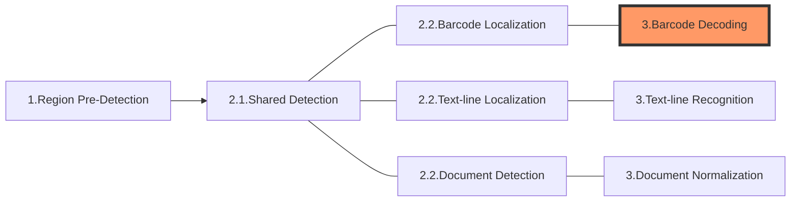

The following diagram shows how sections connect to each other to form tasks:

In this article, we'll discuss the section **Barcode Decoding** which is usually the 3rd section of a "Read-Barcodes" task.

# Section 3 - Barcode Decoding

The purpose of this section is to optimize the quality of the "barcode zones" found by the previous section "Barcode Localization" before decoding the barcode to get the encoded text.

## Constituting Stages

This section consists of the following stages:

1. Cropping: to cut out the barcode zones based on barcode localization results. This results in one or multiple colour images.
2. Grayscaling: to convert the colour image(s) to grayscale.
3. Transforming: to transform the grayscale image(s).
4. Deformation-reducing: to reduce the deformation of the image(s).
5. Barcode-complementing: to complement incomplete barcode(s).
6. Up-scaling: to up-scale the barcode(s) to make it easier to decode.
7. Barcode-decoding: to decode the barcode and get the encoded text.

## Output and Parameters

Each of these stages has its own output (known as an intermediate result) and usually a specific parameter that can regulate the operation:

| Stage                 | Intermediate Result Type                  | Related Parameter                                                                                                     |
| --------------------- | ----------------------------------------- | --------------------------------------------------------------------------------------------------------------------- |
| Cropping              | `IRUT_COLOUR_IMAGE`                       | N/A                                                                                                                   |
| Grayscaling           | `IRUT_GRAYSCALE_IMAGE`                    | [`ColourConversionModes`](../../parameters/reference/image-parameter/colour-conversion-modes.md)                      |
| Transforming          | `IRUT_TRANSFORMED_GRAYSCALE_IMAGE`        | [`GrayscaleTransformationModes`](../../parameters/reference/image-parameter/grayscale-transformation-modes.md)        |
| Deformation-reducing  | `IRUT_DEFORMATION_RESISTED_BARCODE_IMAGE` | [`DeformationResistingModes`](../../parameters/reference/barcode-reader-task-settings/deformation-resisting-modes.md) |
| Barcode-complementing | `IRUT_COMPLEMENTED_BARCODE_IMAGE`         | [`BarcodeComplementModes`](../../parameters/reference/barcode-reader-task-settings/barcode-complement-modes.md)       |
| Up-scaling            | `IRUT_SCALED_UP_BARCODE_IMAGE`            | [`ScaleUpModes`](../../parameters/reference/image-parameter/scale-up-modes.md) |
| Barcode-decoding      | `IRUT_DECODED_BARCODES`                   | N/A                                                                                                                   |