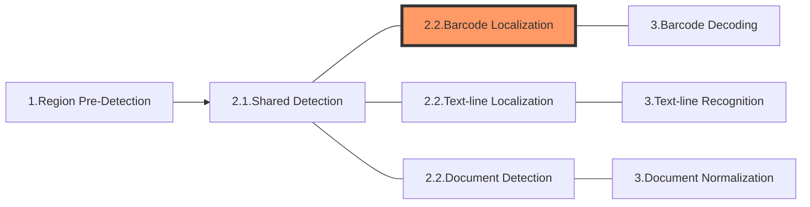

The following diagram shows how sections connect to each other to form tasks:

In this article, we'll discuss the section **Barcode Localization** which is the product-specific part of the 2nd section of a "Read-Barcodes" task.

> The 2nd section of a "Read-Barcodes" task consists of [**Shared Detection**](shared-detection.md) and **Barcode Localization**.

# Section 2.2 - Barcode Localization

The purpose of this section is to find the exact locations of barcodes on the image.

## Constituting Stages

This section consists of multiple stages which forms a fixed and relatively complete set of workflow:

1. Contour-locating: to find contours that may be part of barcodes.
2. Line-locating: to extract lines from the contours.
3. Candidates-locating: to find zones that may contain barcodes.
4. Barcodes-locating: to find exact locations of barcodes.

## Output and Parameters

Each of these stages has its own output (known as an intermediate result) and usually a specific parameter that can regulate the operation:

| Stage               | Intermediate Result Type       | Related Parameter                                                                                                                                                                                                |
| ------------------- | ------------------------------ | ---------------------------------------------------------------------------------------------------------------------------------------------------------------------------------------------------------------- |
| Contour-locating    | `IRUT_CONTOURS`                | [`LocalizationModes`](../../parameters/reference/barcode-reader-task-settings/localization-modes.md) |
| Line-locating       | `IRUT_LINE_SEGMENTS`           | [`LocalizationModes`](../../parameters/reference/barcode-reader-task-settings/localization-modes.md) |
| Candidates-locating | `IRUT_CANDIDATE_BARCODE_ZONES` | [`LocalizationModes`](../../parameters/reference/barcode-reader-task-settings/localization-modes.md) |
| Barcodes-locating   | `IRUT_LOCALIZED_BARCODES`      | [`LocalizationModes`](../../parameters/reference/barcode-reader-task-settings/localization-modes.md) |