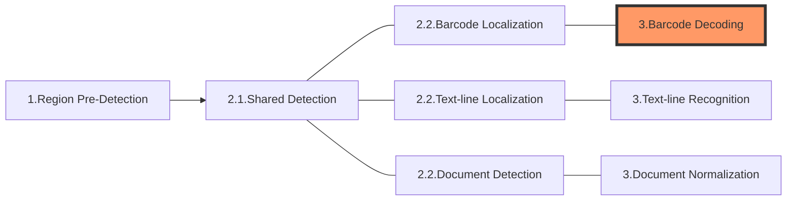
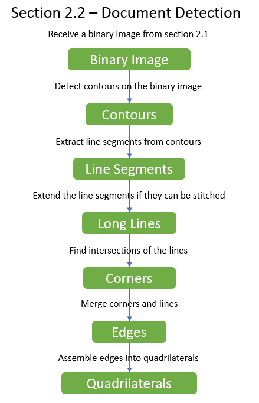

The following diagram shows how sections connect to each other to form tasks:

In this article, we'll discuss the first section of a task - **Document Detection**:

# Section 2.2 - Document Detection

**Document detection** is one of the key features of Dynamsoft Document Normalizer (DDN). If DDN tasks are arranged in the settings, the library will try detecting document boundaries from the image and output the location of the detectedd boundaries.

Preprocessing setting are available for DDN module. As a result, the preprocessing intermediate results can be inherited when performing the document detection algorithm.

## Main Work Flow

Based on the binary image output by section 2.1, DDN module performs boundary detection process on the image. It initially find contours of the target items and extract line segments from the contours. After a series of process, the library calculates the corners, edges and finally confirms the locations of the boundaries. Each boundary is output as a quadrilateral with the coordinates of its four vertices.

   

   

## Available Parameter Settings

**LineExtractionModes**

Defines how to extract lines from the image.

**CornerAngleRangeArray**

Define the range of corner.

**ContentType**

Specify whether the targeting content is document page or tables.

## Result Output

The result of **Document Detection** section is output as `DetectedQuadsResult` which is generally received from the `CaptureResultReceiver` (CRR).

During the process of **Document Detection**, a series of intermediate results are produced.

**Document Detection Result**

| Name | Description | Related Parameter(s) |
| ---- | ----------- | -------------------- |
| `DetectedQuadsResult` | The detected quadrilaterals output by the library. | N/A |

> Notes: The result of document detection is output as one of the `CapturedResult` when its target ROI is specified in the `ImageROIProcessingArray`.

**Document Detection Intermediate Results**

| Name | Description | Related Parameter(s) |
| ---- | ----------- | -------------------- |
| `ContoursUnit` | The detected contours on the image. | N/A |
| `LineSegmentsUnit` | The line segments extracted from the contours. | N/A |
| `LongLinesUnit` | Merged from the line segments. | N/A |
| `CornersUnit` | Formed by intersected long lines. Corners participate in assembling quadrilaterals. | `CornerAngleRangeArray` |
| `CandidateQuadEdgesUnit` | The edges that candidate the quadrilateral assembling. | N/A |
| `DetectedQuadsUnit` | The assembled quadrilaterals. | N/A |

**Shared Preprocessing Intermediate Results**

| Name | Description | Related Parameter(s) |
| ---- | ----------- | -------------------- |
| `ColourImageUnit` | The colour images. Generally, they are the original images. | N/A |
| `ScaledDownColourImageUnit` | The scaled down colour images. | `ScaleDownThreshold` |
| `GrayscaleImageUnit` | The gray scale images. | `ColourConversionModes` |
| `TransformedGrayscaleImageUnit` | The colour inverted gray scale images. | `GrayscaleTransformationModes` |
| `PredetectedRegionsUnit` | The coordinates of predetected regions quadrilateral(s) | `RegionPredetectionModes` |
| `EnhancedGrayscaleImageUnit` | The enhanced gray scale images. | `ImagePreprocessingModes` |
| `BinaryImageUnit` | The binary images. | `BinarizationModes` |
| `TextureDetectionResultUnit` | The detected texture. | `TextureDetectionModes` |
| `TextureRemovedGrayscaleImageUnit` | The gray scale images that have been removed texture. | `TextureDetectionModes` |
| `TextureRemovedBinaryImageUnit` | The binary images that have been removed texture. | `TextureDetectionModes` |
| `TextRemovedBinaryImageUnit` | The gray scale images that have been removed text. | `TextFilterModes` |
