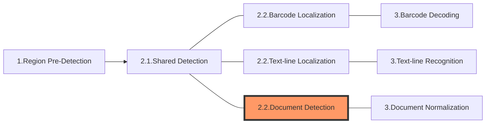

> *Go to [DCV Architecture](../index.md)*

The following diagram shows how sections connect to each other to form tasks:

In this article, we'll discuss the section **Document Detection** which is the product-specific part of the 2nd section of a "Normalize-a-Document" task.

> The 2nd section of a "Normalize-a-Document" task consists of [**Shared Detection**](shared-detection.md) and **Document Detection**.

# Section 2.2 - Document Detection

The purpose of this section is to find the exact locations of "documents" on the image. 

> A document is an object that exhibit clear boundaries.

## Constituting Stages

This section consists of multiple stages which forms a fixed and relatively complete set of workflow:

1. Contour-locating: to find contours that may be part of the document boundaries.
2. Line-locating: to find lines that may be part of  the document boundaries.
3. Long-line-merging: to merge line segments into long lines.
4. Corner-locating: to find corners at intersections of long lines.
5. Candidate-quad-edge-locating: to find candidate edges that may be part of the quads.
6. Quad-locating: to find exact locations of documents.

### Main Work Flow

The algorithm first finds the contour of the target item and extracts line segments from the contour. After a series of processing, the library calculates the corners, edges, and finally determines the position of the boundaries. Each boundary is output as a quadrilateral and the coordinates of its four vertices.

   

   

## Output and Parameters

Each of these stages has its own output (known as an intermediate result) and usually a specific parameter that can regulate the operation:

| Stage                        | Intermediate Result Type    | Related Parameter                                                                                                   |
| ---------------------------- | --------------------------- | ------------------------------------------------------------------------------------------------------------------- |
| Contour-locating             | `IRUT_CONTOURS`             | N/A                                                                                                                 |
| Line-locating                | `IRUT_LINE_SEGMENTS`        | [`LineExtractionModes`](../../parameters/reference/document-normalizer-task-settings/line-extraction-modes.md)      |
| Long-line-merging            | `IRUT_LONG_LINES`           | N/A                                                                                                                 |
| Corner-locating              | `IRUT_CORNERS`              | [`CornerAngleRangeArray`](../../parameters/reference/document-normalizer-task-settings/corner-angle-range-array.md) |
| Candidate-quad-edge-locating | `IRUT_CANDIDATE_QUAD_EDGES` | N/A                                                                                                                 |
| Quad-locating                | `IRUT_DETECTED_QUADS`       | N/A                                                                                                                 |

The following parameter may affect the whole process:

- [`ContentType`](../../parameters/reference/document-normalizer-task-settings/content-type.md)
- [`QuadrilateralDetectionModes`](../../parameters/reference/document-normalizer-task-settings/quadrilateral-detection-modes.md)
