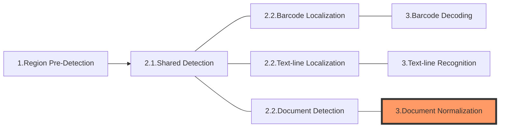

The following diagram shows how sections connect to each other to form tasks:

In this article, we'll discuss the section **Document Normalization** which is usually the 3rd section of a "Normalize-a-Document" task.

# Section 3 - Document Normalization

The purpose of this section is to generate a standard rectangular image of the "document" localized in the section "Document Detection".

> A document is an object that exhibit clear boundaries.

## Constituting Stages

This section consists of just one stage:

- Document-normalizing: to normalize the document which may involve one or several of these actions:
  - Deskew
  - Perspective correction
  - Colour conversion
  - Brightness and contrast adjustment

## Output and Parameters

| Stage Name           | Intermediate Result Type | Related Parameter                                                                                                                                                                                                                                                                                                                                                            |
| -------------------- | ------------------------ | ---------------------------------------------------------------------------------------------------------------------------------------------------------------------------------------------------------------------------------------------------------------------------------------------------------------------------------------------------------------------------- |
| Document-normalizing | `IRUT_NORMALIZED_IMAGE`  | [`Brightness`](../../parameters/reference/document-normalizer-task-settings/brightness.md), [`Contrast`](../../parameters/reference/document-normalizer-task-settings/contrast.md), [`ColourMode`](../../parameters/reference/document-normalizer-task-settings/colour-mode.md), [`DeskewMode`](../../parameters/reference/document-normalizer-task-settings/deskew-mode.md) |
