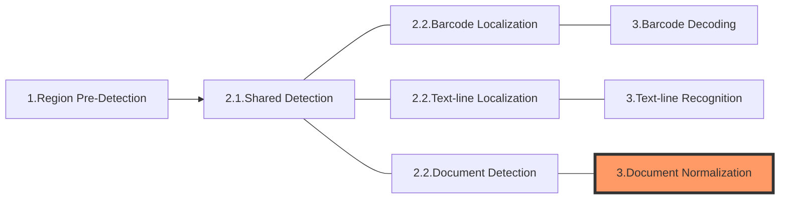

The following diagram shows how sections connect to each other to form tasks:

In this article, we'll discuss the first section of a task - **Document Normalization**:

# Section 3 - Document Normalization

Document Normalization is one of the key features of Dynamsoft Document Normalizer (DDN). In this section, the library performs a series of image-processing on the target ROI to convert the irregular shaped image into a standard rectangular image.

## Main Features

In the **Document Normalization** section, the content of the targeting area is cropped from the original image and a new image based on the cropped region is generated. When generating the new image, the following features might be applied to make sure the output image is shaped to a rectangle.

* Deskew
* Perspective Correction
* Output Colour Mode
* Brightness and Contrast

## Result Output

The result of **Document Normalization** section is output as `NormalizedImagesResult` which is generally received from the `CaptureResultReceiver` (CRR).

During the process of **Document Normalization**, a series of intermediate results are produced.

**Document Normalization Result**

| Name | Description | Related Parameter(s) |
| ---- | ----------- | -------------------- |
| `NormalizedImagesResult` | The normalized images output by the library. | N/A |

If you did a normalize task only:

| Name | Description | Related Parameter(s) |
| ---- | ----------- | -------------------- |
| `NormalizedImageUnit` | The normalized image. | `Brightness`, `Contrast`, `ColourMode`, `DeskewMode` |

If you implement document detection and document normalization continuously, the following intermediate result are available as well.

| Name | Description | Related Parameter(s) |
| ---- | ----------- | -------------------- |
| `ContoursUnit` | The detected contours on the image. | N/A |
| `LineSegmentsUnit` | The line segments extracted from the contours. | N/A |
| `LongLinesUnit` | Merged from the line segments. | N/A |
| `CornersUnit` | Formed by intersected long lines. Corners participate in assembling quadrilaterals. | `InteriorAngleRangeArray` |
| `CandidateQuadEdgesUnit` | The edges that candidate the quadrilateral assembling. | N/A |
| `DetectedQuadsUnit` | The assembled quadrilaterals. The DetectedQuadResult is the  | N/A |
| `ColourImageUnit` | The colour images. Generally, they are the original images. | N/A |
| `ScaledDownColourImageUnit` | The scaled down colour images. | `ScaleDownThreshold` |
| `GrayscaleImageUnit` | The gray scale images. | `ColourConversionModes` |
| `TransformedGrayscaleImageUnit` | The colour inverted gray scale images. | `GrayscaleTransformationModes` |
| `PredetectedRegionsUnit` | The coordinates of predetected regions quadrilateral(s) | `RegionPredetectionModes` |
| `EnhancedGrayscaleImageUnit` | The enhanced gray scale images. | `ImagePreprocessingModes` |
| `BinaryImageUnit` | The binary images. | `BinarizationModes` |
| `TextureDetectionResultUnit` | The detected texture. | `TextureDetectionModes` |
| `TextureRemovedGrayscaleImageUnit` | The gray scale images that have been removed texture. | `TextureDetectionModes` |
| `TextureRemovedBinaryImageUnit` | The binary images that have been removed texture. | `TextureDetectionModes` |
| `TextRemovedBinaryImageUnit` | The gray scale images that have been removed text. | `TextFilterModes` |
