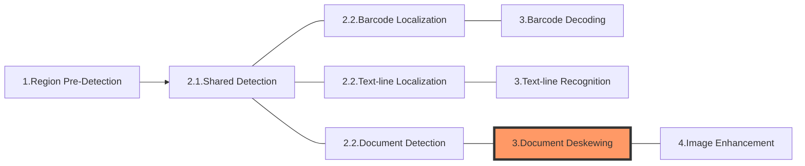

The following diagram shows how sections connect to each other to form tasks:

In this article, we'll discuss the section **Document Deskewing** which is usually the 3rd section of a "Normalize-a-Document" task.

# Section 3 - Document Deskewing

The purpose of this section is to generate a standard rectangular image of the "document" localized in the section "Document Detection".

> A document is an object that exhibit clear boundaries.

## Constituting Stages

This section consists of just one stage:

- Document-deskewing: to deskew the document which may involve one or several of these actions:
  - Deskew
  - Perspective correction

## Output and Parameters

| Stage | Intermediate Result Type | Related Parameter |
| ----- | ------------------------ | ----------------- |
| Document-deskewing | `IRUT_DESKEWED_IMAGE`  | [`PageSize`](../../parameters/reference/document-normalizer-task-settings/page-size.md), [`DeskewMode`](../../parameters/reference/document-normalizer-task-settings/deskew-mode.md) |
