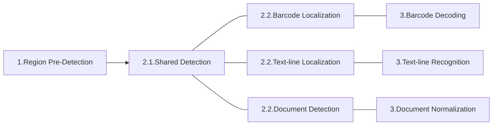

> *Go to [DCV Architecture](../index.md)*

# Image-Processing Tasks

There are multiple types of tasks when processing images in the Dynamsoft Capture Vision (DCV) architecture.

## Task Types

The following are the image-processing tasks supported at present:

| Task Type                  | Performed By | Category         | Result Type             |
| :------------------------- | :----------- | :--------------- | :---------------------- |
| Read Barcodes              | DBR          | Image-Processing | Decoded Barcodes        |
| Recognize Text Lines       | DLR          | Image-Processing | Recognized TextLines    |
| Detect Document Boundaries | DDN          | Image-Processing | Document Boundary Quads |
| Normalize a Document       | DDN          | Image-Processing | Normalized Image        |

***Table 1: Task Types***

## Divide Tasks into Sections

Each image-processing task can be further divided into three sections:

| Task Type            | Sections                                                            |
| :------------------- | :------------------------------------------------------------------ |
| Read Barcodes        | Region Pre-detection, Barcode Localization, Barcode Decoding        |
| Recognize Text Lines | Region Pre-detection, Text-line Localization, Text-line Recognition |
| Normalize a Document | Region Pre-detection, Document Detection, Document Normalization    |

***Table 2: Tasks and Sections***

In total, there are 7 unique image-processing sections, which belong to one of three steps of a task:

### Step one: initial image-processing

This step tries to find parts of the image, called "regions of interest (ROI)" that exhibit distinct features that match the result we are trying to obtain. Then these regions are cropped to produce regional images as the final output of this step for the next step to process. There is only one section for this step:

- [Region Pre-detection](region-predetection.md)

> 1. If no specific region is found, the entire image is the output.
> 2. There can be multiple regions found which result in multiple regional images as the output.

### Step two: detecting the precise location

This step tries to find the precise location, called "zones", of the final results (a barcode, a text-line or a document) on the regional images from step one. Then these zones are cropped to produce zonal images as the final output of this step.

Step two of a task can be one of the following three sections:

- [Barcode Localization](barcode-localization.md)
- [Text-line Localization](textline-localization.md)
- [Document Detection](document-detection.md) (a document refers to an object with a quadrilateral boundary)

> As mentioned in ["Divide Sections into Stages"](#divide-sections-into-stages), each section is further divided into stages. These three sections in step two starts with the same few stages. Read more on [Shared Detection](shared-detection.md).

### Step three: producing the final results

Based on the zonal images, each functional product performs the last operation to obtain the final results.

Step three of a task can be one of the following three sections:

- [Barcode Decoding](barcode-decoding.md)
- [Text-line Recognition](textline-recognition.md)
- [Document Normalization](document-normalization.md)

The following is a simple demonstration of the sections:

## Divide Sections into Stages

Each of the 7 sections mentioned in ["Divide Tasks into Sections"](#divide-tasks-into-sections) can be further divided into many stages as shown below:

> Stages shared by "Barcode Localization", "Text-line Localization" and "Document Detection" are put together for the pseudo type "Shared Detection Section". Read more on [Shared Detection](shared-detection.md)

| Section Type | Stages |
| :----------- | :----- |
| Region Pre-detection | IRUT_COLOUR_IMAGE, IRUT_SCALED_DOWN_COLOUR_IMAGE, IRUT_GRAYSCALE_IMAGE,   IRUT_TRANSFORMED_GRAYSCALE_IMAGE, IRUT_PREDETECTED_REGIONS |
| Shared Detection Section | IRUT_COLOUR_IMAGE, IRUT_SCALED_DOWN_COLOUR_IMAGE, IRUT_GRAYSCALE_IMAGE,   IRUT_TRANSFORMED_GRAYSCALE_IMAGE, IRUT_ENHANCED_GRAYSCALE_IMAGE, IRUT_BINARY_IMAGE,   IRUT_TEXTURE_DETECTION_RESULT, IRUT_TEXTURE_REMOVED_GRAYSCALE_IMAGE, IRUT_TEXTURE_REMOVED_BINARY_IMAGE,   IRUT_TEXT_ZONES, IRUT_TEXT_REMOVED_BINARY_IMAGE |
| Barcode Localization | IRUT_CONTOURS, IRUT_LINE_SEGMENTS, IRUT_CANDIDATE_BARCODE_ZONES,   IRUT_LOCALIZED_BARCODES |
| Text-line Localization | IRUT_LOCALIZED_TEXT_LINES |
| Document Detection | IRUT_CONTOURS, IRUT_LINE_SEGMENTS, IRUT_LONG_LINES,   IRUT_CORNERS, IRUT_CANDIDATE_QUAD_EDGES, IRUT_DETECTED_QUADS |
| Barcode Decoding | IRUT_COLOUR_IMAGE, IRUT_GRAYSCALE_IMAGE, IRUT_TRANSFORMED_GRAYSCALE_IMAGE,   IRUT_DEFORMATION_RESISTED_BARCODE_IMAGE, IRUT_COMPLEMENTED_BARCODE_IMAGE, IRUT_SCALED_UP_BARCODE_IMAGE,   IRUT_DECODED_BARCODES |
| Text-line Recognition | IRUT_COLOUR_IMAGE, IRUT_GRAYSCALE_IMAGE, IRUT_TRANSFORMED_GRAYSCALE_IMAGE,   IRUT_RECOGNIZED_TEXT_LINES |
| Document Normalization | IRUT_NORMALIZED_IMAGES |

***Table 3: Sections and Stages***

In total, there are 27 unique stages which are identified by the types of results they generate:

- IRUT_COLOUR_IMAGE
- IRUT_SCALED_DOWN_COLOUR_IMAGE
- IRUT_GRAYSCALE_IMAGE
- IRUT_TRANSFORMED_GRAYSCALE_IMAGE
- IRUT_ENHANCED_GRAYSCALE_IMAGE
- IRUT_PREDETECTED_REGIONS
- IRUT_BINARY_IMAGE
- IRUT_TEXTURE_DETECTION_RESULT
- IRUT_TEXTURE_REMOVED_GRAYSCALE_IMAGE
- IRUT_TEXTURE_REMOVED_BINARY_IMAGE
- IRUT_CONTOURS
- IRUT_LINE_SEGMENTS
- IRUT_TEXT_ZONES
- IRUT_TEXT_REMOVED_BINARY_IMAGE
- IRUT_CANDIDATE_BARCODE_ZONES
- IRUT_LOCALIZED_BARCODES
- IRUT_SCALED_UP_BARCODE_IMAGE
- IRUT_DEFORMATION_RESISTED_BARCODE_IMAGE
- IRUT_COMPLEMENTED_BARCODE_IMAGE
- IRUT_DECODED_BARCODES
- IRUT_LONG_LINES
- IRUT_CORNERS
- IRUT_CANDIDATE_QUAD_EDGES
- IRUT_DETECTED_QUADS
- IRUT_LOCALIZED_TEXT_LINES
- IRUT_RECOGNIZED_TEXT_LINES
- IRUT_NORMALIZED_IMAGES

These stages are the minimal processing units that can be manipulated and these results are called intermediate results. For successive stages, the result of one stage is usually the source object to be processed by the next stage. A user can register listeners to obtain the results for one or multiple stages. DCV also allows the user to manipulate the algorithmic process by changing the result in between stages. Read more on [Intermediate Result Receiver](../output.md#intermediate-result-receiver) and [Bidirectional Interactivity with Intermediate Results](../index.md#bidirectional-interactivity-with-intermediate-results).

## Incomplete Task

As mentioned in **Table 2** above, a task is usually complete, which means it consists of three consecutive sections. However, it is not always the case. 

1. An incomplete task can be a halfway task which means it starts from step two or even step three and consists of only two or even just one section. Read more about [StartSection](../../parameters/reference/shared-parameter/start-section.md).
2. An incomplete task can be a premature task which means it ends early and doesn't produce the final results. Unlike a halfway task which must start at the beginning of a section, a premature task may end at any stage of a section. Read more about [TerminateSetting](../../parameters/reference/shared-parameter/terminate-settings.md).
