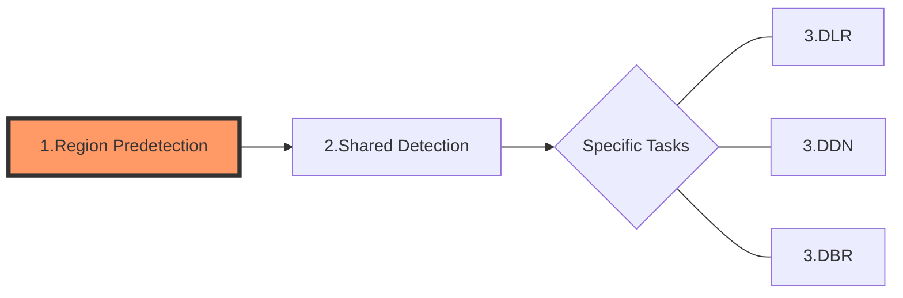

We can roughly divide the algorithmic processing flow of a task into three sections:

* section1.Predetect region(s) for better performance;
* section2.Necessary image pre-processing for enhancing image features.
* section3.Algorithmic processing related to specific tasks..

Each section may contain several more detailed algorithmic stages, and in this article we discuss Section1 - Region Predetection.
## Section 1 - Region Predetection

There is a fixed and most complete set of workflow in Section1, which ensures that the results of Section1 can be successfully produced.

This section begins with an image from [image source Adapter (ISA)](). Then there are some optional stages to convert the original image to a grayscale image. Whether and how these is all determined by the specific parameter configuration of the Dynamsoft Capture Vision (DCV) template. Table 1 lists these parameters and their respective design intents.

Table 1 – Configurable Parameters in Section 1

| **Parameter Name** | **Functionality** | **Status** |
| ------------------ | ---------------------------- | ---------- |
| [`ScaleDownThreshold`]() | To speed up when the input image size is large. | Available |
| [`ColourConversionModes`]() | To set the conversion from colour to grayscale, which keeps or enhances the features of the region of interest. | Available, Extensible |
| [`GrayscaleTransformationModes`]() | To emphasize the features of regions of interest with processing of the grayscale image. | Available, Extensible |
| [`RegionPredetectionModes`]() | To limit the subsequent process sections in certain areas up by detecting the regions of interest automatically. Pre-detection is based on the colour/grayscale distribution of each area. | Available, Extensible |

## Input and Output in Region Predetection

images and a set/sets of coordinates representing the ROIs results.

## Intermediate Results in Region Predetection
The processing of this section may produce some intermediate results, and the full set of these intermediate results is listed below.
| **Name** | **Data Type** | **Notes** | **Related Parameter** |
| ------------------ | ---------------------------- | ---------- | --- |
| [`Colour Image unit`]() | image | The original input images. | N/A |
| [`Down-scaled colour image unit`]() | image | The scaled down colour images. | `ScaleDownThreshold` |
| [`Grayscale image unit`]() | image | The gray scale images. | `ColourConversionModes` |
| [`Transformed grayscale image unit`]() | image | The colour inverted gray scale images. | `GrayscaleTransformationModes` |
| [`Predetected regions unit`]() | coordinates of quadrilateral(s) | The coordinates of detected ROIs | `RegionPredetectionModes` |

As mentioned above, the focus of this section is to reduce the time cost by scaling down or finding out ROIs. It is not essential for follow-up sections but would be helpful for some extreme cases.
 