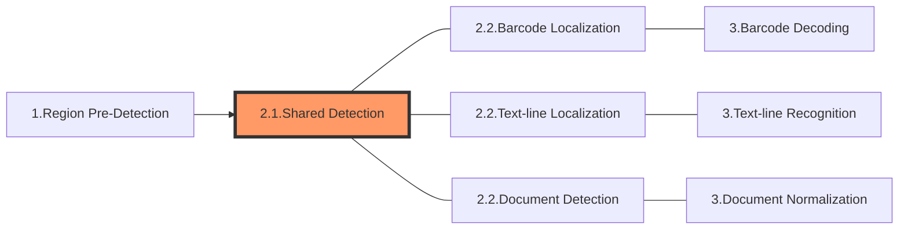

The following diagram shows how sections connect to each other to form tasks:

In this article, we'll discuss the special section - **Shared Detection**.

# Section 2.1 - Shared Detection

As discussed in ["Divide Tasks into Sections"](index.md#divide-tasks-into-sections), an image-processing task usually consists of three sections. The 2nd section is one of the following three

- Barcode Localization
- Text-line Localization
- Document Detection

Each of these three sections consists of multiple stages and they all start with the following identical stages:

1. Cropping: to crop out the regions of interest which are found by the previous section "Region Pre-detection". If no such region was found, return the original image as a whole.
2. Down-scaling: to down-scale a massive image.
3. Grayscaling: to convert a colour image to grayscale.
4. Transforming: to transform a grayscale image.
5. Enhancing: to improve the quality of a grayscale image.
6. Binarizing: to convert a grayscale image to black & white.
7. Texture-detecting: to detect texture on a binary image.
8. Texture-removing-1: to remove the texture of a grayscale image.
9. Texture-removing-2: to remove the texture of a binary image.
10. Text-zone-detecting: to find the exact locations of text zones.
11. Text-removing: to remove text from a binary image.

These 11 stages are grouped together with the name "Shared Detection".

> Important NOTE
> 
> **The section "Shared Detection" is only a concept invented to simplify the explanation of the image-processing workflow. It doesn't technically exist and is not a member of the parameter [section], etc.**

IRUT_COLOUR_IMAGE
IRUT_SCALED_DOWN_COLOUR_IMAGE
IRUT_GRAYSCALE_IMAGE
IRUT_TRANSFORMED_GRAYSCALE_IMAGE
IRUT_ENHANCED_GRAYSCALE_IMAGE
IRUT_BINARY_IMAGE
IRUT_TEXTURE_DETECTION_RESULT
IRUT_TEXTURE_REMOVED_GRAYSCALE_IMAGE
IRUT_TEXTURE_REMOVED_BINARY_IMAGE
IRUT_TEXT_ZONES
IRUT_TEXT_REMOVED_BINARY_IMAGE

Each section may contain several more detailed algorithmic stages, and in this article we discuss Section2 - Shared Detection.

## Section 2 - Shared Detection

There are many stages in Section 2 that can handle common image-related quandaries to ensure that the identified target features are clear and can be used properly in the next sections.

This section begins with an image((possibly from the cropped results of section1). Then there are some optional stages to convert the input image to a binary image. Whether and how these is all determined by the specific parameter configuration of the Dynamsoft Capture Vision (DCV) template. Table 1 lists these parameters and their respective design intents.

Table 1 – Configurable Parameters in Section 2

| **Parameter Name** | **Functionality** | **Status** |
| ------------------ | ---------------------------- | ---------- |
| [`ScaleDownThreshold`]() | To speed up when the input image size is large. | Available |
| [`ColourConversionModes`]() | To set the conversion from colour to grayscale, which keeps or enhances the features of the region of interest. | Available, Extensible |
| [`GrayscaleTransformationModes`]() | To emphasize the features of ROI with processing of the grayscale image. | Available, Extensible |
| [`ImagePreprocessingModes`]() | To emphasize the features of ROI with image-processing techniques on grayscale image. | Available, Extensible |
| [`BinarizationModes`]() | To enhance/keep features of barcode zones by applying different binarization methods and arguments. | Available, Extensible |
| [`TextureDetectionModes`]() | To exclude texture from images to reduce interference. | Available, Extensible |
| [`TextFilterModes`]() | To exclude text from images to reduce interference. | Available, Extensible |

## Input and Output in Shared Detection

## Intermediate Results in Shared Detection Section
The processing of this section may produce some intermediate results, and the full set of these intermediate results is listed below.
| **Name** | **Data Type** | **Notes** | **Related Parameter** |
| ------------------ | ---------------------------- | ---------- | --- |
| `ColourImageUnit` | image | The colour images. Generally, is the original input images. | N/A |
| `ScaledDownColourImageUnit` | image | The scaled down colour images. | `ScaleDownThreshold` |
| `GrayscaleImageUnit` | image | The gray scale images. | `ColourConversionModes` |
| `TransformedGrayscaleImageUnit` | image | The colour inverted gray scale images. | `GrayscaleTransformationModes` |
| `EnhancedGrayscaleImageUnit` | image | The enhanced gray scale images. | `ImagePreprocessingModes` |
| `BinaryImageUnit` | image | The binary images. | `BinarizationModes` |
| `TextureDetectionResultUnit` | TextureDetectionResult | The detected texture. | `TextureDetectionModes` |
| `TextureRemovedGrayscaleImageUnit` | image | The gray scale images that have been removed texture. | `TextureDetectionModes` |
| `TextureRemovedBinaryImageUnit` | image | The binary images that have been removed texture. | `TextureDetectionModes` |
| `TextZone` | vector(Quadrilateral) | The gray scale images that have been removed text. | `TextFilterModes` |
| `TextRemovedBinaryImageUnit` | image | The gray scale images that have been removed text. | `TextFilterModes` |
 
As mentioned above, The focus of this section is to use some optional image-processing techniques to enhance image features for next sections. It is not essential for most common scenarios but would be helpful for some special cases.

**Shared Preprocessing Intermediate Results**

| Name                               | Description                                                 | Related Parameter(s)           |
| ---------------------------------- | ----------------------------------------------------------- | ------------------------------ |
| `ColourImageUnit`                  | The colour images. Generally, they are the original images. | N/A                            |
| `ScaledDownColourImageUnit`        | The scaled down colour images.                              | `ScaleDownThreshold`           |
| `GrayscaleImageUnit`               | The gray scale images.                                      | `ColourConversionModes`        |
| `TransformedGrayscaleImageUnit`    | The colour inverted gray scale images.                      | `GrayscaleTransformationModes` |
| `PredetectedRegionsUnit`           | The coordinates of predetected regions quadrilateral(s)     | `RegionPredetectionModes`      |
| `EnhancedGrayscaleImageUnit`       | The enhanced gray scale images.                             | `ImagePreprocessingModes`      |
| `BinaryImageUnit`                  | The binary images.                                          | `BinarizationModes`            |
| `TextureDetectionResultUnit`       | The detected texture.                                       | `TextureDetectionModes`        |
| `TextureRemovedGrayscaleImageUnit` | The gray scale images that have been removed texture.       | `TextureDetectionModes`        |
| `TextureRemovedBinaryImageUnit`    | The binary images that have been removed texture.           | `TextureDetectionModes`        |
| `TextRemovedBinaryImageUnit`       | The gray scale images that have been removed text.          | `TextFilterModes`              |
