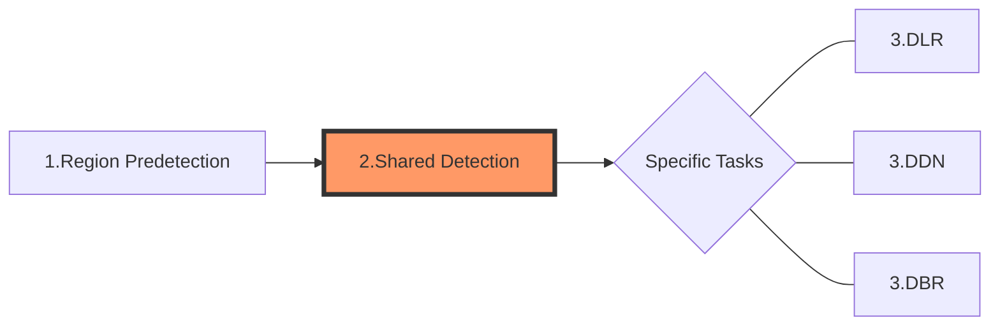

We can roughly divide the algorithmic processing flow of a task into three sections:

* section1.Pre-detect ROI(s) for better speed.
* section2.Necessary image pre-processing(s) for enhancing target features.
* section3.Algorithmic processing related to specific tasks.

Each section may contain several more detailed algorithmic stages, and in this article we discuss Section2 - Shared Detection.

## Section 2 - Shared Detection

There are many stages in Section 2 that can handle common image-related quandaries to ensure that the identified target features are clear and can be used properly in the next sections.

This section begins with an image((possibly from the cropped results of section1). Then there are some optional stages to convert the input image to a binary image. Whether and how these is all determined by the specific parameter configuration of the Dynamsoft Capture Vision (DCV) template. Table 1 lists these parameters and their respective design intents.

Table 1 – Configurable Parameters in Section 2

| **Parameter Name** | **Functionality** | **Status** |
| ------------------ | ---------------------------- | ---------- |
| [`ScaleDownThreshold`]() | To speed up when the input image size is large. | Available |
| [`ColourConversionModes`]() | To set the conversion from colour to grayscale, which keeps or enhances the features of the region of interest. | Available, Extensible |
| [`GrayscaleTransformationModes`]() | To emphasize the features of ROI with processing of the grayscale image. | Available, Extensible |
| [`ImagePreprocessingModes`]() | To emphasize the features of ROI with image-processing techniques on grayscale image. | Available, Extensible |
| [`BinarizationModes`]() | To enhance/keep features of barcode zones by applying different binarization methods and arguments. | Available, Extensible |
| [`TextureDetectionModes`]() | To exclude texture from images to reduce interference. | Available, Extensible |
| [`TextFilterModes`]() | To exclude text from images to reduce interference. | Available, Extensible |

## Input and Output in Shared Detection

## Intermediate Results in Shared Detection Section
The processing of this section may produce some intermediate results, and the full set of these intermediate results is listed below.
| **Name** | **Data Type** | **Notes** | **Related Parameter** |
| ------------------ | ---------------------------- | ---------- | --- |
| `ColourImageUnit` | image | The colour images. Generally, is the original input images. | N/A |
| `ScaledDownColourImageUnit` | image | The scaled down colour images. | `ScaleDownThreshold` |
| `GrayscaleImageUnit` | image | The gray scale images. | `ColourConversionModes` |
| `TransformedGrayscaleImageUnit` | image | The colour inverted gray scale images. | `GrayscaleTransformationModes` |
| `EnhancedGrayscaleImageUnit` | image | The enhanced gray scale images. | `ImagePreprocessingModes` |
| `BinaryImageUnit` | image | The binary images. | `BinarizationModes` |
| `TextureDetectionResultUnit` | TextureDetectionResult | The detected texture. | `TextureDetectionModes` |
| `TextureRemovedGrayscaleImageUnit` | image | The gray scale images that have been removed texture. | `TextureDetectionModes` |
| `TextureRemovedBinaryImageUnit` | image | The binary images that have been removed texture. | `TextureDetectionModes` |
| `TextZone` | vector(Quadrilateral) | The gray scale images that have been removed text. | `TextFilterModes` |
| `TextRemovedBinaryImageUnit` | image | The gray scale images that have been removed text. | `TextFilterModes` |
 
As mentioned above, The focus of this section is to use some optional image-processing techniques to enhance image features for next sections. It is not essential for most common scenarios but would be helpful for some special cases.