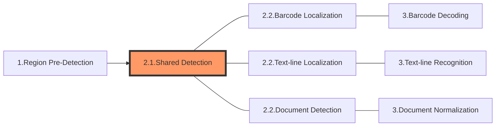

The following diagram shows how sections connect to each other to form tasks:

In this article, we'll discuss the special section - **Shared Detection**.

# Section 2.1 - Shared Detection

As discussed in ["Divide Tasks into Sections"](index.md#divide-tasks-into-sections), an image-processing task usually consists of three sections. The 2nd section is one of the following three

- Barcode Localization
- Text-line Localization
- Document Detection

Each of these three sections consists of multiple stages and they all start with 11 identical stages which are grouped together with the name "Shared Detection".

> **Important NOTE**
> 
> **The section "Shared Detection" is only a concept invented to simplify the explanation of the image-processing workflow. It doesn't technically exist and is not a member of the parameter `Section` which are found in [`SectionImageParameterArray`](../../parameters/reference/shared-parameter/section-image-parameter-array.md) and [`TerminateSetting`](../../parameters/reference/shared-parameter/terminate-setting.md), etc. and cannot be assigned to the parameter [`StartSection`](../../parameters/reference/shared-parameter/start-section.md).**

## Constituting Stages

1. Cropping: to crop out the regions of interest which are found by the previous section "Region Pre-detection". If no such region was found, return the original image as a whole.
2. Down-scaling: to down-scale a massive image.
3. Grayscaling: to convert a colour image to grayscale.
4. Transforming: to transform a grayscale image.
5. Enhancing: to improve the quality of a grayscale image.
6. Binarizing: to convert a grayscale image to black & white.
7. Texture-detecting: to detect texture on a binary image.
8. Texture-removing-1: to remove the texture of a grayscale image.
9. Texture-removing-2: to remove the texture of a binary image.
10. Text-zone-detecting: to find the exact locations of text zones.
11. Text-removing: to remove text from a binary image.

## Output and Parameters

Each of these stages has its own output (known as an intermediate result) and usually a specific parameter that can regulate the operation:

| Stage               | Intermediate Result Type               | Related Parameter                                                                                               |
| ------------------- | -------------------------------------- | --------------------------------------------------------------------------------------------------------------- |
| Cropping            | `IRUT_COLOUR_IMAGE`                    | N/A                                                                                                             |
| Down-scaling        | `IRUT_SCALED_DOWN_COLOUR_IMAGE`        | [`ScaleDownThreshold`](../../parameters/reference/image-parameter/scale-down-threshold.md)                      |
| Grayscaling         | `IRUT_GRAYSCALE_IMAGE`                 | [`ColourConversionModes`](../../parameters/reference/image-parameter/colour-conversion-modes.md)                |
| Transforming        | `IRUT_TRANSFORMED_GRAYSCALE_IMAGE`     | [`GrayscaleTransformationModes`](../../parameters/reference/image-parameter/grayscale-transformation-modes.md) |
| Enhancing           | `IRUT_ENHANCED_GRAYSCALE_IMAGE`        | [`GrayscaleEnhancementModes`](../../parameters/reference/image-parameter/grayscale-enhancement-modes.md)        |
| Binarizing          | `IRUT_BINARY_IMAGE`                    | [`BinarizationModes`](../../parameters/reference/image-parameter/binarization-modes.md)                         |
| Texture-detecting   | `IRUT_TEXTURE_DETECTION_RESULT`        | [`TextureDetectionModes`](../../parameters/reference/image-parameter/texture-detection-modes.md)                |
| Texture-removing-1  | `IRUT_TEXTURE_REMOVED_GRAYSCALE_IMAGE` | N/A                                                                                                             |
| Texture-removing-2  | `IRUT_TEXTURE_REMOVED_BINARY_IMAGE`    | N/A                                                                                                             |
| Text-zone-detecting | `IRUT_TEXT_ZONES`                      | [`TextDetectionMode`](../../parameters/reference/image-parameter/text-detection-mode.md)                        |
| Text-removing       | `IRUT_TEXT_REMOVED_BINARY_IMAGE`       | [`IfEraseTextZone`](../../parameters/reference/image-parameter/if-erase-text-zone.md)                           |
