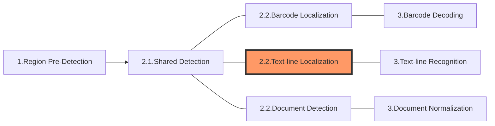

The following diagram shows how sections connect to each other to form tasks:

In this article, we'll discuss the section **Text-line Localization** which is the product-specific part of the 2nd section of a "Recognize-Text-Lines" task.

> The 2nd section of a "Recognize-Text-Lines" task consists of [**Shared Detection**](shared-detection.md) and **Text-line Localization**.

# Section 2.2 - Text-line Localization

The purpose of this section is to detect the exact locations of text-lines.

## Constituting Stages

This section consists of only one stage:

- Text-line-locating: to find the exact locations of the text-lines.

## Output and Parameters

| Stage              | Intermediate Result Type    | Related Parameter |
| ------------------ | --------------------------- | ----------------- |
| Text-line-locating | `IRUT_LOCALIZED_TEXT_LINES` | N/A               |
