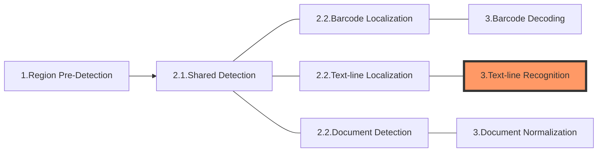

The following diagram shows how sections connect to each other to form tasks:

In this article, we'll discuss the section **Text-line Recognition** which is usually the 3rd section of a "Recognize-Text-Lines" task.

# Section 3 - Text-line Recognition

The purpose of this section is to recognize the text from the text-line areas identified in the previous section "Text-line Localization".

## Constituting Stages

This section consists of the following stages:

1. Cropping: to cut out the text-line areas based on text-line localization results. This results in one or multiple colour images.
2. Grayscaling: to convert the colour image(s) to grayscale.
3. Transforming: to transform the grayscale image(s).
4. Text-line-recognizing: to recognize the text.

## Output and Parameters

Each of these stages has its own output (known as an intermediate result) and usually a specific parameter that can regulate the operation:

| Stage                 | Intermediate Result Type           | Related Parameter                                                                                                                                                                                                                                                                                                                                                                                                                                                   |
| --------------------- | ---------------------------------- | ------------------------------------------------------------------------------------------------------------------------------------------------------------------------------------------------------------------------------------------------------------------------------------------------------------------------------------------------------------------------------------------------------------------------------------------------------------------- |
| Cropping              | `IRUT_COLOUR_IMAGE`                | N/A                                                                                                                                                                                                                                                                                                                                                                                                                                                                 |
| Grayscaling           | `IRUT_GRAYSCALE_IMAGE`             | [`ColourConversionModes`](../../parameters/reference/image-parameter/colour-conversion-modes.md)                                                                                                                                                                                                                                                                                                                                                                    |
| Transforming          | `IRUT_TRANSFORMED_GRAYSCALE_IMAGE` | [`GrayscaleTransformationModes`](../../parameters/reference/image-parameter/grayscale-transformation-modes.md)                                                                                                                                                                                                                                                                                                                                                      |
| Text-line-recognizing | `IRUT_RECOGNIZED_TEXT_LINES`       | [`DictionaryPath`](../../parameters/reference/label-recognizer-task-settings/dictionary-path.md)   [`DictionaryCorrectionThresholds`](../../parameters/reference/label-recognizer-task-settings/dictionary-correction-thresholds.md)   [`StringLengthRange`](../../parameters/reference/label-recognizer-task-settings/string-length-range.md)   [`StringRegExPattern`](../../parameters/reference/label-recognizer-task-settings/string-regex-pattern.md) |
