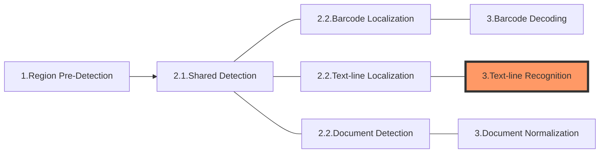

The following diagram shows how sections connect to each other to form tasks:

In this article, we'll discuss the first section of a task - **Text-line Recognition**:

# Section 3 - Text-line Recognition

The purpose of this section is to reduce the time cost by scaling down or finding out regions of interest (ROIs). It is not indispensable for follow-up sections but would be helpful for some extreme cases.

## Constituting Stages

This section consists of multiple stages which forms a fixed and relatively complete set of workflow:

1. Cropping: to crop out the original ROI *specified* by the user. If not specified, return the original image as a whole.
2. Down-scaling: to down-scale a massive image.
3. Grayscaling: to convert a colour image to grayscale.
4. Transforming: to transform a grayscale image.
5. Pre-Detecting: to pre-detect the regions exhibit specific features.

## Output and Parameters

Each of the five stages has its own output (known as an intermediate result) and a specific parameter that can regulate the operation:

| Stage Name    | Intermediate Result Type           | Related Parameter                                                                                               |
| ------------- | ---------------------------------- | --------------------------------------------------------------------------------------------------------------- |
| Cropping      | `IRUT_COLOUR_IMAGE`                | [`Location`](../../parameters/reference/target-roi-def/location.md)                                             |
| Down-scaling  | `IRUT_SCALED_DOWN_COLOUR_IMAGE`    | [`ScaleDownThreshold`](../../parameters/reference/image-parameter/scale-down-threshold.md)                      |
| Grayscaling   | `IRUT_GRAYSCALE_IMAGE`             | [`ColourConversionModes`](../../parameters/reference/image-parameter/colour-conversion-modes.md)                |
| Transforming  | `IRUT_TRANSFORMED_GRAYSCALE_IMAGE` | [`GrayscaleTransformationModes`](../../parameters/reference/image-parameter/gray-scale-transformation-modes.md) |
| Pre-Detecting | `IRUT_PREDETECTED_REGIONS`         | [`RegionPredetectionModes`](../../parameters/reference/image-parameter/Text-line Recognition-modes.md)            |
