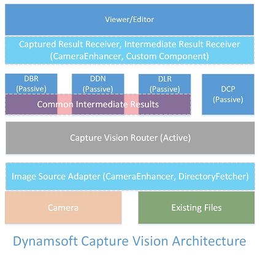
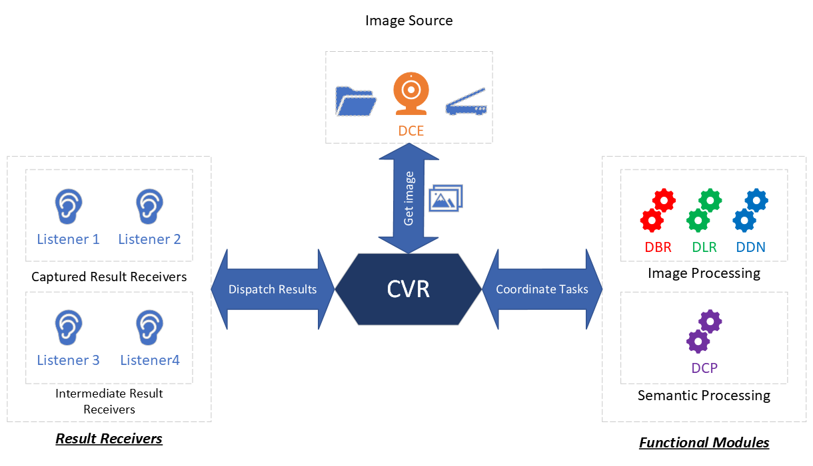
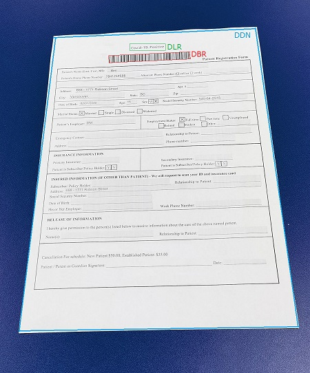
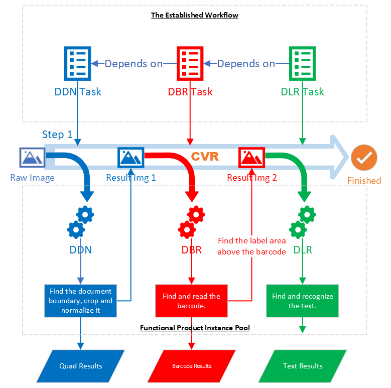

# Architecture of Dynamsoft Capture Vision

## Architecture Diagram

In the [introduction](../introduction/index.md), we have introduced the following [functional products](../introduction/index.md#functional-products):

- Dynamsoft Barcode Reader (DBR)
- Dynamsoft Label Recognizer (DLR)
- Dynamsoft Document Normalizer (DDN)
- Dynamsoft Code Parser (DCP)
- Dynamsoft Camera Enhancer (DCE)

The diagram below shows the architecture of Dynamsoft Capture Vision (DCV) and how these functional products fit into it:

> There are a few other functional products in the diagram but we can ignore them for now.

As shown in the diagram, all functional products are passive in the architecture. In other words, they are either told to perform a task or given the result of another task, both of which are done by the active part of the architecture known as Capture Vision Router (CVR).

## Capture Vision Router

Capture Vision Router (CVR) is the most important part of the DCV architecture. As its names suggests, CVR works as a router or a coordinator. Its major tasks include:

### Get Images from the Image Source  

In the DCV architecture, an image source refers to an object that has implemented the [Image Source Adapter (ISA) interface](std-input.md#image-source-adapter) such as Dynamsoft Camera Enhancer (DCE).

At runtime, CVR accepts an image source and tries to get images from it for the functional products to process. Usually, this is a continuous process which ends when the image source is exhausted.

### Coordinate Image-Processing Tasks

CVR accepts and maintains a list of image-processing settings known as ["CaptureVisionTemplates"](../parameters/file/capture-vision-template.md). Each template defines the tasks to be performed against an image. These tasks may be configured to run in parallel or one after another.

At runtime, CVR selects a CaptureVisionTemplate and analyzes it to build a task workflow, which it then runs for all images acquired from the image source.

> Read more on [CaptureVisionTemplate](../parameters/file/capture-vision-template.md).

- For tasks that can run in parallel, CVR will start to process the next image as long as it has an extra working thread to create a functional product instance.
- For tasks that must run in a sequence, CVR makes sure of the running order.

> There are two type of tasks. Read more about [Image-Processing Tasks](image-processing/index.md) and [Semantic-Processing Tasks](semantic-processing.md).

### Dispatch Results to Listening Objects

In the DCV architecture, a listening object refers to an object that has implemented either the [Captured Result Receiver (CRR) interface](std-output.md#captured-result-receiver) or [Intermediate Result Receiver (IRR) interface](std-output.md#intermediate-result-receiver).

Results are produced throughout the processing workflow of images. We categorize these results in two types:

1. Final results: also known as "Captured Results". These are the results of completed tasks.
   > There are only 6 types of final results. Read more on [final results](std-output.md#final-results).
2. Intermediate results: these are results produced on multiple check-points of a task.
   > These check points are called "Stages", and there are 27 stages at present. Read more on [divisible task](../parameters/file/task-settings/index.md#divisible-task).

There is no limit to the number of listening objects.

#### How the dispatch is done

>>>>>>>

The following diagram is a simple demostration of the process:

## Architecture Advantages

With the help of CVR, the DCV architecture has the following advantages:

> These advantages were previously introduced as [DCV Key Features](../introduction/index.md#key-features).

### Scalability with Pluggable Components

In the architecture, scalability is demonstrated in the following aspects:

1. The "source" that supplies images to be processed can be any object that is compliant with the [Image Source Adapter (ISA) interface](std-input.md#image-source-adapter). At present, Dynamsoft provides two options:
  - Dynamsoft Camera Enhaner, a product that supplies frames from a live video stream
  - Directory Fetcher, a utility class that supplies existing images from a directory
  > Dynamsoft is also an expert on utilizing scanners with our TWAIN products, we are working on making our TWAIN products ISA-compliant as well.
  > 
  > ISA is an open interface, and Dynamsoft provides a skeleton implementation based on which customers can build their own image sources. For example, one that supplies images on the cloud.
2. Depending on the business requirments, CVR can use only one or up to all four functional modules to perform tasks on the same images and produce multiple kinds of results.
  > CVR takes care of task coordination internally, which means the customer application can use the same API to get different results.
3. The same results from processing the same images can be reused multiple times simply by adding more listener objects.

### Flexibility With Customizable Workflows

In the architecure, flexibility is achieved through task coordination.

Task coordination is a process in which CVR establishes a workflow connecting different tasks, and then calls upon corresponding functional modules to perform these tasks against each image.

Let's take the following image as an example

The requirements are:

1. Accurately find the boundary of the patient **form** and normalize it. This is a DDN task.
2. Read the barcode **on the form** to get the patient id. This is a DBR task.
3. Read the text **above the barcode** to determine whether the patient tested positive for Covid-19. This is a DLR task.

The following diagram is a simple demonstration of the coordination:

### Simplicity with Packable Scenarios

### High Performance With Shared Computations