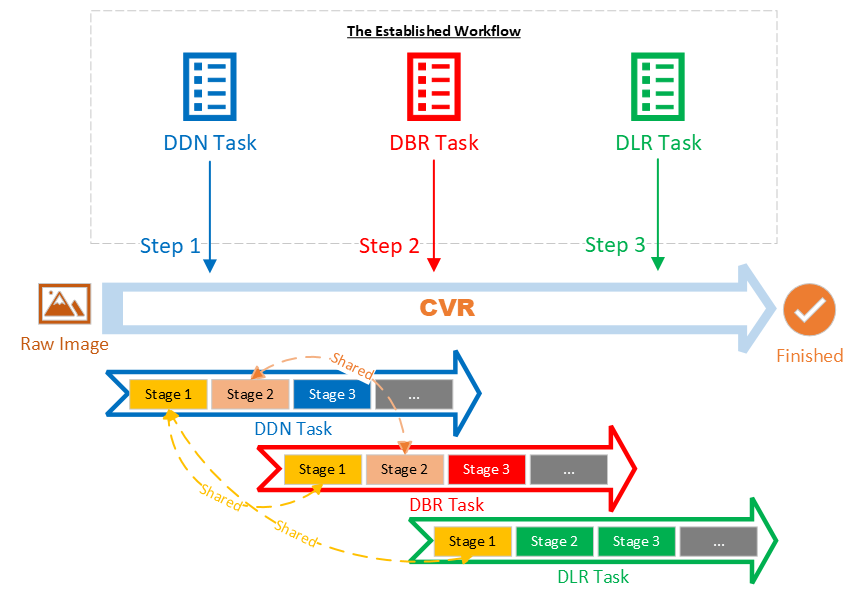

# Architecture of Dynamsoft Capture Vision

Dynamsoft Capture Vision (DCV) is a powerful SDK architecture designed to adapt to a variety of image-processing scenarios, enabling the extraction of useful information from images. Its structure accommodates both entry-level needs and sophisticated business logic. The design allows developers to quickly build conceptual prototypes within hours while also supporting complex customizations for more demanding tasks. In this article, we'll take a deep dive into the DCV architecture that makes this flexibility possible.

## Architecture Diagram

In the [introduction](../introduction/index.md), we introduced the following [functional products](../introduction/index.md#functional-products):

- **Dynamsoft Barcode Reader (DBR)**
- **Dynamsoft Label Recognizer (DLR)**
- **Dynamsoft Document Normalizer (DDN)**
- **Dynamsoft Code Parser (DCP)**
- **Dynamsoft Camera Enhancer (DCE)**

The diagram below illustrates the architecture of Dynamsoft Capture Vision (DCV) and how these functional products fit into it:

***Diagram 1: DCV Architecture***

---------------

As shown in the **Diagram**, all functional products are ***passive*** in the architecture. In other words, they either execute a task when instructed or process the results of another task: both of which are handled by the ***active*** component of the architecture, known as the **Capture Vision Router (CVR)**.

## Capture Vision Router

The **Capture Vision Router (CVR)** is the most critical component of the DCV architecture. As its name suggests, CVR functions as a router or coordinator. Let's break down its major responsibilities.

### Retrieving Images from the Image Source  

In the DCV architecture, an **image source** refers to any object that implements the [Image Source Adapter (ISA) interface](input.md#image-source-adapter). For example, **Dynamsoft Camera Enhancer (DCE)** is commonly used as an image source in applications utilizing Dynamsoft software.

At runtime, CVR accepts an image source and acts as the image input provider for functional products. Typically, this process is continuous and only ends when the image source is exhausted.

### Coordinating Processing Tasks

CVR accepts and maintains a list of processing settings known as [parameter template](../parameters/file/index.md). Each template defines the tasks to be performed on an image. These tasks can be configured to run either in parallel or sequentially.

At runtime, CVR selects a *CaptureVisionTemplate* and analyzes it to construct a task workflow, which then runs for all images acquired from the image source.

- For tasks that can run in parallel, CVR processes the next image as long as there is an available working thread to create a *functional product* instance. Read more about [Parallel Image-Processing](#parallel-image-processing).
- For tasks that must run in sequence, CVR ensures that each task follows the correct order of operations.

> There are two types of tasks. Learn more about [Image-Processing Tasks](./image-processing/index.md) and [Semantic-Processing Tasks](semantic-processing.md).

### Dispatching Results to Listening Objects

In the DCV architecture, a **listening object** refers to any object that implements either the [Captured Result Receiver (CRR) interface](output.md#captured-result-receiver) or the [Intermediate Result Receiver (IRR) interface](output.md#intermediate-result-receiver). There is no limit to the number of listening objects that CVR can configure.

As CVR processes images, different types of results are generated. These results are categorized into two main types:

1. **Final results** (*Captured Results*): These are the outputs of a completed task. Read more about them [here](output.md#final-results).

2. **Intermediate results**: These are results produced at various checkpoints during task execution.  
   > These checkpoints are called *stages*. These stages are further grouped into seven categories known as *image-processing sections*. Learn more about [Image-Processing Tasks](./image-processing/index.md).

The following diagram provides a simplified overview of the CVR workflow:

***Diagram 2: CVR Tasks***

---------------

## Architecture Advantages

With the help of **Capture Vision Router (CVR)**, the **DCV architecture** offers several advantages, previously introduced as [DCV Key Features](../introduction/index.md#key-features):

### Scalability with Pluggable Components

DCV was designed for **scalability**, leveraging **pluggable components**. Below are the key components that enable this flexibility:

1. **Image Source**: The source supplying images can be any object compliant with the [Image Source Adapter (ISA) interface](input.md#image-source-adapter).  
   > ISA is an open interface. Dynamsoft provides a skeleton implementation, allowing customers to create their own image sources (e.g., an image source that supplies images from the cloud).  
   > Customers can also use the following built-in options:  
   > - **Dynamsoft Camera Enhancer**: Captures frames from a live video stream.  
   > - **Directory Fetcher**: Supplies existing images from a directory.  

2. **Task Coordination**: Depending on business requirements, **CVR** can use multiple functional products simultaneously to process images and generate different results.  
   > CVR handles internal task coordination, allowing customer applications to use a unified API for retrieving multiple results.  

3. **Result Reusability**: Processed results can be reused multiple times simply by adding more listener objects.

### Flexibility with Customizable Workflows

Flexibility in DCV is achieved through "task coordination".  

**Task coordination** refers to how **CVR** establishes a workflow, linking different tasks and invoking functional products as needed.  

Consider the following **sample image**:

  

The required tasks for processing this image are:  

1. **Identify the document and extract it** (*DDN Task*).  
2. **Read the barcode** to retrieve the patient ID (*DBR Task*).  
3. **Extract text above the barcode** to determine COVID-19 test results (*DLR Task*).  

Here's a simple representation of "task coordination":

  
***Diagram 3: CVR Task Coordination***  

---------------

### High Performance with Shared Computations

DCV optimizes performance through **Intermediate Results Sharing** and **Parallel Image-Processing**.

#### **Intermediate Results Sharing**

Previously, we discussed how [CVR dispatches results to listening objects](#dispatching-results-to-listening-objects) and [coordinates processing tasks](#coordinating-processing-tasks). Some tasks share "common image analysis stages", allowing **intermediate results** to be reused across tasks.  

Here's a demonstration of **intermediate result sharing**:

  
***Diagram 4: Intermediate Results Sharing***  

---------------

At runtime, the following happens:  

1. **DDN Task** processes all three stages.  
2. **DBR Task** reuses results from DDN for stages 1 & 2 and processes only stage 3.  
3. **DLR Task** reuses results from DDN for stage 1 and processes stages 2 & 3.  

> **Note:**  
> 1. Real-world tasks typically involve more than three stages.  
> 2. A slow task that starts early may use an intermediate result generated by a later, faster task.

#### **Parallel Image-Processing**

As shown in **Diagram 3** above, CVR maintains a pool of functional product instances that can be invoked immediately for tasks. At runtime, CVR continuously acquires images and starts processing new ones as long as an idle instance is available.

> **Note:**  
> - Instances in the pool dynamically switch between different functional products (**DBR, DDN, DLR, DCP**).  
> - **CVR** determines and manages instance allocation at runtime.

### Simplicity with Packable Scenarios

One of the biggest advantages of the DCV architecture is its **simple outward-facing API**.  

Let's revisit the three core jobs of **CVR** (see [Capture Vision Router](#capture-vision-router) and *Diagram 2*):

| **Index** | **Description**                          | **Corresponding API of CVR**                                                                 |
|:---------:|-----------------------------------------|---------------------------------------------------------------------------------------------|
| **1**     | Retrieve images from the image source  | `SetInput()` accepts an image source.                                                      |
| **2**     | Coordinate processing tasks      | `InitSettings()` loads a parameter file defining workflows, and `StartCapturing()` executes a workflow. |
| **3**     | Dispatch results to listening objects  | `AddResultReceiver()` registers one or more listeners.                                     |

- Jobs 1 & 3 handle straightforward **input and output**.  
- Job 2 determines the **actual workflow and application behavior**.  

In some scenarios, workflows remain consistent, allowing predefined settings to be used. These settings are called `preset template`. Customers can simply select a template, reducing development effort. Read more about [common scenarios](../introduction/index.md#simplicity-with-packable-scenarios).

### Bidirectional Interactivity with Intermediate Results

Extracting meaningful information from images often requires **interactivity**. **DCV architecture** enables interaction through **intermediate results**, which facilitate:

#### **1. Timely Dispatch of Intermediate Results**

Each image-processing task comprises multiple **stages**, where some results are useful while others are not.  

For example, during barcode reading, one stage may *detect* the barcode location, and another may *decode* it. If decoding fails, users need to differentiate between a barcode *detected but not decoded* vs. one *fully processed*.  

To address this, we use a **listening object** with the [Intermediate Result Receiver (IRR) interface](output.md#intermediate-result-receiver). This object listens for localized barcodes and decoded barcodes, applying different visual cues.  

Here's a visual representation of how CVR dispatches intermediate results:

  
***Diagram 5: Intermediate Results Dispatching***  

---------------

#### **2. Elective Intervention in the Processing Workflow**

**DCV architecture** allows external intervention during image processing. The process works as follows:

1. A specific type of *intermediate result* is generated.  
2. CVR dispatches the result to a registered listener and pauses processing.  
3. The customer's code in the callback function receives the result.  
4. The code examines, modifies, and returns the result to CVR.  
5. CVR injects the updated data back into the workflow and resumes processing.  

Here's a visual demonstration of this process:

  
***Diagram 6: Intermediate Results Intervention***  
