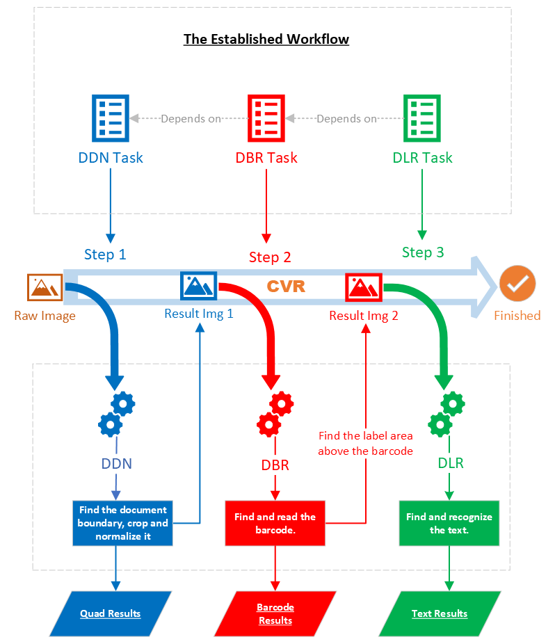
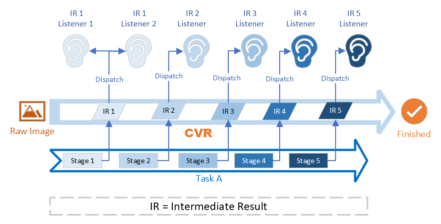

# Architecture of Dynamsoft Capture Vision

Dynamsoft Capture Vision (DCV) is a powerful SDK framework designed to adapt to a variety of different image processing scenarios in order to derive and extract useful information from images. The structure easily accommodates both entry-level needs and sophisticated business logic. The design enables developers to effortlessly build conceptual prototypes within hours, while leaving the door open for complex customizations for more demanding tasks. In this article, we'll take a deep dive into the DCV architecture that makes it all possible.

## Architecture Diagram

In the [introduction](../introduction/index.md), we have introduced the following [functional products](../introduction/index.md#functional-products):

- Dynamsoft Barcode Reader (DBR)
- Dynamsoft Label Recognizer (DLR)
- Dynamsoft Document Normalizer (DDN)
- Dynamsoft Code Parser (DCP)
- Dynamsoft Camera Enhancer (DCE)

The diagram below shows the architecture of Dynamsoft Capture Vision (DCV) and how these functional products fit into it:

> There are a few other functional products in the diagram but we can ignore them for now.

***Diagram 1: DCV Architecture***

As shown in diagram 1, all functional products are *passive* in the architecture. In other words, they are either told to perform a task or given the result of another task, both of which are done by the *active* part of the architecture known as **Capture Vision Router (CVR)**.

## Capture Vision Router

Capture Vision Router (CVR) is the most important part of the DCV architecture. As its names suggests, CVR works as a router or a coordinator. Let's break down the major responsibilities of CVR.

### Retrieve Images from the Image Source  

In the DCV architecture, an image source refers to an object that has implemented the [Image Source Adapter (ISA) interface](std-input.md#image-source-adapter). For example, Dynamsoft Camera Enhancer (DCE) is often used as an image source in applications that use Dynamsoft software.

At runtime, CVR accepts an image source and acts as an image input for the the functional products. Usually, this is a continuous process which ends when the image source is exhausted.

### Coordinate Image-Processing Tasks

CVR accepts and maintains a list of image-processing settings known as [CaptureVisionTemplates](../parameters/file/capture-vision-template.md). Each template defines the tasks to be performed on an image. These tasks may be configured to run in parallel or one after the other.

At runtime, CVR selects a *CaptureVisionTemplate* and analyzes it to build a task workflow, which then runs for all images acquired from the image source.

- For tasks that can run in parallel, CVR will start to process the next image as long as it has an extra working thread to create a functional product instance. Read more on [Parallel Image Processing](#parallel-image-processing).
- For tasks that must run in a sequence, CVR makes sure that each task follows the correctt order of operations.

> There are two type of tasks. Read more about [Image-Processing Tasks](image-processing/index.md) and [Semantic-Processing Tasks](semantic-processing.md).

### Dispatch Results to Listening Objects

In the DCV architecture, a listening object refers to an object that has implemented either the [Captured Result Receiver (CRR) interface](std-output.md#captured-result-receiver) or [Intermediate Result Receiver (IRR) interface](std-output.md#intermediate-result-receiver). There is no limit to the number of listening objects that CVR can configure.

As images are getting processed by CVR, different types of results can be produced. We categorize these results into two main categories:

1. *Final results*: also known as *Captured Results*. These are the results of a completed task.
   > There are 6 types of final results. Read more about them [here](std-output.md#final-results).
2. *Intermediate results*: these are results produced during the process of completing a task. They can be produced at multiple check-points of a task.
   > These check points are called *Stages*, and there are 27 stages at present. Read more on what a [divisible task](../parameters/file/task-settings/index.md#divisible-task) is.

The following diagram is a simple demostration of the CVR workflow:

***Diagram 2: CVR Tasks***

---------------

## Architecture Advantages

With the help of CVR, the DCV architecture has the following advantages (which were previously introduced as [DCV Key Features](../introduction/index.md#key-features)):

### Scalability with Pluggable Components

DCV was built with scalability at the forefront of the architectural design through the use of pluggable components. Here are the following *components* that play a part in demonstrating this scalability:

1. The "source" that supplies images to be processed can be any object that is compliant with the [Image Source Adapter (ISA) interface](std-input.md#image-source-adapter).
  > ISA is an open interface, and Dynamsoft provides a skeleton implementation based on which customers can build their own image sources. For example, an image source that supplies images from the cloud.
  > 
  > Customers can also choose to use the following options:
  > - **Dynamsoft Camera Enhancer**, a product that supplies frames from a live video stream
  > - **Directory Fetcher**, a utility class that supplies existing images from a directory
2. Depending on the business requirements, CVR can use up to four functional products to perform different tasks on the same image(s) and produce different types of results based on the functional product.
  > CVR takes care of task coordination internally, which means the customer application can use the same API to get different results.
3. These results can be reused multiple times simply by adding more listener objects.

### Flexibility with Customizable Workflows

In the DCV architecure, flexibility is achieved through task coordination.

Task coordination is a process in which CVR establishes a workflow connecting different tasks, and then calls upon the required functional products to perform these tasks on each image.

Let's take the following sample image as an example

***Figure 1: Sample Image***

The requirements are:

1. Accurately find the boundary of the patient **form** and normalize it. This is a *DDN* task.
2. Read the barcode **on the form** to get the patient ID. This is a *DBR* task.
3. Read the text **above the barcode** to determine whether the patient has tested positive for COVID-19. This is a *DLR* task.

Here is a simple demonstration of the coordination:

***Diagram 3: CVR Task Coordination***

### High Performance with Shared Computations

The interconnectivity of the different functional products in the DCV architecture allows the framework to optimize the performance of each product and thus the overall application. How this is achieved is through two core concepts of the CVR: *Intermediate Results Sharing* and *Parallel Image Processing*.

#### **Intermediate Results Sharing**

We talked about how CVR [dispatches results to listening objects](#dispatch-results-to-listening-objects), where we introduced intermediate results which are produced at multiple check-points, known as stages, of a task. Another responsibility of CVR that we touched upon is [coordinating image-processing tasks](#coordinate-image-processing-tasks), where we learned that multiple tasks can be configured in a single workflow.

Take the sample image in Figure 1 as an example. The image is first processed by *DDN*, then by *DBR*, and lastly by *DLR*. All three tasks analyze the pixels of an image to find results, and they share similar analysis "stages". Under certain conditions, they can share the results from these analysis stages so that one product (let's say *DBR*) can use the intermediate results produced by another functional product (let's say *DDN*), saving time and resources.

The following diagram is a simple demonstration of the idea:

***Diagram 4: Intermediate Results Sharing***

The diagram above shows that all three tasks share stage 1 while *DDN* & *DBR* share stage 2. When the workflow starts running, the following may happen:

1. The DDN task performs operations for all 3 stages;
2. The DBR task directly uses results from the DDN task for stages 1 & 2 and only needs to perform an operation for stage 3;
3. The DLR task directly uses the result from the DDN task and only needs to perform operations for stages 2 & 3.

> NOTE
> 1. Usually there are far more than 3 stages per task.
> 2. In real time, it is also likely for an early task to use the intermediate result of a later task.

#### **Parallel Image Processing**

As shown in diagram 3 above, CVR maintains a pool of instances consisting of functional product instances that can be invoked immediately for certain tasks. At runtime, CVR will continuously get images from the image source and starts processing a new image as long as there is at least one idle functional product instance to use.

> An instance in the pool can belong to any one of the functional products (DBR/DDN/DLR/DCP) at any given time. This is determined and maintained by CVR at runtime.

### Simplicity with Packable Scenarios

Another benefit of the DCV Architecture is that the outward interface is very simple. Let's revisit the three jobs for CVR introduced above (refer to [Capture Vision Router](#capture-vision-router) and "Diagram 2"):

| Index | Description                            | Corresponding API of CVR                                                                                                               |
| :-------- | :------------------------------------- | :------------------------------------------------------------------------------------------------------------------------------------- |
| Job 1     | Get Images from the Image Source.      | `SetInput()` accepts an image source.                                                                                                  |
| Job 2     | Coordinate Image-Processing Tasks.     | `InitSettings()` accepts a parameter file which defines one or multiple worflows and `StartCapturing()` specifies one workflow to use. |
| Job 3     | Dispatch Results to Listening Objects. | `AddResultReceiver()` accepts one or multiple listening objects.                                                                       |

Job 1 and 3 serve as "input" and "output" and are straightforward. In different applications, the real difference will be in job 2 where different arrangements of tasks mean applications may do completely different things. For some usage scenarios, the workflows are usually consistent, which allows settings to be predefined as ["CaptureVisionTemplates"](../parameters/file/capture-vision-template.md). We call these scenarios **packable scenarios**. Customers can specify one of these templates to use in their applications, simplifying the development work needed.

### Bidirectional Interactivity with Intermediate Results

In order to derive meaningful information from images, interaction is usually required. With the help of intermediate results, the DCV architecture facilitates the interaction in the following ways:

#### **Timely dispatch of intermediate results**

Each image-processing task consists of multiple stages. Each stage by itself is a substantial operation. For example, one stage may convert a colour image to grayscale and the next stage binarizes the grayscale image. Some of these results may not be very useful.

However, let's consider the barcode reading process. One stage may find the exact location of a barcode and another will decode the barcode to get the text. In some cases, a barcode may be localized but fail the decoding stage and we want the user to notice the difference. To do this, we add a listening object compatible with the [Intermediate Result Receiver (IRR) interface](std-output.md#intermediate-result-receiver) and listen for localized barcodes and decoded barcodes, then highlight these barcodes with different colours or with some other flag.

Intermediate results are generated throughout the execution of a task and CVR makes sure that these results are immediately dispatched to all registered listeners. The following diagram is a simple demostration of this.

***Diagram 5: Intermediate Results Dispatching***

#### **Elective intervention of the processing workflow**

The DCV architecture allows external programs to intervene in image processing. The steps are

1. A specific type of intermediate result is generated;
2. CVR dispatches the result to a registered listener A and pauses image processing;
3. Customer's code in the callback function for listener A receives the result;
4. The code examines the result, makes some changes, and sends it back to CVR;
5. CVR injects the updated data back and resumes image processing.
  
The following diagram is a simple demostration of this process

***Diagram 6: Intermediate Results Intervention***
