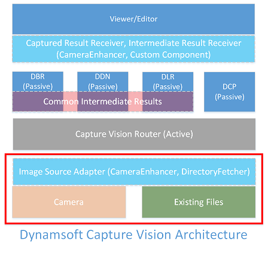

> *Go back to [DCV Architecture](index.md)*

# Input



In the Dynamsoft Capture Vision (DCV) architecture, "input" is what supplies the images to be processed, and we usually call it "the image source".

An image source refers to an object that has implemented the [Image Source Adapter (ISA)](input.md#image-source-adapter) interface.

## Image Source Adapter

"Image Source Adapter" (ISA) is the interface that plugs an image source into a DCV application. The interface is designed to have the following features:

1. Return an image when requested by [Capture Vision Router (CVR)](index.md#capture-vision-router)
2. Maintain an image buffer to allow instant access of images (save the time it takes to open image files)

### Return an image when requested

This is the design purpose for an image source. To make it easy to use, ISA requires the following methods:

1. A method to return how many images are available. For example, `getImageCount()`
2. A method to check whether a specific image is available. For example, `hasImage()`
3. A method to set the order in which images are returned. For example, `setNextImageToReturn()`
4. A method to actually return an image. For example, `getImage()`

### Maintain an image buffer

This is to facilitate the returning of images by building up a buffer area. ISA requires the following methods to achieve it:

1. A method to add images. For example, `addImageToBuffer()`
2. Methods to control the buffer size. For example, `setMaxImageCount()` and `getMaxImageCount()`
3. Methods to control when to build the buffer. For example, `startFetching()` and `stopFetching()`
4. Methods to handle buffer overflow. For example, `setBufferOverflowProtectionMode()` and `getBufferOverflowProtectionMode()`
5. Other utility methods like `isBufferEmpty()` and `hasNextImageToFetch()`

## ISA Implementation

An image source is usually required when creating a DCV application. In most cases, developers can directly use one of the following ready-made implementations in their application:

### Dynamsoft Camera Enhancer

Dynamsoft Camera Enhancer (DCE) is available on Web and Mobile platforms. It enables the users to do the following:

1. Control cameras
2. Acquire image frames from a live video stream
3. Provide basic user interaction

As it has implemented the ISA interface, we can directly use it as an image source. For example:

<div class="sample-code-prefix template2"></div>
   >- JavaScript
   >- Android
   >- Objective-C
   >- Swift
   >
>
```javascript
let captureVisionRouter = Dynamsoft.CVR.CaptureVisionRouter.createInstance();
let cameraEnhancer = Dynamsoft.DCE.CameraEnhancer.createInstance();
captureVisionRouter.setInput(cameraEnhancer);
```
>
```java
// Obtain current runtime settings of `reader` instance.
PublicRuntimeSettings settings = reader.getRuntimeSettings();
settings.region.regionTop = 10;
settings.region.regionBottom = 90;
settings.region.regionLeft = 10;
settings.region.regionRight = 90;
settings.region.regionMeasuredByPercentage = 1;
settings.barcodeFormatIds = EnumBarcodeFormat.BF_QR_CODE | EnumBarcodeFormat.BF_ONED;
// Update the settings.
reader.updateRuntimeSettings(settings);
```
>
```objc
NSError* err = nil;
// Obtain current runtime settings of `reader` instance.
iPublicRuntimeSettings* settings = [reader getRuntimeSettings:&err];
settings.region.regionTop = 10;
settings.region.regionBottom = 90;
settings.region.regionLeft = 10;
settings.region.regionRight = 90;
settings.region.regionMeasuredByPercentage = 1;
// Update the settings.
[reader updateRuntimeSettings:settings error:&err];
```
>
```swift
// Obtain current runtime settings of `barcodeReader` instance.
let settings = try? barcodeReader.getRuntimeSettings()
settings?.region.regionTop = 10
settings?.region.regionBottom = 90
settings?.region.regionLeft = 10
settings?.region.regionRight = 90
settings?.region.regionMeasuredByPercentage = 1
// Update the settings.
try? barcodeReader.updateRuntimeSettings(settings!)
```

### Directory Fetcher

Directory Fetcher is available on Mobile and Desktop/Server Platforms. It enables users to simulate a directory containing images as an image source. For example:

<div class="sample-code-prefix template2"></div>
   >- Android
   >- Objective-C
   >- Swift
   >- Python
   >- Java
   >- C#
   >- C++
   >- C
   >
>
```java
// Obtain current runtime settings of `reader` instance.
PublicRuntimeSettings settings = reader.getRuntimeSettings();
settings.region.regionTop = 10;
settings.region.regionBottom = 90;
settings.region.regionLeft = 10;
settings.region.regionRight = 90;
settings.region.regionMeasuredByPercentage = 1;
settings.barcodeFormatIds = EnumBarcodeFormat.BF_QR_CODE | EnumBarcodeFormat.BF_ONED;
// Update the settings.
reader.updateRuntimeSettings(settings);
```
>
```objc
NSError* err = nil;
// Obtain current runtime settings of `reader` instance.
iPublicRuntimeSettings* settings = [reader getRuntimeSettings:&err];
settings.region.regionTop = 10;
settings.region.regionBottom = 90;
settings.region.regionLeft = 10;
settings.region.regionRight = 90;
settings.region.regionMeasuredByPercentage = 1;
// Update the settings.
[reader updateRuntimeSettings:settings error:&err];
```
>
```swift
// Obtain current runtime settings of `barcodeReader` instance.
let settings = try? barcodeReader.getRuntimeSettings()
settings?.region.regionTop = 10
settings?.region.regionBottom = 90
settings?.region.regionLeft = 10
settings?.region.regionRight = 90
settings?.region.regionMeasuredByPercentage = 1
// Update the settings.
try? barcodeReader.updateRuntimeSettings(settings!)
```
>
```python
# Obtain current runtime settings of `reader` instance.
settings = reader.get_runtime_settings()
settings.region.region_top = 10
settings.region.region_bottom = 90
settings.region.region_left = 10
settings.region.region_right = 90
settings.region.region_measured_by_percentage = 1
# Update the settings.
reader.update_runtime_settings(settings)
```
>
```java
// Obtain current runtime settings of `reader` instance.
PublicRuntimeSettings settings = reader.getRuntimeSettings();
settings.region.regionTop = 10;
settings.region.regionBottom = 90;
settings.region.regionLeft = 10;
settings.region.regionRight = 90;
settings.region.regionMeasuredByPercentage = 1;
settings.barcodeFormatIds = EnumBarcodeFormat.BF_ONED | EnumBarcodeFormat.BF_QR_CODE;
// Update the settings.
reader.updateRuntimeSettings(settings);
```
>
```c#
// Obtain current runtime settings of `reader` instance.
PublicRuntimeSettings settings = reader.GetRuntimeSettings();
settings.Region.RegionTop = 10;
settings.Region.RegionBottom = 90;
settings.Region.RegionLeft = 10;
settings.Region.RegionRight = 90;
settings.Region.RegionMeasuredByPercentage = 1;
// Update the settings.
reader.UpdateRuntimeSettings(settings);
```
>
```c++
PublicRuntimeSettings settings;
char szErrorMsg[256] = {0};
// Obtain current runtime settings of `reader` instance.
reader.GetRuntimeSettings(&settings);
settings.region.regionTop = 10;
settings.region.regionBottom = 90;
settings.region.regionLeft = 10;
settings.region.regionRight = 90;
settings.region.regionMeasuredByPercentage = 1;
// Update the settings.
reader.UpdateRuntimeSettings(&settings, szErrorMsg, 256);
```
>
```c
PublicRuntimeSettings settings;
char szErrorMsg[256] = {0};
// Obtain current runtime settings of `reader` instance.
DBR_GetRuntimeSettings(reader, &settings);
settings.region.regionTop = 10;
settings.region.regionBottom = 90;
settings.region.regionLeft = 10;
settings.region.regionRight = 90;
settings.region.regionMeasuredByPercentage = 1;
// Update the settings.
DBR_UpdateRuntimeSettings(reader, &settings, szErrorMsg, 256);
```

### Custom Implementation

An ISA implementation requires more than ten methods, which is not easy to do. Therefore, Dynamsoft provides a base class to help developers build their own. Check out the definition of the class for more information:

<div class="sample-code-prefix template2"></div>
   >- JavaScript
   >- Android
   >- Objective-C
   >- Swift
   >- Python
   >- Java
   >- C#
   >- C++
   >- C
   >
>
```javascript
abstract class ImageSourceAdapter {
    constructor() { };
    /**
     * User has to implement this method themselves.
     */
    abstract hasNextImageToFetch: () => boolean;
    /**
     * Add images (of the type DSImageData) to the buffer.
     * This method will check if _isfetchingStarted is true. If not, it will refuse to add the image to buffer
     */
    addImageToBuffer: (image: Core.BasicStructures.DSImageData) => void;
    /**
     * Returns a buffered image.
     * @param removeFromBuffer Whether ISA should remove the image from Buffer after it is returned. `true` by default
     */
    getImage: (removeFromBuffer?: boolean) => Promise<Core.BasicStructures.DSImageData>;
    // Set _isfetchingStarted to true 
    startFetching: () => void;
    // Set _isfetchingStarted to false
    stopFetching: () => void;
    /**
     * This method can set the processing priority of an image.
     */
    setNextImageToReturn: (imageId: number, keepInBuffer?: boolean) => void;
    hasImage: (imageId: number) => boolean;
    /**
     * Sets how many images are allowed to be buffered.
     * @param recommendation: A class that implements the interface
     * should try to keep the buffer full if at all possible.*/
    setMaxImageCount: (count: number) => void;
    /**
     * Returns how many images can be buffered. 
     */
    getMaxImageCount: () => number;
    /**
     * Returns the actual count of buffered images. 
     */
    getImageCount: () => number;
    /**
     * Sets a mode that determines the action to take when there
     * is a new incoming image and the buffer is full.
     * @param mode specifies the mode
     * Allowed methods are defined in EnumBufferOverflowProtectionMode.
     */
    setBufferOverflowProtectionMode: (mode: Core.BasicStructures.EnumBufferOverflowProtectionMode) => void;
    getBufferOverflowProtectionMode: () => Core.BasicStructures.EnumBufferOverflowProtectionMode;
    /**
     * Determines whether the buffer is empty.
     */
    isBufferEmpty: () => boolean;
```
>
```objc
NSError* err = nil;
// Obtain current runtime settings of `reader` instance.
iPublicRuntimeSettings* settings = [reader getRuntimeSettings:&err];
settings.region.regionTop = 10;
settings.region.regionBottom = 90;
settings.region.regionLeft = 10;
settings.region.regionRight = 90;
settings.region.regionMeasuredByPercentage = 1;
// Update the settings.
[reader updateRuntimeSettings:settings error:&err];
```
>
```swift
// Obtain current runtime settings of `barcodeReader` instance.
let settings = try? barcodeReader.getRuntimeSettings()
settings?.region.regionTop = 10
settings?.region.regionBottom = 90
settings?.region.regionLeft = 10
settings?.region.regionRight = 90
settings?.region.regionMeasuredByPercentage = 1
// Update the settings.
try? barcodeReader.updateRuntimeSettings(settings!)
```
>
```python
# Obtain current runtime settings of `reader` instance.
settings = reader.get_runtime_settings()
settings.region.region_top = 10
settings.region.region_bottom = 90
settings.region.region_left = 10
settings.region.region_right = 90
settings.region.region_measured_by_percentage = 1
# Update the settings.
reader.update_runtime_settings(settings)
```
>
```java
// Obtain current runtime settings of `reader` instance.
PublicRuntimeSettings settings = reader.getRuntimeSettings();
settings.region.regionTop = 10;
settings.region.regionBottom = 90;
settings.region.regionLeft = 10;
settings.region.regionRight = 90;
settings.region.regionMeasuredByPercentage = 1;
settings.barcodeFormatIds = EnumBarcodeFormat.BF_ONED | EnumBarcodeFormat.BF_QR_CODE;
// Update the settings.
reader.updateRuntimeSettings(settings);
```
>
```c#
// Obtain current runtime settings of `reader` instance.
PublicRuntimeSettings settings = reader.GetRuntimeSettings();
settings.Region.RegionTop = 10;
settings.Region.RegionBottom = 90;
settings.Region.RegionLeft = 10;
settings.Region.RegionRight = 90;
settings.Region.RegionMeasuredByPercentage = 1;
// Update the settings.
reader.UpdateRuntimeSettings(settings);
```
>
```c++
PublicRuntimeSettings settings;
char szErrorMsg[256] = {0};
// Obtain current runtime settings of `reader` instance.
reader.GetRuntimeSettings(&settings);
settings.region.regionTop = 10;
settings.region.regionBottom = 90;
settings.region.regionLeft = 10;
settings.region.regionRight = 90;
settings.region.regionMeasuredByPercentage = 1;
// Update the settings.
reader.UpdateRuntimeSettings(&settings, szErrorMsg, 256);
```
>
```c
PublicRuntimeSettings settings;
char szErrorMsg[256] = {0};
// Obtain current runtime settings of `reader` instance.
DBR_GetRuntimeSettings(reader, &settings);
settings.region.regionTop = 10;
settings.region.regionBottom = 90;
settings.region.regionLeft = 10;
settings.region.regionRight = 90;
settings.region.regionMeasuredByPercentage = 1;
// Update the settings.
DBR_UpdateRuntimeSettings(reader, &settings, szErrorMsg, 256);
```
