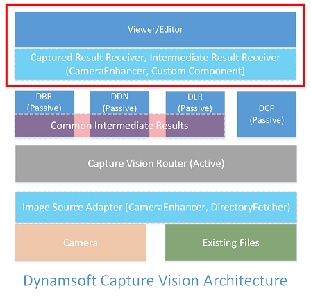

> *Go back to [DCV Architecture](index.md)*

# Output



As the last piece of the Dynamsoft Capture Vision (DCV) architecture, "output" is responsible for transporting the image-processing results to objects that logically depend on them.

A standard output target is an object that has implemented either the [Captured Result Receiver (CRR) interface](#captured-result-receiver) or [Intermediate Result Receiver (IRR) interface](#intermediate-result-receiver). The two interfaces both consist of multiple callback functions, therefore, a standard output target is usually referred to as a **listening object**.

## Captured Result Receiver

Captured Result Receiver (CRR) is an interface for the output of "final results".

### Final results

Final results refer to the following 6 types of results:

1. The original image
2. Barcode text found on the image
3. Text lines found on the image
4. Document boundaries found on the image
5. Normalized image based on a detected document boundary
6. Data tables parsed from barcode text or text line(s) found on the image

These results are "final" because they are only returned after an image has finished processing. In other words, for each image, the CRR callback functions are only triggered once. 

The CRR interface consists of 

1. A callback function that returns all six types of results. This function is always triggered.
2. Six other callback functions for each of the six types of results. These functions are only triggered when their corresponding types of results exist.

<div class="sample-code-prefix template2"></div>
   >- JavaScript
   >- Android
   >- Objective-C
   >- Swift
   >- Python
   >- Java
   >- C#
   >- C++
   >- C
   >
>
```javascript
export interface CapturedResultReceiver {
    /**
     * All results found on the image are returned through this callback.
     * This callback is always triggered.
     */
    onCapturedResultReceived?: (pResult: Core.BasicStructures.CapturedResult) => void;
    /**
     * This callback is only triggered when the raw or original image is set to be returned.
     */
    onRawImageResultReceived?: (pResult: RawImageResultItem) => void;
    /**
     * This callback is only triggered when barcodes are found on the image.
     */
    onDecodedBarcodesReceived?: (pResult: DBR.DecodedBarcodesResult) => void;
    /**
     * This callback is only triggered when text-lines are found on the image.
     */
    onRecognizedTextLinesReceived?: (pResult: DLR.RecognizedTextLinesResult) => void;
    /**
     * This callback is only triggered when document boundary quads are detected on the image.
     */
    onDetectedQuadsReceived?: (pResult: DDN.DetectedQuadsResult) => void;
    /**
     * This callback is only triggered when the image has been normalized successfully.
     */
    onNormalizedImagesReceived?: (pResult: DDN.NormalizedImageResult) => void;
    /**
     * This callback is only triggered when there are parsed results on the image.
     */
    onParsedResultsReceived?: (pResult: DCP.ParsedResult) => void;
}
```
>
```objc
To-add
```
>
```swift
To-add
```
>
```python
To-add
```
>
```java
To-add
```
>
```c#
To-add
```
>
```c++
To-add
```
>
```c
To-add
```

## Intermediate Result Receiver

Intermediate Result Receiver (IRR) is an interface for the output of intermediate results. Intermediate results refer to the following 27 types of results:

1. Pre-detected regions unit
2. Localized barcodes unit
3. Decoded barcodes unit
4. Localized text lines unit
5. Recognized text lines unit
6. Detected quads unit
7. Normalized images unit
8. Colour Image unit
9. Down-scaled colour image unit
10. Grayscale image unit
11. Transformed grayscale image unit
12. Enhanced grayscale image unit
13. Binarized image unit
14. Texture detection result unit
15. Texture removed grayscale image unit
16. Texture removed binary image unit
17. Contours unit
18. Line segments unit
19. Text zones unit
20. Text removed binary image unit
21. Long lines unit
22. Corners unit
23. Candidate quad edges unit
24. Candidate barcode zones unit
25. Up-scaled barcode image unit
26. Deformation resisted barcode image unit
27. Complemented barcode image unit

These results are "intermediate" because they are generated while the image is getting processed for the "final" results. For each image, the IRR callback functions are triggered as soon as certain types of results are generated.

> For the JavaScript Edition, due to technical restrictions, these results are returned after the image has finished processing.

The IRR interface consists of 27 callback functions for each of the 27 types of results.
<div class="sample-code-prefix template2"></div>
   >- JavaScript
   >- Android
   >- Objective-C
   >- Swift
   >- Python
   >- Java
   >- C#
   >- C++
   >- C
   >
>
```javascript
interface IntermediateResultReceiver {
    /**
     * This callback is triggered when regions of interest are pre-detected.
     */
    onPredetectedRegionsReceived?: (targetROIDefName: string,
        taskName: string,
        unit: PredetectedRegionsUnit
    ) => void;
    /**
     * This callback is triggered when barcodes are localized.
     */
    onLocalizedBarcodesReceived?: (targetROIDefName: string,
        taskName: string,
        unit: DBR.IntermediateResult.LocalizedBarcodesUnit) => void;
    /**
     * This callback is triggered when barcodes are decoded.
     */
    onDecodedBarcodesReceived?: (targetROIDefName: string,
        taskName: string,
        unit: DBR.IntermediateResult.DecodedBarcodesUnit) => void;
    /**
     * This callback is triggered when text-lines are localized.
     */
    onLocalizedTextLinesReceived?: (targetROIDefName: string,
        taskName: string,
        unit: DLR.IntermediateResult.LocalizedTextLinesUnit) => void;
    /**
     * This callback is triggered when text-lines are recognized.
     */
    onRecognizedTextLinesReceived?: (targetROIDefName: string,
        taskName: string,
        unit: DLR.IntermediateResult.RecognizedTextLinesUnit) => void;
    /**
     * This callback is triggered when document boundary quads are detected.
     */
    onDetectedQuadsReceived?: (targetROIDefName: string,
        taskName: string,
        unit: DDN.IntermediateResult.DetectedQuadsUnit) => void;
    /**
     * This callback is triggered when the image is normalized.
     */
    onNormalizedImagesReceived?: (targetROIDefName: string,
        taskName: string,
        unit: DDN.IntermediateResult.NormalizedImageUnit) => void;
    /**
     * This callback is triggered when a coloured image is produced.
     */
    onColourImageUnitReceived?: (targetROIDefName: string,
        taskName: string,
        sectionType: EnumSectionType,
        unit: ColourImageUnit) => void;
    /**
     * This callback is triggered when the coloured images is down-scaled.
     */
    onScaledDownColourImageUnitReceived?: (targetROIDefName: string,
        taskName: string,
        sectionType: EnumSectionType,
        unit: ScaledDownColourImageUnit) => void;
    /**
     * This callback is triggered when the coloured images is converted to grayscale.
     */
    onGrayscaleImageUnitReceived?: (targetROIDefName: string,
        taskName: string,
        sectionType: EnumSectionType,
        unit: GrayscaleImageUnit) => void;
    /**
     * This callback is triggered when the grayscale image is transformed (usually this means all the pixels have their colour inverted).
     */
    onTransformedGrayscaleImageUnitReceived?: (targetROIDefName: string,
        taskName: string,
        sectionType: EnumSectionType,
        unit: TransformedGrayscaleImageUnit) => void;
    /**
     * This callback is triggered when the quality of the grayscale image is enhanced.
     */
    onEnhancedGrayscaleImageUnitReceived?: (targetROIDefName: string,
        taskName: string,
        sectionType: EnumSectionType,
        unit: EnhancedGrayscaleImageUnit) => void;
    /**
     * This callback is triggered when the grayscale image is binarized.
     */
    onBinaryImageUnitReceived?: (targetROIDefName: string,
        taskName: string,
        sectionType: EnumSectionType,
        unit: BinaryImageUnit) => void;
    /**
     * This callback is triggered when texture is detected on the image.
     */
    onTextureDetectionResultUnitReceived?: (targetROIDefName: string,
        taskName: string,
        sectionType: EnumSectionType,
        unit: TextureDetectionResultUnit) => void;
    /**
     * This callback is triggered when texture is removed from the grayscale image.
     */
    onTextureRemovedGrayscaleImageUnitReceived?: (targetROIDefName: string,
        taskName: string,
        sectionType: EnumSectionType,
        unit: TextureRemovedGrayscaleImageUnit) => void;
    /**
     * This callback is triggered when texture is removed from the binary image.
     */
    onTextureRemovedBinaryImageUnitReceived?: (targetROIDefName: string,
        taskName: string,
        sectionType: EnumSectionType,
        unit: TextureRemovedBinaryImageUnit) => void;
    /**
     * This callback is triggered when contours are found on the image.
     */
    onContoursUnitReceived?: (targetROIDefName: string,
        taskName: string,
        sectionType: EnumSectionType,
        unit: ContoursUnit) => void;
    /**
     * This callback is triggered when line segments are found on the image.
     */
    onLineSegmentsUnitReceived?: (targetROIDefName: string,
        taskName: string,
        sectionType: EnumSectionType,
        unit: LineSegmentsUnit) => void;
    /**
     * This callback is triggered when text zones are found on the image.
     */
    onTextZonesUnitReceived?: (targetROIDefName: string,
        taskName: string,
        sectionType: EnumSectionType,
        unit: TextZonesUnit) => void;
    /**
     * This callback is triggered when an image without text is produced.
     */
    onTextRemovedBinaryImageUnitReceived?: (targetROIDefName: string,
        taskName: string,
        sectionType: EnumSectionType,
        unit: TextRemovedBinaryImageUnit) => void;
    /**
     * This callback is triggered when long lines are found on the image.
     */
    onLongLinesUnitReceived?: (targetROIDefName: string,
        taskName: string,
        unit: DDN.IntermediateResult.LongLinesUnit) => void;
    /**
     * This callback is triggered when corners are found on the image.
     */
    onCornersUnitReceived?: (targetROIDefName: string,
        taskName: string,
        unit: DDN.IntermediateResult.CornersUnit) => void;
    /**
     * This callback is triggered when candidate quad edges are found on the image.
     */
    onCandidateQuadEdgesUnitReceived?: (targetROIDefName: string,
        taskName: string,
        unit: DDN.IntermediateResult.CandidateQuadEdgesUnit) => void;
    /**
     * This callback is triggered when candidate barcode zones are found on the image.
     */
    onCandidateBarcodeZonesUnitReceived?: (targetROIDefName: string,
        taskName: string,
        unit: DBR.IntermediateResult.CandidateBarcodeZonesUnit) => void;
    /**
     * This callback is triggered when the barcode zones are up-scaled for better decoding.
     */
    onScaledUpBarcodeImageUnitReceived?: (targetROIDefName: string,
        taskName: string,
        unit: DBR.IntermediateResult.ScaledUpBarcodeImageUnit) => void;
    /**
     * This callback is triggered when deformation of the barcode zones is corrected.
     */
    onDeformationResistedBarcodeImageUnitReceived?: (targetROIDefName: string,
        taskName: string,
        unit: DBR.IntermediateResult.DeformationResistedBarcodeImageUnit) => void;
    /**
     * This callback is triggered when
     */
    onComplementedBarcodeImageUnitReceived?: (targetROIDefName: string,
        taskName: string,
        unit: DBR.IntermediateResult.ComplementedBarcodeImageUnit) => void;
}
```
>
```objc
To-add
```
>
```swift
To-add
```
>
```python
To-add
```
>
```java
To-add
```
>
```c#
To-add
```
>
```c++
To-add
```
>
```c
To-add
```
