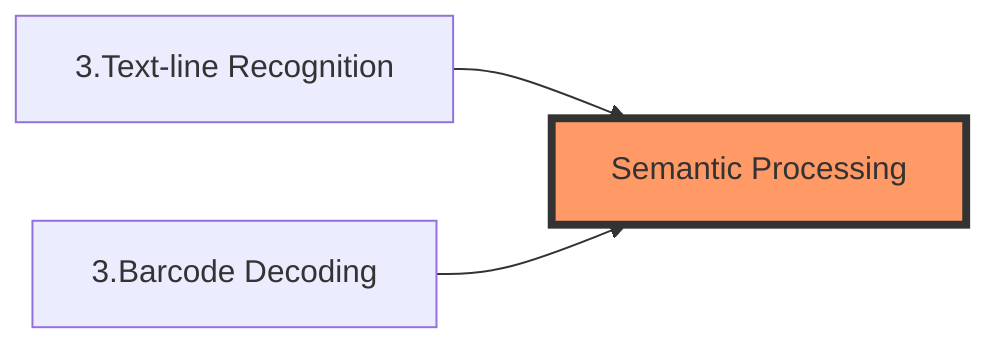
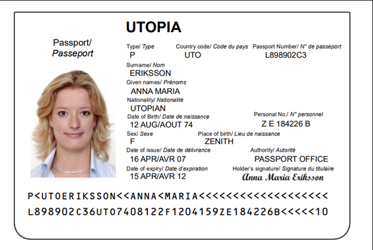

# Semantic Processing

A semantic processing operation usually follows [Text-line Recognition](image-processing/textline-recognition.md) or [Barcode Decoding](image-processing/barcode-decoding.md):



## What is Semantic Processing

The purpose of "Semantic Processing" is to make the recognized text more user friendly. At present, it means to parse a text, which follows a specific specification, into fields. For example, on this sample passport image



we can find the MRZ and recognize the following text lines

```text
P<UTOERIKSSON<<ANNA<MARIA<<<<<<<<<<<<<<<<<<<
L898902C36UTO7408122F1204159ZE184226B<<<<<10
```

these lines make no sense to a human eye, so we parse it with "Semantic Processing" and with a bit more code, the result becomes

```text
Document Type : PASSPORT (TD-3)
Issuing State : UTO
Surname : ERIKSSON
Given Name : ANNA MARIA
Passport Number : L898902C3
Nationality : UTO
Date of Birth (YYYY-MM-DD) : 1974-08-12
Gender : F
Date of Expiry (YYYY-MM-DD) : 2012-04-15
```
