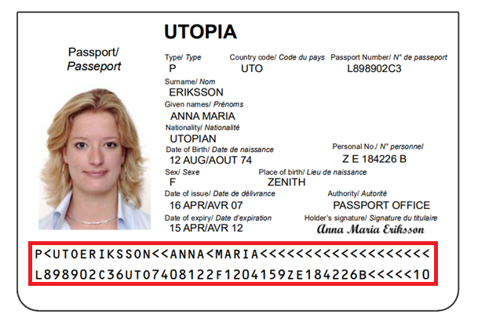

# Semantic Processing

A semantic processing operation usually follows either a "Read barcodes" task or a "Recognize text lines" task.

## What is Semantic Processing?

The purpose of semantic processing is to make recognized text more user-friendly. Currently, this means parsing text that follows a specific format into structured fields.  

For example, in the following passport image:



A "Recognize text lines" task extracts the following lines:

```text
P<UTOERIKSSON<<ANNA<MARIA<<<<<<<<<<<<<<<<<<<
L898902C36UTO7408122F1204159ZE184226B<<<<<10
```

By itself, this text may not be easily readable. However, using a "Semantic Processing" task, we can parse it into meaningful fields. With some additional processing, the result becomes:

```text
Document Type : PASSPORT (TD-3)
Issuing State : UTO
Surname : ERIKSSON
Given Name : ANNA MARIA
Passport Number : L898902C3
Nationality : UTO
Date of Birth (YYYY-MM-DD) : 1974-08-12
Gender : F
Date of Expiry (YYYY-MM-DD) : 2012-04-15
```
