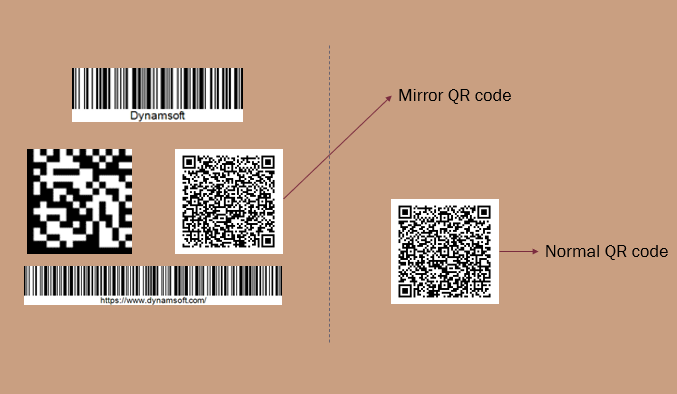

# BarcodeFormatSpecification Object

`BarcodeFormatSpecification` is able to set configurations for specified barcode formats. You can leave this area empty to use the default barcode reading settings.

```json
{
    "Name":"BFS_1",
    "AllModuleDeviation" : 0,
    "AustralianPostEncodingTable" : "C",
    "EnableAddOnCode": 0, 
    "BarcodeAngleRangeArray" : [
        {
            "MinValue": 100,
            "MaxValue": 200
        }
    ],
    "BarcodeBytesLengthRangeArray" : [
        {
            "MinValue": 100,
            "MaxValue": 200
        }
    ],
    "BarcodeComplementModes" : [
        {
            "Mode": "BCM_GENERAL" 
        }
    ],
    "BarcodeFormatIds" : ["BF_DATAMATRIX"],
    "BarcodeHeightRangeArray" : [
        {
            "MinValue": 100,
            "MaxValue": 200
        }
    ],
    "BarcodeTextLengthRangeArray" : [
        {
            "MinValue": 100,
            "MaxValue": 200
        }
    ],
    "BarcodeTextRegExPattern" : " ^([*].+[*]|[+].+[+])$",
    "BarcodeWidthRangeArray" : [
        {
            "MinValue": 100,
            "MaxValue": 200
        }
    ],
    "BarcodeZoneBarCountRangeArray" : [
        {
            "MinValue": 1,
            "MaxValue": 128
        }
    ],
    "BarcodeZoneMinDistanceToImageBorders" : 1,
    "Code128Subset" : "A",
    "DataMatrixSizeOptions": ["DMS_DEFAULT"],
    "DataMatrixModuleIsotropic": 1
    "DeformationResistingModes" : [
        {
            "Mode": "DRM_GENERAL", 
            "Level": 1
        }
    ],
    "FindUnevenModuleBarcode" : 1,
    "HeadModuleRatio" : "211412",
    "MinQuietZoneWidth" : 1,
    "MinRatioOfBarcodeZoneWidthToHeight" : 100,
    "MinResultConfidence" : 30,
    "MirrorMode" : "MM_NORMAL",
    "ModuleSizeRangeArray" : [
        {
            "MinValue": 3,
            "MaxValue": 20
        }
    ],
    "MSICodeCheckDigitCalculation" : "MSICCDC_MOD_10",
    "PartitionModes" : ["PM_WHOLE_BARCODE"],
    "RequireStartStopChars" : 1,
    "ReturnPartialBarcodeValue" : 1,
    "StandardFormat" : "BF_CODE128",
    "TailModuleRatio" : "2331112",
    "VerifyCheckDigit" : 1
}
```


## Usage Instructions

### Parameter Configurations

**Set target barcode format**

Sets `BarcodeFormatIds` to specify which barcode format the current FormatSpecification configuration is applied to. View enumeration [BarcodeFormats]({{site.dcvb_enums}}barcode-reader/barcode-format.html) for all supported barcode formats.

**Set special configurations for target format**

The design intent of `BarcodeFormatSpecification` is to do special processing for specific barcode format while not affecting the decoding of other barcode types.

In other words, settings in `BarcodeFormatSpecification` have a higher priority when conflicting with global settings. For example:

<div align="center">
   <p></p>
</div>

Sometimes the image and the real scene happen to be mirror images of each other. For 2D barcodes, mirroring may cause the decoding to fail. In this case, all barcodes are normal except QR code, we could configure the MirrorMode to correct the situation:

```json
{
        "Name": "BFS_mirror", 
        "BarcodeFormatIds": ["BF_QR_CODE"], 
        "MirrorMode":"MM_MIRROR"
}
```

### Quick Settings

Based on a existing `BarcodeFormatSpecification` object, you can use `BaseBarcodeFormatSpecificationName` with other minor changes to configure a new `BarcodeFormatSpecification` object. For example；

```json
{
    "Name":"BFS_0",
    "BarcodeFormatIds" : ["BF_DATAMATRIX"],
    "BinarizationModes" : [
        {
            "Mode": "BM_LOCAL_BLOCK",
            "BlockSizeX": 5,
            "BlockSizeY": 5,
        }
    ]
},
{
    "Name":"BFS_1",    
    "BaseBarcodeFormatSpecificationName" : "BFS_0", // Use the same settings with BFS_0 but add little changes.
    "MinResultConfidence" : 20
}
```

### Additional Annotations

`BarcodeReaderTaskSetting` determines how a barcode reader task works from initializing to finializing. As a parameter of `BarcodeReaderTaskSetting`, `BarcodeFormatSpecification` decides how the barcodes are processed when they are detected in the barcode reader task. A group of default settings has been allocated for the `BarcodeFormatSpecification` so that the `BarcodeReaderTaskSetting` still works without specifying `BarcodeFormatSpecification` parameters.