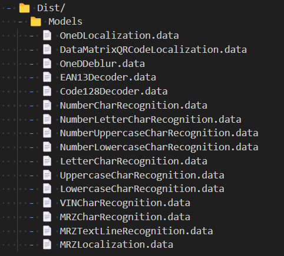

---   
layout: default-layout
title:  CaptureVisionModel - Dynamsoft Capture Vision Parameter File
description: The CaptureVisionModel object in the Dynamsoft Capture Vision Parameter File defines how the models are found and works.
keywords: CaptureVisionModel
needAutoGenerateSidebar: true
noTitleIndex: true
---

# CaptureVisionModel Object

A `CaptureVisionModel` object defines how the library find Convolutional Neural Networks (CNN) model files that support the barcode decoding, character recognition and text line recognition. All the officially provided model files are shown in the image below.

<div align="center">
   <p></p>
   <p>Supported CaptureVisionModel files</p>
</div>

## Example

```json
{
    "Name": "NumberLetterCharRecognition",
    "DirectoryPath": "D:\\CaptureVisionModel\\",
    "MaxModelInstances": 1,
    "ModelArgs": {
        "CharSet": {}
    }
}
```

## Available Parameters

### Name

The name of the CaptureVisionModel object. It will be used as a unique identifier for the model.

| Parameter Summary |
| :------------------- |
| **Type**<br>*String* |
| **Remarks**<br>It must be the filename of the model file. For example, to use the `NumberLetterCharRecognition.data` model file, you need to set `Name` to "NumberLetterCharRecognition". |

### DirectoryPath

The directory path of the model file.

| Parameter Summary |
| :------------------- |
| **Type**<br>*String* |
| **Default Value**<br>"" |

### MaxModelInstances

The maximum number of instances of the model.

| Parameter Summary |
| :------------------- |
| **Type**<br>*int* |
| **Range**<br>[1,256] |
| **Default Value**<br>1 (4 for single character model) |


### ModelArgs

Sets advanced arguments of the model.

| Parameter Summary |
| :------------------- |
| **Type**<br>*JSON object* |
| **Remarks**<br>Currently, [CharSet]({{ site.dcvb_parameters }}file/auxiliary/char-set.html) is supported |
