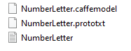

---   
layout: default-layout
title:  CharacterModel - Dynamsoft Capture Vision Parameter File
description: The CharacterModel object in the Dynamsoft Capture Vision Parameter File defines how the charactor models are found.
keywords: Text line specification
needAutoGenerateSidebar: true
noTitleIndex: true
---

# CharacterModel

A `CharacterModel` object defines how the library find Convolutional Neural Networks (CNN) models files that support the character recognition.

```json
{
    "Name": "NumberLetter",
    "DirectoryPath" : "D:\\CharacterModel\\",
    "FilterFilePath" : "D:\\exclude.txt"
}
```

The character model files consist of

- Primary model files (Required): The files that stores the major character recognition models.
- Auxiliary model files (Optional): Support the recognition when the result output by the major model doesn't match the RegEx.
- Filter files (Optional): Set which characters are included or excluded from the text line recognition.

<div align="center">
   <p></p>
   <p>Example of CharacterModel files</p>
</div>

The data you input via the CharacterModel is to tell the library how it can find the character model files.

## General Usage

In the `CharacterModel` object, what you have to specify are:

- `Name`: Find the model files by the name of the model.
- `DirectoryPath`: Where the model files are located.

```json
{
    "Name": "NumberLetter",
    "DirectoryPath" : "D:\\CharacterModel\\"
}
```

The library will be able to find all the related files that match the name you input including both the major models and the assist models.

## Include Filter File

If you have requirements to exclude any characters, you can configure a filter file and add the file path to your `CharacterModel` object.

Example of a exclude filter file.

```txt
exclude
I Q O
```

You can define the filter file in the same folder with the model files. For example:

```json
{
    "Name" : "NumberUppercase",
    "DirectoryPath" : "D:\\CharacterModel\\",
    "FilterFilePath" : "D:\\CharacterModel\\Exclude.txt"
}
```

You can define a same filter file for different `CharacterModel` objects.

```json
{
    "Name" : "VINModel",
    "DirectoryPath" : "D:\\VIN\\",
    "FilterFilePath" : "D:\\VIN\\Exclude.txt"
},
{
    "Name" : "MRZModel",
    "DirectoryPath" : "D:\\MRZ\\",
    "FilterFilePath" : "D:\\VIN\\Exclude.txt"
}
```

## As a Parameter of TextLineSpecification Object

- In each `TargetROI`, you can allocate multiple `LabelRecognizer` tasks.
- In each `LabelRecognizer` task, you can add multiple `TextLineSpecification` settings.
- In each `TextLineSpecification` task, you can specify only one `CharacterModel` setting.
