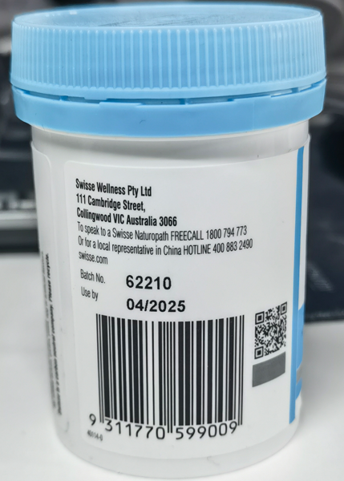

# TextLineSpecification Object

Set the `CharacterModel`, `ImageProcessing` parameters and other configurations for the specified text lines. This is the parameter that defines how the algorithm extract characters from each text lines of a `LabelRecognizer` task. You can leave this area empty to use the default character recognizing settings.

```json
{
    "Name":"LS_1",
    "CharacterModelName" : "NumberLetter",
    "GrayscaleEnhancementModes" : [],
    "BinarizationModes" : [],
    "CharacterNormalizationModes" : [],
    "BaseTextLineSpecificationName" : "LS_0",
    "ApplicableTextLineNumbers":"",
    "StringLengthRange" : [44,44],
    "StringRegExPattern" : "",
    "FirstPoint" : [ 0, 0 ],
    "SecondPoint" : [ 100, 0 ],
    "ThirdPoint" : [ 100, 20 ],
    "FourthPoint" : [ 0, 20 ],
    "CharHeightRange" : [ 800, 1000, 1 ]
}
```

<!--
<div align="center">
   <p></p>
   <p></p>
</div>-->

## Why Use this Parameter
<!--Draft-->
- There exists a text line that diferent from the others. Set special model or parameters for a certain text line.
- Each text line have different styles.
- There exists some recognizable charaters in the lines but they are not the targeting content.

## Select Character Model

The default model is "NumberLetter" which recognize all general number and letter characters.

## Configure ImageProcessing Modes

`GrayscaleEnhancementModes`, `BinarizationModes` and `CharacterNormalizationModes`

## Specify the Target Text Lines

- Where the text lines are located in the TargetROI.
- Which text line use the settings.

### Others

Use `BaseTextLineSpecificationName` to make minor changes on a existing `TextLineSpecification` object.

## As a LabelRecognizerTaskSetting Parameter

You can either apply the default settings to all text lines or specify one or multiple
