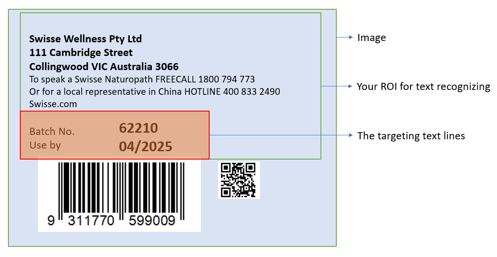

# TextLineSpecification Object

Set the `CharacterModel`, `ImageProcessing` parameters and other configurations for the specified text lines. This is the parameter that defines how the algorithm extract characters from each text lines of a `LabelRecognizer` task. You can leave this area empty to use the default character recognizing settings.

```json
{
    "Name":"LS_1",
    "CharacterModelName" : "NumberLetter",
    "ApplicableTextLineNumbers":"",
    "GrayscaleEnhancementModes" : [],
    "BinarizationModes" : [],
    "CharacterNormalizationModes" : [],
    "BaseTextLineSpecificationName" : "LS_0",
    "StringLengthRange" : [44,44],
    "StringRegExPattern" : "",
    "FirstPoint" : [ 0, 0 ],
    "SecondPoint" : [ 100, 0 ],
    "ThirdPoint" : [ 100, 20 ],
    "FourthPoint" : [ 0, 20 ],
    "CharHeightRange" : [ 800, 1000, 1 ]
}
```

If the number **first** text line is not in the area, only the **third** and **fifth** text lines are processed.

## Usage Instructions

### Parameter Configurations

**Select CharacterModel**

Select one of the `CharacterModel` for the text line(s) by specifying the name of the model. View [`CharacterModel`](character-model.md) page for how to configure the models.

**Set Targeting Text Lines**

Parameter `ApplicableTextLineNumbers` defines which text lines shall apply the settings of this `TextLineSpecification` object.

- If `ApplicableTextLineNumbers` is null, all the text lines will use the default settings.
- If `ApplicableTextLineNumbers` is not applied to all the text lines, the remaining text lines will use the default settings.

You can also specify the location of the targeting text lines with 4 point coordinates. The targeting text line is filtered based on the combination of `ApplicableTextLineNumbers` and area definition. For example:

<div align="center">
   <p></p>
   Example Text Line Specification
</div>

You can use the following parameters to process the above image:

```json
{
    "ApplicableTextLineNumbers" : "7,8",
    "FirstPoint" : [ 0, 60 ],
    "SecondPoint" : [ 70, 60 ],
    "ThirdPoint" : [ 70, 100 ],
    "FourthPoint" : [ 0, 100 ]
}
```

If your set the `ApplicableTextLineNumbers` as "1-8", the text line from 1 to 6 are not recognized because they are not in the specified area.

**Configure ImageProcessing Modes**

`GrayscaleEnhancementModes` enhance the quality of the grayscale image.

`BinarizationModes` configurations finally reflect in the quality of the binary image. It determines how the charaters are presented on the text areas before they recognized by the library. The higher quality of the binary image, the higher read rate and accuracy of the character recognition result.

`CharacterNormalizationModes` are additional settings that further improve the quality of characters. Genarally, they are **morphological transformations**. You can view more about them from <a href="https://docs.opencv.org/4.x/d9/d61/tutorial_py_morphological_ops.html" target="_blank">Image-Processing in OpenCV - Morphological Transformations</a>.

### Quick Settings

Based on a existing `TextLineSpecification` object, you can use `BaseTextLineSpecificationName` with other minor changes to configure a new `TextLineSpecification` object. For example；

```json
{
    "Name":"LS_0",
    "CharacterModelName" : "NumberLetter",
    "ApplicableTextLineNumbers":"1-3",
    "BinarizationModes" : [
        {
            "Mode": "BM_LOCAL_BLOCK",
            "BlockSizeX": 5,
            "BlockSizeY": 5,
        }
    ],
    "CharacterNormalizationModes" : [
        {
            "Mode": "CNM_MORPH",
            "MorphOperation": "Close",
            "MorphArgument": "3",
        }
    ],
    "StringLengthRange" : [44,44],
    "StringRegExPattern" : "Dynamsoft",
    "CharHeightRange" : [ 800, 1000, 1 ]
},
{
    "Name":"LS_1",    
    "BaseTextLineSpecificationName" : "LS_0", // Use the same settings with LS_0 but add some changes.
    "ApplicableTextLineNumbers":"4-7",
    "CharHeightRange" : [ 600, 800, 1 ]
}
```

### Additional Annotations

`LabelRecognizerTaskSetting` determines how a label recognizer task works from initializing to finializing. As a parameter of `LabelRecognizerTaskSetting`, `TextLineSpecification` decides how the text lines are processed when they are detected in the label recognizer task. A group of default settings has been allocated for the `TextLineSpecification` so that the `LabelRecognizerTaskSetting` still works without specifying `TextLineSpecification` parameters.
