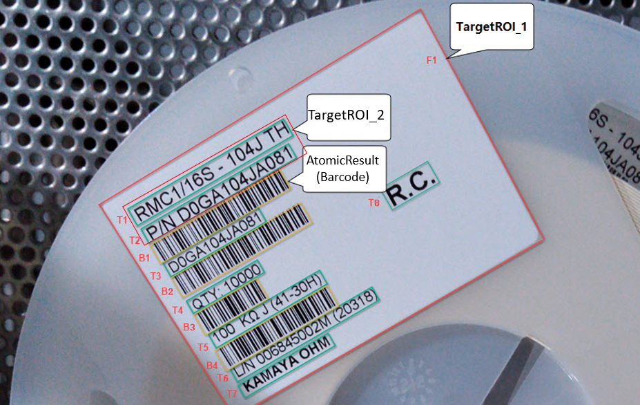

# CaptureVisionTemplate

The **input** and **output** of the library are defined in the `CaptureVisionTemplate`

```json
{
    "CaptureVisionTemplates": [
        {
            "Name" : "CV_0",
            "ImageSourceName": "CameraEnhancer_0",
            "OutputRawImage": 0,
            "ImageROIProcessingNameArray": ["TA_0", "BA_0", "TA_2" ],
            "SemanticProcessingNameArray": ["Parse_Driver_License_AAMVA"]           
        }
    ]
}
```

## Input Definition

### ImageSourceAdapter - Dynamsoft Powered Image Source Controlling System

## Output Definition

### ImageROIProcessingNameArray - Control the Output of Capture Result

**Basic Concepts**

`ImageROIProcessingNameArray` is the parameter that controls how the algorithm will be executed and which `CapturedResults` will be output. Before you getting further understandings about this parameter, there are some basic concepts you'd better know:

- `TargetROI`: The image or a part of image that you want to process. [View more about TargetROI](target-roi-def-options/index.md)
- `Task`: The task definitions determine which parts of the algorithm will be performed on the `TargetROI`. It finally reflects on the result types of the `AtomicResults` & `CapturedResult` you get.
- `AtomicResult`: The output of the `Tasks`. They might not be what you exactly want but they definitately help you on getting what you want.
- `CapturedResult`: The results that you exactly want. View more about [CapturedResults](../../architecture/std-output.md)

**Definition**

- If you are going to output all the `TextLineResults` in the image, you have to include "TargetROI_1" in the `ImageROIProcessingNameArray`.
- If you are going to output the first 2 lines of the `TextLineResults`, you have to include "TargetROI_2" only.

<div align="center">
   <p></p>
   <p>Example of CharacterModel files</p>
</div>

### Semantic Result Output
