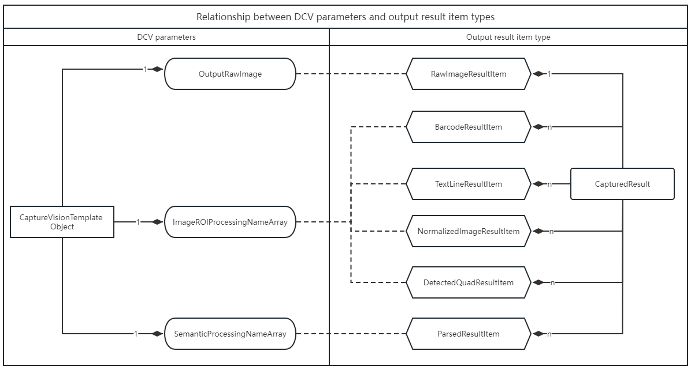
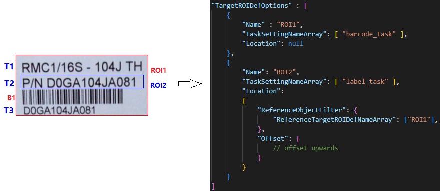
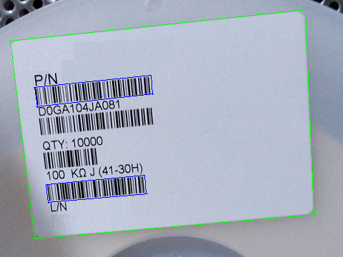
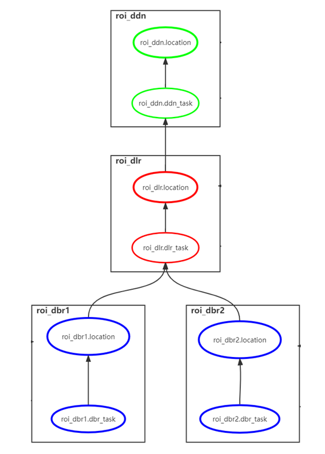

---   
layout: default-layout
title: CaptureVisionTemplate - Dynamsoft Capture Vision Parameters
description: The CaptureVisionTemplate object in the Dynamsoft Capture Vision.
keywords: CaptureVisionTemplate
needAutoGenerateSidebar: true
noTitleIndex: true
needGenerateH3Content: true
permalink: /parameters/file/capture-vision-template-v2.0.0.html
---

# Design of the CaptureVisionTemplate Object

A `CaptureVisionTemplate` object is the entry object of a parameter template in Dynamsoft Capture Vision (DCV) SDK.

```json
{
    "Name" : "CV_0",
    "ImageSourceName": "ISA_0",
    "ImageROIProcessingNameArray": ["TA_0" ],
    "SemanticProcessingNameArray": ["SP_0"],
    "OutputRawImage": 0,
    "MaxParallelTasks" : 4,
    "Timeout" : 500
}
```

<div align="center">
   <p>Example 1 – Parameters of CaptureVisionTemplate</p>
</div>

## Summary of CaptureVisionTemplate top-level parameters

| Parameter Name | Description |
| -------------- | ----------- |
| [`Name`](../reference/shared-parameter/name.md) | Represents the name of the parameter template, which serves as its unique identifier. |
| [`ImageSourceName`](../reference/capture-vision-template/image-source-name.md) | Indicates the input source name, used to refer to the `ImageSource` object. It is used to define the input image source of DCV. |
| [`ImageROIProcessingNameArray`](../reference/capture-vision-template/image-roi-processing-name-array.md) | Represents the collection of image ROI processing object names, used to refer to the `TargetROIDef` objects. It is used to define recognition tasks performed on ROIs of an image, including reading barcodes, recognizing labels, or detecting document quadrilaterals. |
| [`SemanticProcessingNameArray`](../reference/capture-vision-template/semantic-processing-name-array.md)| Represents the collection of semantic-processing object names, used to refer to the `SematicProcessing` objects. It is used to define post-processing code parsing tasks performed on input text/bytes.|
| [`OutputRawImage`](../reference/capture-vision-template/output-raw-Image.md) | Indicates whether DCV finally outputs the original input image. |
| [`MaxParallelTasks`](../reference/capture-vision-template/max-parallel-tasks.md) | Indicates the maximum number of parallel tasks for the DCV runtime. |
| [`Timeout`](../reference/capture-vision-template/timeout.md) | Indicates the maximum amount of time (in milliseconds) that the recognition tasks should take per page.|

<div align="center">
   <p>Table 1 – Parameters Summary of CaptureVisionTemplate</p>
</div>

## Input Source Configuration

In the parameter template, the `ImageSourceName` parameter refers to the `ImageSource` object, which defines the image input source of DCV. When DCV starts capturing, it will parse the `ImageSource` parameter, convert it into an [Image Source Adapter (ISA)](../../architecture/input.md#image-source-adapter) object, and then continuously obtain images from it.

## Captured Output Configuration

`OuputRawImage`, `ImageROIProcessingNameArray` and `SemanticProcessingNameArray` are three different parameters that control the captured output, organized as a `CapturedResult` interface in DCV. `CapturedResult` represents a set of all captured result items on an image. Each type of result Item represents the output of different task types. The following figure lists the rough relationship between DCV output parameters and output results.

<div align="center">
   <p></p>
   <p>Figure 1 – Relationship between DCV parameters and output result item types</p>
</div>

As illustrated in figure 1, the left column represents the DCV output parameters, while the right column indicates the type of DCV output result item types. The dashed line between the two displays the rough relationship between parameters and result items types.

The `ImageROIProcessingNameArray` parameter can produce results such as `BarcodeResultItem`, `TextLineResultItem`, `DetectedQuadResultItem`, and `NormalizedImageResultItem`, while the `SemanticProcessingNameArray` parameter can produce the result of `ParsedResultItem`. This is because the `ImageROIProcessingNameArray` parameter refers to one or more `TargetROIDef` objects, and the `SemanticProcessingNameArray` parameter refers to one or more `SemanticProcessing` objects. 

Next, we will focus on the core design of the `TargetROIDef` and `SemanticProcessing` object.

## Core Design of TargetROIDef Object

The [`TargetROIDef`](./target-roi-definition/index.md) object is used to specify one or more recognition tasks to be performed on some regions of interest (ROIs) within an image. In simple terms, [`TargetROIDef`](./target-roi-definition/index.md) can be expressed using the following formula:

```
TargetROIDef = Recognition Task Definition + Spatial Location Definition
```

### Key Concepts

The following figure and table briefly illustrates some key concepts involved.

<div align="center">
   <p></p>
   <p>Figure 2 – An example showing the key concepts</p>
</div>

|Concept|Description|Explanation with example|
|:------|:----------|:-----------------------|
|**Recognition Tasks**| The tasks include barcode recognition, label recognition, document boundary detection, etc.| `ROI1` and `ROI2` are two `TargetROIDef` objects. A task named `barcode_task` is configured on `ROI1` and a task named `label_task` is configured on `ROI2`.|
|**Atomic Result**| Represents the atomic result of the recognition task output. It can be a color detection region, a barcode, a text line, a table cell, a detected quadrilateral etc.|`T1`, `T2`, `T3` are three atomic result objects of `TextLineResultItem` type, and B1 is one atomic object of `BarcodeResultItem` type.|
|**Spatial Location**| A `Location` configured on a `TargetROIDef` may generate zero or more target regions on which to perform a specific recognition task.| `ROI1.Location` is defined as `null` which means generate only one target regions. `ROI2.Location` is defined as an upward offset relative to the output regions of `ROI1`.|
|**Reference Region**|A reference region is a physical quadrilateral region. It includes two types: **entire image region** and **atomic result region**. The former refers to the quadrilateral extent of the original image, and the latter refers to the quadrilateral extent of each atomic result.| `ROI1` has only one reference region which is the entire image region. `ROI2` has three reference regions which generated from `T1`, `T2`, `T3`. |
|**Target Region**| A target region is a physical quadrilateral region, which is calculated from a reference region and offset.| `ROI1` has only one target region, which is equal to the reference region. `ROI2` has three target regions, which are calculated by offsets from quadrilateral regions of `T1`, `T2`, `T3`.|

<div align="center">
   <p>Table 2 – Key Concepts of TargetROIDef</p>
</div>

### Workflow Design Based on Reference/Target Regions

Using the recursive definition of the reference relationship between different `TargetROIDef` objects, a complex workflow can be constructed to meet the requirements of complex scenarios.

Let's consider the following example: a user wants to read barcodes below `P/N` and above `L/N` in the image below. Upon analysis, we find the following positional dependencies:

- The rough location of the target barcode (blue box) can be calculated separately from the location of the text lines (`P/N` and `L/N`).
- The text lines (`P/N` and `L/N`) are on the first and fifth lines inside the label border (green box).

<div align="center">
   <p></p>
   <p>Figure 3 – A sample image illustrating workflow design</p>
</div>

The following json is a parameter template fragment that configures ROI dependencies to solve the above problems.

```json
{
    "TargetROIDefOptions" : [
        {
            "Name" : "roi_ddn", 
            "TaskSettingNameArray": [ "ddn_task" ], 
            "Location" : null
        }, 
        {
            "Name" : "roi_dlr", 
            "TaskSettingNameArray": [ "dlr_task" ], 
            "Location": 
            {
                "ReferenceObjectFilter" : {
                    "ReferenceTargetROIDefNameArray": ["roi_ddn"], 
                },
                "Offset": null
            }
        },
        {
            "Name" : "roi_dbr1", 
            "TaskSettingNameArray": [ "dbr_task" ], 
            "Location": 
            {
                "ReferenceObjectFilter" : {
                    "ReferenceTargetROIDefNameArray": ["roi_dlr"], 
                },
                "Offset":{
                    // offset downwards
                }
            }
        },
        {
            "Name" : "roi_dbr2", 
            "TaskSettingNameArray": [ "dbr_task" ], 
            "Location": 
            {
                "ReferenceObjectFilter" : {
                    "ReferenceTargetROIDefNameArray": ["roi_dlr"], 
                },
                "Offset":{
                    // offset upwards
                }
            }
        }
    ]
}
```

<div align="center">
   <p>Example 2 – DCV parameter template fragment illustrating workflow design</p>
</div>

- It configures four `TargetROIDef` objects: `ddn_roi`, `dlr_roi`, `dbr_roi1`, and `dbr_roi2`.
- `ddn_roi` is configured to depend on the entire image region directly.
- `dlr_roi` is configured to depend on `ddn_roi` and has a `null` offset, which means it uses the same region as the output region of `ddn_roi`.
- `dbr_roi1` is configured to depend on `dlr_roi` and has an offset configured to be shifted downwards from the output region of `dlr_roi`.
- `dbr_roi2` is also configured to depend on `dlr_roi` and has an offset configured to be shifted upwards from the output region of `dlr_roi`.

### Construct a Dependency Graph

When DCV parses the `TargetROIDef` objects in the above parameter template, it constructs a directed dependency graph based on the configured dependencies between different `TargetROIDef` objects. During actual execution, the tasks are executed in the order specified by the dependency graph. The following figure illustrates the generated dependency graph after parsing the above template fragment.

<div align="center">
   <p></p>
   <p>Figure 4 – Dependency Graph</p>
</div>

### Filter Out the Desired Reference Regions

In practical applications, if a `TargetROIDef` depends on another `TargetROIDef` object named `roi1`, it may not want to depend unconditionally on all the reference regions generated by `roi1`. Instead, it may want to depend only on those regions that meet certain filtering conditions, such as the text meeting a specific regular expression or the barcode type meeting specific formatting requirements.

Based on `Example 2`, regular expression filtering conditions are added to `dbr_roi1` and `dbr_roi2`:

```json
{
    "TargetROIDefOptions" : [
        //......
        {
            "Name" : "roi_dbr1", 
            //......
            "Location": 
            {
                "ReferenceObjectFilter" : {
                    "ReferenceTargetROIDefNameArray": ["roi_dlr"], 
                    "TextLineFilteringCondition":
                    {
                        "LineStringRegExPattern": "^P/N" 
                    }
                },
                //......
            }
        },
        {
            "Name" : "roi_dbr2", 
            //......
            "Location": 
            {
                "ReferenceObjectFilter" : {
                    "ReferenceTargetROIDefNameArray": ["roi_dlr"], 
                    "TextLineFilteringCondition":
                    {
                        "LineStringRegExPattern": "^L/N" 
                    }
                },
                //......
            }
        }
    ]
}
```

- `roi_dbr1` is configured to only depend on the reference region generated by `roi_dlr` that meet the regular expression "^P/N".
- `roi_dbr2` is configured to only depend on the reference region generated by `roi_dlr` that meet the regular expression "^L/N".

At runtime, reference regions that do not meet the filtering conditions will be discarded and will not be passed as inputs to subsequent `TargetROIDef` for further processing.

For more details about filtering reference objects, please refer to [`ReferenceObjectFilter`]({{site.parameter}}reference/target-roi-def/location.html#referenceobjectfilter)

## Core Design of SemanticProcessing Object

The [`SemanticProcessing`](./semantic-processing/index.md) object is used to specify one or more tasks to analyze and extract information from image ROI processing results. The whole workflow typically involves following concepts.

### Prerequisites

A `SemanticProcessing` object will take effect when its name is referenced in `CaptureVisionTemplate.SemanticProcessingNameArray`.

### Launch Timing

The semantic process is triggered only after all the recognition tasks referenced in `CaptureVisionTemplate.ImageROIProcessingNameArray` have been completed.

### Data Filtering

In many cases, the process may involve filtering data to select only the relevant sources, such as a label text meeting a specific regular expression or a barcode meeting a specific format. `ReferenceObjectFilter` is used to specify such data filtering criteria.

### Task Execution

This is the main part of the workflow where the actual tasks are defined. `TaskSettingNameArray` is used to specify such tasks by referencing the name of a [`CodeParserTaskSetting`]({{site.parameter}}file/task-settings/code-parser-task-settings.html) object.

### Results Reporting

Currently, semantic-processing supports code parsing tasks, so the result is returned with callback [`OnParsedResultsReceived`]().