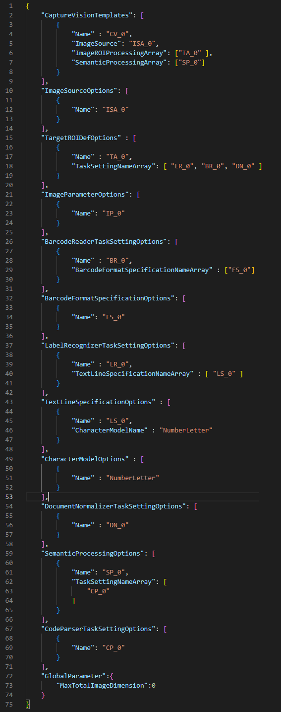

---   
layout: default-layout
title: Structure of Dynamsoft Capture Vision Parameters
description: Introduce the parameter definitions, organization structure involved in Dynamsoft Capture Vision.
keywords: Parameter, Definition, Hierarchy
needAutoGenerateSidebar: true
noTitleIndex: true
---

# The Overall Structure of DCV Parameters

Dynamsoft Capture Vision (DCV) is an aggregating SDK of a series of specific functional products, which cover object capturing, content understanding, result parsing, and interactive viewing. To achieve high scalability and flexibility in DCV, a highly flexible and configurable parameter system has been designed to drive different behavior logic within the SDK.

This article provides an overview of the structure of parameters in Dynamsoft Capture Vision. In order to eliminate ambiguity, we first define a few conceptual nouns:

1. **Parameter**
A parameter is designed to represent a particular aspect of the behavior of the SDK, and each parameter has its own name. For instance, the 'ExpectedBarcodeCount' parameter is used to control the expected count of recognized barcodes. Parameters can be configured with specific values or ranges of values, which can be adjusted as required.

2. **Parameter template**
A parameter template is a collection of parameters organized in a structured manner, expressed in JSON format. The 'template name' is a unique identifier assigned to each parameter template. In the DCV SDK, this name is used to load the relevant configurations and control runtime behavior.
  
3. **Parameter template file**
A parameter template file is a JSON file that contains one or multiple parameter templates.

## Structure of the Parameter Template File

### Top-level Objects

   

   
Figure 1 – Top level objects of DCV template file

As shown in the figure above, the organizational structure of a parameter template file consists of several top-level objects, as shown below.

- `CaptureVisionTemplates`
- `ImageSourceOptions`
- `TargetROIDefOptions`
- `ImageParameterOptions`
- `BarcodeReaderTaskSettingOptions`
- `BarcodeFormatSpecificationOptions`
- `LabelRecognizerTaskSettingOptions`
- `TextLineSpecificationOptions`
- `DocumentNormalizerTaskSettingOptions`
- `SemanticProcessingOptions`
- `CodeParserTaskSettingOptions`
- `GlobalParameter`

With the exception of GlobalParameter, all top-level objects in the parameter template file are arrays of the corresponding object. For example,`CaptureVisionTemplates` are an array of `CaptureVisionTemplate` objects, and `TargetROIDefOptions` are an array of `TargetROIDef` objects. 
Furthermore, to reuse the same parameter definitions, reduce the size of the parameter template file, and simplify the parameter configuration hierarchy, a reference system based on the name was adopted in the parameter template file design. For example, the value of the `ImageSource` parameter for the first element in `CaptureVisionTemplates` is `ISA_0`, which refers to the first element in `ImageSourceOptions`.

Therefore, a parameter template starts with an element in `CaptureVisionTemplates` and recursively searches for the objects that are directly or indirectly referenced by it, and then combines them to form a specific set of parameters. Then, the parameter template may be applied to DCV to control its internal execution logic.
Next, we will focus on introducing some main objects and their relationships in a parameter template.

## Main Objects and Relationships in Parameter Templates

The diagram below illustrates the main objects included in a complete parameter template, as well as the reference relationships between them.

- A solid green line indicates a one-to-one or one-to-zero correspondence between the two objects.
- A solid black line indicates a one-to-zero or one-to-n correspondence between the two objects.
- The dash line indicates that these objects may be associated with one-to-n `ImageParamter` objects, which may take effect at different stages of the algorithm.

   

   
Figure 2 – Object reference relationships in a parameter templates

From a data flow perspective in the diagram above, `ImageSource` represents the input to DCV, `TargetROIDef` represents the various recognition tasks performed by DCV on the image (including barcode recognition, text recognition, document detection/normalization, etc.), and `SemanticProcessing` is used to parse the text/bytes results generated by `TargetROIDef` objects and obtain human-readable data fields.

### CaptureVisionTemplate Object

This is the entry object of a parameter template in DCV. The `Name` parameter represents the name of the parameter template, which serves as its unique identifier. The key parameters under this object are as follows:

- `ImageSource`: Represents the input data source, which plays the role of the image source here.

- `ImageROIProcessingArray`: Represents the collection of image ROI processing definition objects. It is used to define recognition tasks performed on ROI of an image, including reading barcodes, recognizing labels, or detecting document quads.

- `SemanticProcessingArray`: Represents the collection of semantic processing objects.

For more details, please refer to this link.

### ImageSource Object

The `ImageSource` object defines the input for DCV, responsible for providing images to DCV. It can be defined as different image sources, including but not limited to image directories, scanners, cameras, etc. Of course, it is optional. If not configured in the template, we can also directly call `SetInput` API in the code to set the input source for DCV.

For more details, please refer to this link.

### TargetROIDef Object

The `TargetROIDef` object is used to specify one or more recognition tasks to be performed on some regions of interest (ROIs) within an image. It includes:

- `Location`: Defines the spatial definition of the ROI based on the offset of the reference object area.
- `TaskSettingNameArray`: Specifies one or more recognition task configurations (including text, barcode, table, etc.) by providing an array of unique names of task setting objects, such as `BarcodeReaderTaskSetting`, `LabelRecognizerTaskSetting`, and `DocumentNormalizerTaskSetting`.

For more details, please refer to this link.

### ImageParameter Object

The `ImageParameter` object provides various features to adjust and enhance the input image for better recognition results. These features include:

- `ColourConversionModes`: Converts the color image to grayscale for better processing.

- `GrayscaleTransformationModes`: Applies positive, negative, or both transformations to the grayscale image.

- `GrayscaleEnhancementModes`: Enhances the grayscale image for better contrast and clarity.

- `BinarizationModes`: Converts the grayscale image to binary for easier feature extraction.

- `TextureDetectionModes`: Detects texture to filter out unnecessary processing and reduce computational cost.

- `TextDetectionMode`: Detects text regions in the image for better recognition results.

- `ScaleUpModes`: Enlarges small barcodes and text labels for better localization accuracy.

The above are the common features provided by the `ImageParameter` object, which are used to optimize the input image for better recognition results.

For more details, please refer to this link.

### BarcodeReaderTaskSetting Object

The `BarcodeReaderTaskSetting` object is used to configure the barcode reading task in DCV. It includes several common settings, such as:

- `ExpectedBarcodesCount`: Specifies the expected number of barcodes to be decoded in the image.

- `BarcodeFormatIds`: Specifies the barcode types to be decoded.

- `LocalizationModes`: Configures different localization modes to balance the localization efficiency and accuracy in different scenarios.

- `DeblurModes`: Configures different deblur modes to balance the decoding efficiency and accuracy in different scenarios.

Advanced settings include how to control the start and end phases of the task, how to fine-tune the settings for different barcode types, and more.
These settings can be adjusted to optimize the barcode recognition performance in different scenarios.

For more details, please refer to this link.

### LabelRecognizerTaskSetting Object

The `LabelRecognizerTaskSetting` object is used to configure the label recognition task in DCV. It includes several common settings, such as:

- `DictionaryPath` and `DictionaryCorrectionThresholds`: Provide dictionary file and correction threshold definition for label recognition.

- `StringLengthRange`: Defines the length range of the recognized string.

- `StringRegExPattern`: Defines the regular expression pattern for the recognized string.

Advanced settings include how to control the start and end phases of the task, how to fine-tune the settings for different text lines, and more.

For more details, please refer to this link.

### DocumentNormalizerTaskSetting Object

The `DocumentNormalizerTaskSetting` object is used to configure the normalization process of a document image. It includes several commonly used settings, such as:

- `Brightness`: Specifies the brightness level of the normalized image.
- `Contrast`: Controls the contrast level of the normalized image.
- `ColourMode`: Specifies the pixel type of the normalized image, such as RGB, grayscale or binary image.
- `ContentType`: Determines the target content type to be normalized, such as a document, or table.
- `DeskewMode`: Specifies the method used to apply the deskew process on the target image, which helps to correct any skew present in the image.

In addition to these basic settings, the `DocumentNormalizerTaskSetting` object also provides advanced options to:

- Control the start and end phases of the normalization task.
- Set the page size of the normalized image.
- Specify the range of angles for the extracted corners.

These finer-grained settings give users greater control over the normalization process and help to ensure that the output image meets their specific requirements.

For more details, please refer to this link.

### SemanticProcessing Object

Semantic processing is an optional step in image processing that helps to extract human-readable data from instant text results. It involves:

- `ReferenceObjectFilter`: Defines the filtering criteria for the text results obtained from the referenced `TargetROIDef` objects. This involves specifying the `TargetROIDef` objects that we want to generate text results for, and what filters to apply to those text results.
- `TaskSettingNameArray`: Defines the code parsing tasks to be performed on the filtered text results.

By using semantic processing, users can easily extract structured data from encoded text results, which can be useful in a wide range of applications such as driver license decoding, MRZ parsing, and more.

For more details, please refer to this link.

### CodeParserTaskSetting Object

The `CodeParserTaskSetting` object is used to configure the code parsing task in DCV. It includes the following settings:

- `CodeSpecifications`: Defines an array of file name objects that determine which templates need to be loaded at runtime for code parsing. Each file name specifies a type of code to parse, such as `MRTD_TD2_VISA` and `MRTD_TD3_VISA`, etc.
- `ResourcesPath`: Defines the resource path to the directory that contains the template files for the code parser. These template files define more detailed fields that need to be parsed and corresponding rules.

For more details, please refer to this link.

## Special Rules for Parameter Configuration

In this section, we will discuss some special rules for configuring the DCV parameter templates. Understanding these rules will help you efficiently configure a simple and user-friendly parameter template.

### Default Value of Parameters

Generally, the DCV parameter templates have been designed with many common scenarios in mind, so the default values of many parameters do not need to be modified. When configuring a custom template, you only need to configure required parameters and fine-tuning parameters related to business scenarios. Other optional parameters are automatically filled with default values. This simplifies your configuration and makes your templates easier to read.

### Inherited Parameters

Sometimes, we need to configure multiple templates to adapt to different scenarios, but only a few parameter values differ between each template. DCV provides a parameter configuration inheritance mechanism that further reduces the amount of configuration work.
For example, when configuring `IP_A` and `IP_B` objects in `ImageParameterOptions`, you can define a `BaseImageParameterName` parameter in the `IP_B` object with a value of `IP_A`. Then `IP_B` object will inherit all the parameter definitions of `IP_A`, and if `IP_B` defines a parameter with the same name but a different value, that parameter will adopt the value of `IP_B`.

This allows you to create a new parameter template that inherits most of its configuration from an existing template, reducing the amount of repetitive configuration work needed.
