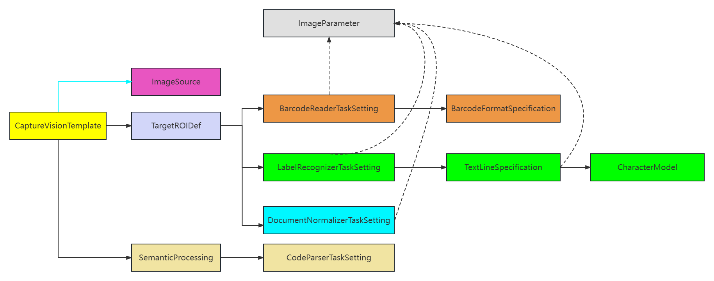

---   
layout: default-layout
title: Overview of Dynamsoft Capture Vision Parameters
description: Introduce the overview parameters design of Dynamsoft Capture Vision.
keywords: Parameter, Parameter Template, Parameter Template File
needAutoGenerateSidebar: true
noTitleIndex: true
needGenerateH3Content: true
---

# Overview of DCV parameters

Dynamsoft Capture Vision (DCV) is designed for high scalability and flexibility, and its parameter system plays a crucial role in achieving that. The parameter system can drive the behaviour of the SDK through its many varied configurations. In this article, we will provide an overview of the parametric architecture design of Dynamsoft Capture Vision.

## Key Terms

In order to eliminate ambiguity, we first define several key terms.

1. **Parameter**
A parameter is designed to represent a particular aspect of the behavior of the SDK, and each parameter has its own name. For instance, the `ExpectedBarcodesCount` parameter is used to control the expected number of barcodes in the image or frame. Parameters can be configured with specific values or a range of values, which can be adjusted as required.

1. **Parameter template**
A parameter template is a collection of parameters organized in a structured manner, expressed in JSON format. The name of the `CaptureVisionTemplate` object is also called "template name", which is a unique identifier assigned to each parameter template. In the DCV SDK, this name is used to load the relevant configurations and control runtime behavior.
  
1. **Parameter template file**
A parameter template file is a JSON file that contains one or multiple parameter templates.

## Structure of a Parameter Template File

As shown in the example below, the organizational structure of a parameter template file consists of several top-level objects such as `CaptureVisionTemplates`, `ImageSourceOptions`,`TargetROIDefOptions` etc.

```json
{
    "CaptureVisionTemplates": [
        {
            "Name" : "CV_0",
            "ImageSourceName": "ISA_0",
            "ImageROIProcessingNameArray": ["TA_0" ],
            "SemanticProcessingNameArray": ["SP_0"] 
        }       
    ],
    "ImageSourceOptions": [ 
        {
            "Name": "ISA_0"
        }
    ],
    "TargetROIDefOptions" : [
        {
            "Name" : "TA_0",
            "TaskSettingNameArray": [ "LR_0", "BR_0", "DN_0" ]
        }
    ],
    "ImageParameterOptions": [
        {
            "Name": "IP_0"
        }
    ], 
    "BarcodeReaderTaskSettingOptions": [
        {
            "Name" : "BR_0",
            "BarcodeFormatSpecificationNameArray" : ["FS_0"]
        }
    ],
    "BarcodeFormatSpecificationOptions": [
        {
            "Name": "FS_0"
        }
    ],
    "LabelRecognizerTaskSettingOptions": [
        {
            "Name" : "LR_0",
            "TextLineSpecificationNameArray" : [ "LS_0" ]
        }
    ],
    "TextLineSpecificationOptions" : [
        {
            "Name" : "LS_0",
            "CharacterModelName" : "NumberLetter"
        }
    ],
    "CharacterModelOptions" : [
        {
            "Name" : "NumberLetter"
        }
    ],
    "DocumentNormalizerTaskSettingOptions": [
        {
            "Name" : "DN_0"
        }
    ],
    "SemanticProcessingOptions": [
        {
            "Name": "SP_0",
            "TaskSettingNameArray": [
                "CP_0"
            ]
        }
    ],
    "CodeParserTaskSettingOptions": [
        {
            "Name": "CP_0"
        }
    ],
    "GlobalParameter":{
        "MaxTotalImageDimension":0
    }
}
```

With the exception of `GlobalParameter`, all top-level objects in the parameter template file are arrays of the corresponding object. For example,`CaptureVisionTemplates` is an array of `CaptureVisionTemplate` objects, and `TargetROIDefOptions` is an array of `TargetROIDef` objects, and so on.

Furthermore, you will notice that some of the parameters' definitions are reused across the parameter template file. This helps reduce the size of the parameter template file and simplify the parameter configuration hierarchy, making it easier for you to understand and create your own template. For example, the value of the `ImageSourceName` parameter for the first object in `CaptureVisionTemplates` is `ISA_0`, which refers to the first object in `ImageSourceOptions`.

Therefore, a parameter template starts with an object in `CaptureVisionTemplates` and recursively searches for the objects that are directly or indirectly referenced by it, and then combines them to form a specific set of parameters. Then, the parameter template may be applied to DCV through "template name" to control its internal execution logic.

Next, we will focus on introducing some main objects and their relationships in a parameter template.

## Structure of a Parameter Template

The diagram below illustrates the objects included in a complete parameter template, as well as the reference relationships between them.

- A solid green line indicates a one-to-zero or one-to-one correspondence between the two objects.
- A solid black line indicates a one-to-zero or one-to-n correspondence between the two objects.
- The dash line indicates that these objects may be associated with one-to-n `ImageParameter` objects, which may take effect at different stages of the algorithm.

<div align="center">
   <p></p>
   <p>Figure 2 – Object reference relationships in a parameter template</p>
</div>

The following table list the main objects type and description of a complete parameter template:

| Object Type                    | Description  |
| :------------------------------| :----------- |
|  [CaptureVisionTemplate]({{site.parameter}}file/capture-vision-template.html)         |  This is the entry object of a parameter template in DCV. The `Name` parameter represents the name of the parameter template, which serves as its unique identifier.|
|  [ImageSource]({{site.parameter}}file/image-source.html)                  |  Defines the input for DCV responsible for providing images to DCV. It can be defined as different image sources, including but not limited to, image directories, scanners, cameras, etc.|
| [TargetROIDef]({{site.parameter}}file/target-roi-definition/index.html)                   |  Used to specify one or more recognition tasks to be performed on some regions of interest (ROIs) within an image.|
|  [SemanticProcessing]({{site.parameter}}file/semantic-processing/index.html)            |  Used to specify one or more code parsing tasks to be performed on text/byte results to help extract human readable information. |
|  [BarcodeReaderTaskSetting]({{site.parameter}}file/task-settings/barcode-reader-task-settings.html)      |  Configures the settings for barcode reading tasks performed on images in DCV. |
|  [LabelRecognizerTaskSetting]({{site.parameter}}file/task-settings/label-recognizer-task-settings.html)    |  Configures the settings for label recognition tasks performed on images in DCV.|
|  [DocumentNormalizerTaskSetting]({{site.parameter}}file/task-settings/document-normalizer-task-settings.html) |  Configures the settings for the document detection or normalization process of an image in DCV. |
|  [CodeParserTaskSetting]({{site.parameter}}file/task-settings/code-parser-task-settings.html)         |  Configures the code parsing tasks such as passport MRZ, driving license and other user specific tasks in DCV etc.|
|  [ImageParameter]({{site.parameter}}file/image-parameter.html)              |  Provides various image-processing features to adjust and enhance the input image for better recognition results.|

For more details, please refer to [introduction of the capture vision template](capture-vision-template.md)

## How to Apply DCV Parameters

There are two ways in which the parameters can be implemented in Dynamsoft Capture Vision (DCV):

- `SimplifiedCaptureVisionSettings`: It is a structure that contains commonly used DCV parameters. To update DCV parameters using `SimplifiedCaptureVisionSettings`, you can follow these steps:

   1. Call the `GetSimplifiedSettings` API to get the `SimplifiedCaptureVisionSettings` object named `dcv_settings` associated with the Dynamsoft Capture Vision Router instance.
   2. Modify the attributes of `dcv_settings`.
   3. Call the `UpdateSettings` API to apply the modified `dcv_settings`.

- `JSON parameter template file/string` - It supports all DCV parameters. The related parameter setting APIs are:

   1. `InitSettings/InitSettingsFromFile` - after calling this interface, each parameter template in the file/string will be converted into a single parameter template object. They will replace the previously associated parameter template objects on the Capture Vision Router instance.

   2. `ResetSettings` - after calling this API, the internal associated parameter template objects are reset to the factory state.

## Special Rules for DCV Parameter Configuration

In this section, we will discuss some special rules for configuring the DCV parameter templates. Understanding these rules will help you efficiently configure a simple and user-friendly parameter template.

### Default Value of Parameters

Generally, the DCV parameter templates have been designed with many common scenarios in mind, so the default values of many parameters do not need to be modified. When configuring a custom template, you only need to configure required parameters and fine-tuning parameters related to business scenarios. Other optional parameters are automatically filled with default values. This simplifies your configuration and makes your templates easier to read.

### Inherited Parameters

Sometimes, we need to configure multiple templates to adapt to different scenarios, but only a few parameter values differ between each template. DCV provides a parameter configuration inheritance mechanism that further reduces the amount of configuration work.
For example, when configuring `IP_A` and `IP_B` objects in `ImageParameterOptions`, you can define a `BaseImageParameterName` parameter in the `IP_B` object with a value of `IP_A`. Then `IP_B` object will inherit all the parameter definitions of `IP_A`, and if `IP_B` defines a parameter with the same name but a different value, that parameter will adopt the value of `IP_B`.

This allows you to create a new parameter template that inherits most of its configuration from an existing template, reducing the amount of repetitive configuration work needed.
