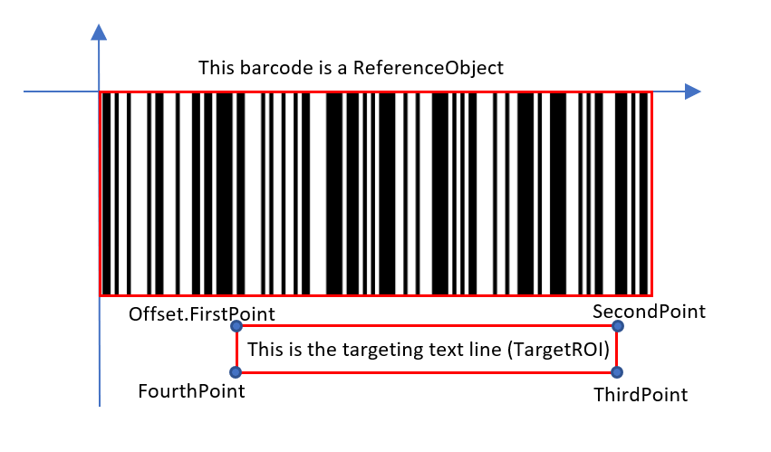
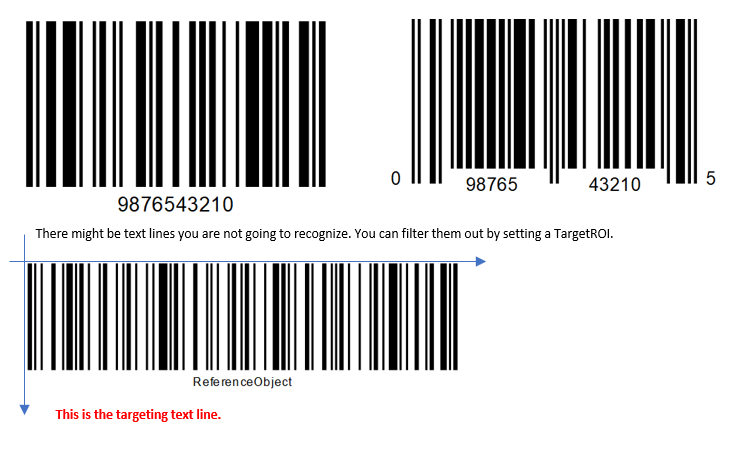

---   
layout: default-layout
title:  TargetROIDef Object Introduction
description: Introduced the TargetROIDef definition for Dynamsoft Capture Vision.
keywords: TargetROIDef
needAutoGenerateSidebar: true
noTitleIndex: true
---

# Design of the TargetROIDef Object

The `TargetROIDef` object is used to specify one or more recognition tasks to be performed on some regions of interest (ROIs) within an image.

```json
{
    "Name" : "TA_1",

    "TaskSettingNameArray": [
        "LR_0",// Name of LabelRecognizerTaskSetting Object
        "BR_0",// Name of BarcodeReaderTaskSetting Object
        "DN_0" // Name of DocumentNormalizerTaskSetting Object
    ], 
    "Location": 
    {
        "ReferenceObjectFilter" :
        {  
            "ReferenceTargetROIDefNameArray": ["TR_0", "TR_1"], 
            "AtomicResultTypeArray" : ["ART_TEXT_LINE","ART_BARCODE","ART_FRAME"], 

            "BarcodeFilteringCondition": {},
            "FrameFilteringCondition": {}, 
            "TextLineFilteringCondition": {},
            "RegionFilteringCondition": {}
        },
        "Offset": {
            "ReferenceObjectOriginIndex": 0, 
            "ReferenceObjectType": "ROT_ATOMIC_OBJECT", 
            "MeasuredByPercentage" : 1,
            "FirstPoint" : [ 0, 0 ],
            "SecondPoint" : [ 100, 0 ],
            "ThirdPoint" : [ 100, 100 ],
            "FourthPoint" : [ 0, 100 ],
        }
    }
}
```

<div align="center">
   <p>Example 1 – Parameters of TargetROIDef</p>
</div>

## Summary of TargetROIDef top-level parameters

| Parameter Name | Description |
| -------------- | ----------- |
| [`Name`]({{site.dcvb_parameters_reference}}target-roi-def/name.html) | Represents the name of the `TargetROIDef` object, which serves as its unique identifier. |
| [`TaskSettingNameArray`]({{site.dcvb_parameters_reference}}target-roi-def/task-setting-name-array.html) | Represents the collection of task setting object names, used to refer to the `BarcodeReaderTaskSetting`,`LabelRecognizerTaskSetting`,`DocumentNormalizerTaskSetting` objects. It is used to define recognition tasks such as reading barcodes, recognizing labels, or detecting document quads. |
| [`Location`]({{site.dcvb_parameters_reference}}target-roi-def/location.html) | Define the spatial location where the recognition tasks are performed. It consists of `ReferenceObjectFilter` and `Offset` parameter. |
| [`BaseTargetROIDefName`]({{site.dcvb_parameters_reference}}target-roi-def/base-target-roidef-name.html) | Represents the name of another `TargetROIDef` object. It is used to inherit the parameters defined in its parent `TargetROIDef` object. If a parameter has already been defined in this object, the parameter with the same name will not be inherited from the parent object.|
| [`EnableResultsDeduplication`]({{site.dcvb_parameters_reference}}target-roi-def/enable-results-deduplication.html) | Represents whether to enable the result deduplication. |

In simple terms, `TargetROIDef` can be expressed using the following formula:

```
TargetROIDef = Recognition Task Definition + Spatial Location Definition
```

## Recognition Tasks

The recognition tasks configured on the `TargetROIDef` object include barcode recognition, label recognition, document boundary detection, etc. 
The atomic result of each task type is the smallest output item, which can be a barcode, text line, table cell, detected quadrilateral, etc. `CapturedResult` represents a set of all captured atomic result items on an image. The following table lists the task types and corresponding atomic result item types.

| Task Type                 | Performed By | Atomic Result Type     |
| :-------------------      | :----------- | :------------------- |
| Read Barcodes             | Dynamsoft Barcode Reader SDK          | BarcodeResultItem               |
| Recognize Text Lines      | Dynamsoft Label Recognizer SDK        | TextResultItem                  |
| Detect Document Borders   | Dynamsoft Document Normalizer SDK     | DetectedQuadResultItem          |
| Normalize a Document      | Dynamsoft Document Normalizer SDK     | NormalizedImageResultItem       |

If you want to learn more about the design details of recognition task settings, please refer to the following links:

- [Design of barcode reader task settings](../task-settings/barcode-reader-task-settings.md)
- [Design of label recognizer task settings](../task-settings/label-recognizer-task-settings.md)
- [Design of document normalizer task settings](../task-settings/document-normalizer-task-settings.md)

## Spatial Location

Parameter `Location` defines the spatial location where the recognition tasks are performed. It consists of `ReferenceObjectFilter` parameter and `Offset` parameter. The former is used to filter out the desired reference regions, and the latter defines a uniform offset relative to the reference regions.
Next, we focus on explaining some key concepts based on the example diagram below:

<div align="center">
   <p></p>
   <p>Figure 1 – An example showing the key concepts</p>
</div>

|Concept|Description|Explanation with example|
|:------|:----------|:-----------------------|
|**Atomic Result**| Represents the atomic result of the recognition task output. It can be a color detection region, a barcode, a text line, a table cell, a detected quadrilateral etc.|`T1`, `T2`, `T3` are three atomic result objects of `TextLineResultItem` type, and B1 is one atomic object of `BarcodeResultItem` type.|
|**Reference Region**|A reference region is a physical quadrilateral region. It includes two types: **entire image region** and **atomic result region**. The former refers to the quadrilateral extent of the original image, and the latter refers to the quadrilateral extent of each atomic result.| `ROI1` has only one reference region which is the entire image region. `ROI2` has three reference regions which generated from `T1`, `T2`, `T3`. |
|**Target Region**| A target region is a physical quadrilateral region, which is calculated from a reference region and offset.| `ROI1` has only one target region, which is equal to the reference region. `ROI2` has three target regions, which are calculated by offsets from quadrilateral regions of `T1`, `T2`, `T3`.|

### Reference Object Filter

Defines the filter conditions of the reference objects. You can filter the reference objects by the `TargetROIDefName`, the type of the atomic results and even the further details of the atomic results. There might exist multiple objects that fit the filter conditions. As a result, the more appropriate the filter conditions are, the more accurate reference regions you receive.

#### Summary of ReferenceObjectFilter top-level parameters

| Parameter Name | Description |
| -------------------------------- | ----------- |
| [`ReferenceTargetROIDefNameArray`]({{site.dcvb_parameters_reference}}target-roi-def/location/reference-object-filter/reference-object-filter-parameter-details.html#referencetargetroidefnamearray) | Reference the atomic object generated by other `TargetROIDef` objects by specifying its name. This parameter will intersect with the `AtomicResultTypeArray` parameter to determine the final referenced `TargetROIDef` objects. |
| [`AtomicResultTypeArray`]({{site.dcvb_parameters_reference}}target-roi-def/location/reference-object-filter/reference-object-filter-parameter-details.html#referencetasknamearray) | Set atomic result types that can be used as reference objects. This parameter will intersect with the `ReferenceTargetROIDefNameArray` parameter to determine the final referenced `TargetROIDef` objects. |
| [`BarcodeFilteringCondition`]({{site.dcvb_parameters_reference}}target-roi-def/location/reference-object-filter/barcode-filtering-condition.html) | Set barcode conditions that can be used as reference objects. |
| [`FrameFilteringCondition`]({{site.dcvb_parameters_reference}}target-roi-def/location/reference-object-filter/frame-filtering-condition.html) | Set frame conditions that can be used as reference objects. |
| [`TextLineFilteringCondition`]({{site.dcvb_parameters_reference}}target-roi-def/location/reference-object-filter/text-line-filtering-condition.html) | Set text line conditions that can be used as reference objects |
| [`RegionFilteringCondition`]({{site.dcvb_parameters_reference}}target-roi-def/location/reference-object-filter/region-filtering-condition.html) | Set colour region conditions that can be used as reference *objects* |

### Offset

Defines the offset of the target region from the reference object. If there is no reference object defined, the origin will be set to the top-left vertex of the original image.

<div align="center">
   <p></p>
   <p>Figure 2 – Offset example</p>
</div>

#### Summary of Offset top-level parameters

| Parameter Name | Description |
| -------------------------------- | ----------- |
| [`ReferenceObjectOriginIndex`]({{site.dcvb_parameters_reference}}target-roi-def/location/offset/offset-parameter-details.html#referenceobjectoriginindex) | Defines which point of the reference object will be set as the origin of the coordinate system. |
| [`ReferenceObjectType`]({{site.dcvb_parameters_reference}}target-roi-def/location/offset/offset-parameter-details.html#referenceobjecttype) | Defines which coordinate system to use when configuring offset parameters basd on the reference objects. |
| [`ReferenceXAxis`]({{site.dcvb_parameters_reference}}target-roi-def/location/offset/reference-x-axis.html) | Defines the x-axis of the coordinate system to use when configuring offset parameters basd on the reference objects. |
| [`ReferenceYAxis`]({{site.dcvb_parameters_reference}}target-roi-def/location/offset/reference-y-axis.html) | Defines the y-axis of the coordinate system to use when configuring offset parameters basd on the reference objects. |
| [`MeasuredByPercentage`]({{site.dcvb_parameters_reference}}target-roi-def/location/offset/offset-parameter-details.html#measuredbypercentage) | Sets whether or not to use percentage to measure the points' coordinates. |
| [`FirstPoint`]({{site.dcvb_parameters_reference}}target-roi-def/location/offset/offset-parameter-details.html#firstpoint) | The first point of the target region, which defines the offset from the origin. |
| [`SecondPoint`]({{site.dcvb_parameters_reference}}target-roi-def/location/offset/offset-parameter-details.html#secondpoint) | The second point of the target region, which defines the offset from the origin. |
| [`ThirdPoint`]({{site.dcvb_parameters_reference}}target-roi-def/location/offset/offset-parameter-details.html#thirdpoint) | The third point of the target region, which defines the offset from the origin. |
| [`FourthPoint`]({{site.dcvb_parameters_reference}}target-roi-def/location/offset/offset-parameter-details.html#fourthpoint) | The fourth point of the target region, which defines the offset from the origin. |

## How to Configure Target/Reference Relationships

### Reference the Original Image

Even if you don't have any reference object, you can still set a offset based on the original image to localize the ROI.

The following parameter template snippet shows how to define ROI from the original image and perform barcode recognition.

- Step 1: Name your `TargetROI` "ROI_0".
- Step 2: Set the `ReferenceObjectFilter` of the "ROI_0" to `null`.
- Step 3: Define the Offset. Here it is assumed that barcode recognition is performed on the upper part(50%) of the image.

```json
{
    "TargetROIDefOptions": 
    [
        {
            "Name": "ROI_0",
            "TaskSettingNameArray":["barcode_task"],
            "Location": 
            {
                "ReferenceObjectFilter": null,
                "Offset":
                {
                    "MeasuredByPercentage": 1,
                    "FirstPoint": [ 0, 0 ],
                    "SecondPoint": [ 100, 0 ],
                    "ThirdPoint": [ 100, 50 ],
                    "FourthPoint": [ 0, 50 ]
                }
            },
        }
    ]
}
```

### Reference Another TargetObjectDef

If the there exists significant objects that can help you localizing the targeting content, you can define filter conditions to localize the reference objects first and then capture the targeting content.

The following example shows how to configure the `ReferenceObjectFilter` to use the barcode location to extract the certain text line information:

<div align="center">
   <p></p>
   <p>Figure 3 – How to reference another TargetObjectDef</b></p>
</div>

```json
{
    "TargetROIDefOptions": 
    [
        {
            "Name": "ROI_0",
            "TaskSettingNameArray":["barcode_task"],
            "Location": null
        },        
        {
            "Name": "ROI_1",
            "TaskSettingNameArray":["text_task"],
            "Location": 
            {
                "ReferenceObjectFilter" :
                {  
                    "ReferenceTargetROIDefNameArray": ["ROI_0"], // The ROI that you decoded the barcodes.
                    "AtomicResultTypeArray" : ["ART_BARCODE"], // Set the AtomicResult type to barcode.

                    // Set BarcodeFilteringCondition. Otherwise, all the barcodes will become ReferenceObject.
                    "BarcodeFilteringCondition": 
                    {
                        "BarcodeFormatIds": ["BF_CODE_128"], // Use Code 128 only.
                        "BarcodeTextRegExPattern": "ReferenceObject" // Find the Code 128 whose text has "ReferenceObject"
                    }
                },
                "Offset" :
                {
                    "MeasuredByPercentage" : 1,
                    "FirstPoint" : [ 20, 140 ],
                    "SecondPoint" : [ 60, 140 ],
                    "ThirdPoint" : [ 60, 170 ],
                    "FourthPoint" : [ 20, 170 ]
                }
            },
        }
    ]
}
```
