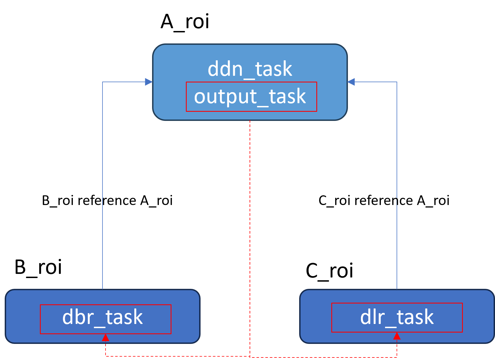

# OutputTaskSetting Object

The `OutputTaskSetting` object is used to configure how to output the expected results of the ancestor `TargetROIDef` by filtering the results of the descendant `TargetROIDef` object.

```json
{
    "Name" : "output_task",

    "OutputCondition": {
        "TaskResultArray": [
            {
                "TargetROIDefName": "B", 
                "TaskSettingNameArray": ["B_task"],
                "Operator": "AND",

                "BackwardReferenceOutput": {
                    "ReferenceTaskNameArray": ["A_task"], 
                    "ReferenceResultTypeArray":[ "ART_TEXT_LINE","ART_BARCODE","ART_FRAME", "ART_TABLE_CELL", "ART_COLOUR_REGION" ]
                }
            }
        ],
        "Operator": "AND"
    }
}
```

<div align="center">
   <p>Example 1 – Parameters of OutputTaskSetting</p>
</div>

## Summary of OutputTaskSetting top-level parameters

| Parameter Name | Value Type | Required or Optional | Description |
|---|---|---|---|
| Name | string | Mandatory | Sets the name of current `OutputTaskSetting` object. The value must be unique between all `task-setting` objects. |
| OutputCondition | {{site.dcv_parameters_reference}}output-task-setting/output-condition.html | Optional | Sets how the current `OutputTaskSetting` object outputs results that meet multiple filter conditions across products.|

## Design of the OutputCondition object

|Concept|Description|
|:------|:----------|
|**Reference TargetROIDef object**| Represents the `TargetROIDef` object where the output task is located. It may be the reference `TargetROIDef` of other descendant `TargetROIDef` objects.|
|**Descendant TargetROIDef objects**| Represents descendant `TargetROIDef` objects. The task results of descendant `TargetROIDef` objects can be navigated to the task results of the reference `TargetROIDef` object through the reference item. |

The following example shows how to set the `OutputCondition` object.

```json
{
    ......
    "TargetROIDefOptions" : [
        {
            "Name" : "A_roi",  
            "TaskSettingNameArray": [
                "ddn_task",
                "output_task"
            ]
        },        
        {
            "Name" : "B_roi",  
            "TaskSettingNameArray": [
                "dbr_task"
            ], 
            "Location": 
            {
                "ReferenceObjectFilter" : {
                    "ReferenceTargetROIDefNameArray": ["A_roi"],
                    "ReferenceTaskNameArray": ["ddn_task"]
                }
            }
        },
        {
            "Name" : "C_roi",  
            "TaskSettingNameArray": [
                "dlr_task"
            ], 
            "Location": 
            {
                "ReferenceObjectFilter" : {
                    "ReferenceTargetROIDefNameArray": ["A_roi"],
                    "ReferenceTaskNameArray": ["ddn_task"]
                }
            }
        }
    ],
    "OutputTaskSettingOptions": [
        {
            "Name" : "output_task",
            "OutputCondition": {
                "TaskResultArray": [
                    {
                        "TargetROIDefName": "B_roi",
                        "BackwardReferenceOutput": {
                            "ReferenceTaskNameArray": ["ddn_task"]
                        }
                    },
                    {
                        "TargetROIDefName": "C_roi",
                        "BackwardReferenceOutput": {
                            "ReferenceTaskNameArray": ["ddn_task"]
                        }                        
                    }
                ],
                "Operator": "AND"
            }
        }
    ]
    ......
}
```

<div align="center">
   <p></p>
</div>

There is a parent `TargetROIDef` object named `A_roi` which contains two tasks named `ddn_task` and `output_task`. There are two descendant `TargetROIDef` objects named `B_roi` and `C_roi`, and there is a task named `dbr_task` and `dlr_task` on each `TargetROIDef` respectively.

The `output_task` works as follows: After processing `B_roi` and `C_roi`, retrieve the task results from `dbr_task` and `dlr_task`, navigate to the reference result generated by `ddn_task`, and execute logical AND combinations to obtain the filtered results.
