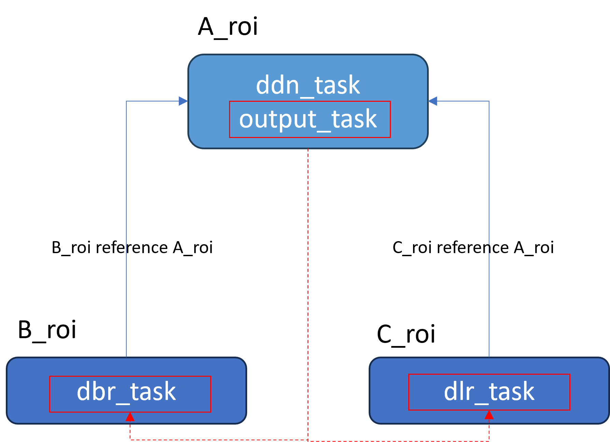

---
layout: default-layout
title: OutputTaskSetting Parameters - Dynamsoft Capture Vision
description: Reference index for OutputTaskSetting object in Dynamsoft Capture Vision parameters, which configure how to output expected results by filtering descendant TargetROIDef results.
keywords: OutputTaskSetting, output, parameter reference
needAutoGenerateSidebar: true
noTitleIndex: true
needGenerateH3Content: true
---

# OutputTaskSetting Parameters

The `OutputTaskSetting` object configures how to output the expected results of a `TargetROIDef` by filtering the results of descendant `TargetROIDef` objects.

## Example JSON

```json
{
    "OutputTaskSettingOptions": [
        {
            "Name": "output_task",
            "OutputCondition": {
                "TaskResultArray": [
                    {
                        "TargetROIDefName": "B",
                        "TaskSettingNameArray": ["B_task"],
                        "Operator": "AND"
                    }
                ],
                "Operator": "AND"
            }
        }
    ]
}
```

## Hierarchical Structure

This tree shows one `OutputTaskSetting` object inside `OutputTaskSettingOptions`.

```text
OutputTaskSetting
├── Name
└── OutputCondition
```

## Top-Level Parameters

| Parameter Name | Description |
|:---------------|:------------|
| [`Name`](name.md) | The unique name of the OutputTaskSetting object. |
| [`OutputCondition`](output-condition.md) | The condition for outputting results. |


## How OutputCondition Works

`OutputCondition` defines how `OutputTaskSetting` filters and combines results from related ROIs.

### Core Concepts

| Concept | Description |
|:--------|:------------|
| **Reference TargetROIDef** | The `TargetROIDef` where the output task runs. It is the anchor ROI used to correlate descendant results. |
| **Descendant TargetROIDef** | A `TargetROIDef` linked to the reference ROI through location reference relationships. Its task results can be selected for output filtering. |

### Configuration Flow

1. Attach `OutputTaskSetting` to the reference `TargetROIDef`.
2. In `OutputCondition.TaskResultArray`, list descendant ROIs to participate in filtering.
3. For each entry, use `BackwardReferenceOutput` (when needed) to align descendant results back to the reference context.
4. Use `Operator` (`AND`/`OR`) to combine all condition entries.

### Complete Example

The following example shows a complete `OutputCondition` configuration:

```json
{
    "TargetROIDefOptions": [
        {
            "Name": "A_roi",
            "TaskSettingNameArray": ["ddn_task", "output_task"]
        },
        {
            "Name": "B_roi",
            "TaskSettingNameArray": ["dbr_task"],
            "Location": {
                "ReferenceObjectFilter": {
                    "ReferenceTargetROIDefNameArray": ["A_roi"],
                    "ReferenceTaskNameArray": ["ddn_task"]
                }
            }
        },
        {
            "Name": "C_roi",
            "TaskSettingNameArray": ["dlr_task"],
            "Location": {
                "ReferenceObjectFilter": {
                    "ReferenceTargetROIDefNameArray": ["A_roi"],
                    "ReferenceTaskNameArray": ["ddn_task"]
                }
            }
        }
    ],
    "OutputTaskSettingOptions": [
        {
            "Name": "output_task",
            "OutputCondition": {
                "TaskResultArray": [
                    {
                        "TargetROIDefName": "B_roi",
                        "BackwardReferenceOutput": {
                            "ReferenceTaskNameArray": ["ddn_task"]
                        }
                    },
                    {
                        "TargetROIDefName": "C_roi",
                        "BackwardReferenceOutput": {
                            "ReferenceTaskNameArray": ["ddn_task"]
                        }
                    }
                ],
                "Operator": "AND"
            }
        }
    ]
}
```

<div align="center">
   <p></p>
</div>

### Example Breakdown

- **Reference ROI:** `A_roi` contains `ddn_task` and `output_task`.
- **Descendant ROIs:** `B_roi` (`dbr_task`) and `C_roi` (`dlr_task`) are both linked to `A_roi`.
- **Filtering behavior:** `output_task` collects eligible results from `B_roi` and `C_roi`, maps them through `BackwardReferenceOutput`, and applies `AND` logic.
