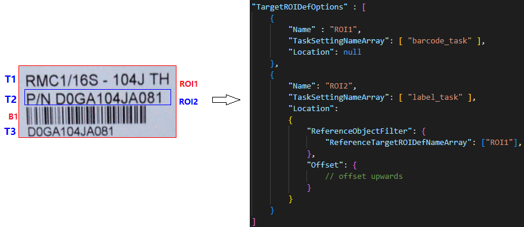
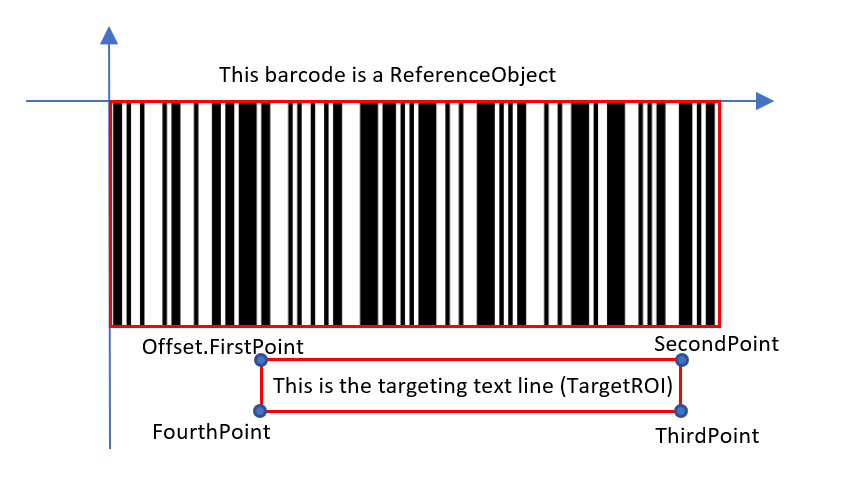
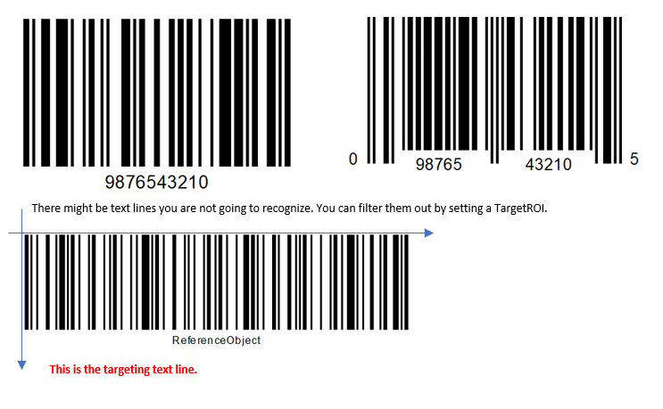

# TargetROIDef Parameters

The `TargetROIDef` object specifies one or more recognition tasks to be performed on regions of interest (ROIs) within an image.

## Example JSON

```json
{
    "TargetROIDefOptions": [
        {
            "Name": "roi_a",
            "BaseTargetROIDefName": "",
            "TaskSettingNameArray": ["dbr_task"],
            "PauseFlag": 0,
            "EnableResultsDeduplication": 1,
            "Location": {
                "ReferenceObjectFilter": {
                    "ReferenceTargetROIDefNameArray": ["roi_root"],
                    "ReferenceTaskSettingNameArray": ["dbr_root"],
                    "ReferenceResultType": "RRT_ORIGINAL_IMAGE"
                },
                "Offset": {
                    "MeasuredByPercentage": 1,
                    "FirstPoint": [0, 0],
                    "SecondPoint": [100, 100]
                }
            }
        }
    ]
}
```

## Hierarchical Structure

This tree shows one `TargetROIDef` object inside `TargetROIDefOptions`.

```text
TargetROIDef
├── Name
├── BaseTargetROIDefName
├── TaskSettingNameArray
├── PauseFlag
├── EnableResultsDeduplication
└── Location
  ├── ReferenceObjectFilter
  └── Offset
```

## Top-Level Parameters

| Parameter Name | Description |
|:---------------|:------------|
| [`Name`](name.md) | The unique name of the TargetROIDef object. |
| [`BaseTargetROIDefName`](base-target-roidef-name.md) | The name of another TargetROIDef to inherit from. |
| [`TaskSettingNameArray`](task-setting-name-array.md) | The names of task setting objects to apply. |
| [`PauseFlag`](pause-flag.md) | Whether to pause processing at this ROI. |
| [`EnableResultsDeduplication`](enable-results-deduplication.md) | Whether to enable deduplication of results. |
| [`Location`](location.md) | The location definition of the target ROI. |

## How TargetROIDef Works

`TargetROIDef` combines two parts:

```text
TargetROIDef = Task Binding + Location Definition
```

### Location-Related Quick Links

| Parameter Name | Description |
|:---------------|:------------|
| [`Location`](location.md) | Container object that combines reference filtering and offset definition. |
| [`ReferenceObjectFilter`](location/reference-object-filter/index.md) | Filters which reference objects are used when computing the ROI location. |
| [`Offset`](location/offset/index.md) | Defines the offset from the reference object to the target ROI. |

## Task Binding

`TaskSettingNameArray` binds one or more task settings to the ROI defined by this `TargetROIDef` object. Typical tasks include barcode reading, text-line recognition, and document processing.

Each task produces atomic result items (for example, barcode, text line, or quadrilateral). `CapturedResult` represents the full set of captured atomic results for an image.

| Task Type | Performed By | Atomic Result Type |
| :-------- | :----------- | :----------------- |
| Read Barcodes | Dynamsoft Barcode Reader SDK | BarcodeResultItem |
| Recognize Text Lines | Dynamsoft Label Recognizer SDK | TextResultItem |
| Detect Document Borders | Dynamsoft Document Normalizer SDK | DetectedQuadResultItem |
| Deskew a Document | Dynamsoft Document Normalizer SDK | DeskewedImageResultItem |
| Enhance an Image | Dynamsoft Document Normalizer SDK | EnhancedImageResultItem |

For more details:
- [Barcode reader task settings]({{ site.dcvb_parameters_reference }}barcode-reader-task-settings/index.html)
- [Label recognizer task settings]({{ site.dcvb_parameters_reference }}label-recognizer-task-settings/index.html)
- [Document normalizer task settings]({{ site.dcvb_parameters_reference }}document-normalizer-task-settings/index.html)

## Location Model

`Location` defines where recognition tasks are performed. It includes:

- `ReferenceObjectFilter`: selects reference regions.
- `Offset`: maps those reference regions to final target regions.

This design enables either fixed ROIs (relative to the original image) or dynamic ROIs (relative to detected results).



| Concept | Description | Example Explanation |
| :------ | :---------- | :------------------ |
| **Atomic Result** | The smallest output item from a task (for example, barcode, text line, table cell, or detected quadrilateral). | `T1`, `T2`, `T3` are three `TextLineResultItem` objects, and `B1` is one `BarcodeResultItem` object. |
| **Reference Region** | A physical quadrilateral region used as the positioning base. It can come from the entire image or from atomic results. | `ROI1` has one reference region (entire image). `ROI2` has three reference regions generated from `T1`, `T2`, `T3`. |
| **Target Region** | A physical quadrilateral region calculated from a reference region plus offset rules. | `ROI1` has one target region equal to the reference region. `ROI2` has three target regions calculated by offsets from `T1`, `T2`, `T3` quadrilateral regions. |

### ReferenceObjectFilter

Defines filter conditions for reference objects. You can filter reference objects by `TargetROIDefName`, atomic result type, and specific atomic result details. Multiple objects may fit the filter conditions. More precise filter conditions yield more accurate reference regions.

| Parameter Name | Type | Required/Optional | Description |
| -------------- | ---- | ----------------- | ----------- |
| [`ReferenceTargetROIDefNameArray`]({{ site.dcvb_parameters_reference }}target-roi-def/location/reference-object-filter/reference-object-filter-parameter-details.html#referencetargetroidefnamearray) | String Array | Optional | References atomic objects generated by other `TargetROIDef` objects by name. Intersects with `AtomicResultTypeArray` to determine final referenced objects. |
| [`AtomicResultTypeArray`]({{ site.dcvb_parameters_reference }}target-roi-def/location/reference-object-filter/reference-object-filter-parameter-details.html#atomicresulttypearray) | String Array | Optional | Atomic result types that can be used as reference objects. Intersects with `ReferenceTargetROIDefNameArray` to determine final referenced objects. |
| [`BarcodeFilteringCondition`]({{ site.dcvb_parameters_reference }}target-roi-def/location/reference-object-filter/barcode-filtering-condition.html) | Object | Optional | Barcode conditions that can be used as reference objects. |
| [`FrameFilteringCondition`]({{ site.dcvb_parameters_reference }}target-roi-def/location/reference-object-filter/frame-filtering-condition.html) | Object | Optional | Frame conditions that can be used as reference objects. |
| [`TextLineFilteringCondition`]({{ site.dcvb_parameters_reference }}target-roi-def/location/reference-object-filter/text-line-filtering-condition.html) | Object | Optional | Text line conditions that can be used as reference objects. |
| [`RegionFilteringCondition`]({{ site.dcvb_parameters_reference }}target-roi-def/location/reference-object-filter/region-filtering-condition.html) | Object | Optional | Colour region conditions that can be used as reference objects. |

### Offset

Defines the offset of the target region from the reference object. If no reference object is defined, the origin is set to the top-left vertex of the original image.



| Parameter Name | Type | Required/Optional | Description |
| -------------- | ---- | ----------------- | ----------- |
| [`ReferenceObjectOriginIndex`]({{ site.dcvb_parameters_reference }}target-roi-def/location/offset/offset-parameter-details.html#referenceobjectoriginindex) | Integer | Optional | Which point of the reference object will be set as the origin of the coordinate system. |
| [`ReferenceObjectType`]({{ site.dcvb_parameters_reference }}target-roi-def/location/offset/offset-parameter-details.html#referenceobjecttype) | String | Optional | Which coordinate system to use when configuring offset parameters based on the reference objects. |
| [`ReferenceXAxis`]({{ site.dcvb_parameters_reference }}target-roi-def/location/offset/reference-x-axis.html) | Object | Optional | The x-axis of the coordinate system to use when configuring offset parameters based on the reference objects. |
| [`ReferenceYAxis`]({{ site.dcvb_parameters_reference }}target-roi-def/location/offset/reference-y-axis.html) | Object | Optional | The y-axis of the coordinate system to use when configuring offset parameters based on the reference objects. |
| [`MeasuredByPercentage`]({{ site.dcvb_parameters_reference }}target-roi-def/location/offset/offset-parameter-details.html#measuredbypercentage) | Integer | Optional | Whether to use percentage to measure the points' coordinates (0 or 1). |
| [`FirstPoint`]({{ site.dcvb_parameters_reference }}target-roi-def/location/offset/offset-parameter-details.html#firstpoint) | Integer Array | Required | The first point of the target region, defining the offset from the origin. |
| [`SecondPoint`]({{ site.dcvb_parameters_reference }}target-roi-def/location/offset/offset-parameter-details.html#secondpoint) | Integer Array | Required | The second point of the target region, defining the offset from the origin. |
| [`ThirdPoint`]({{ site.dcvb_parameters_reference }}target-roi-def/location/offset/offset-parameter-details.html#thirdpoint) | Integer Array | Required | The third point of the target region, defining the offset from the origin. |
| [`FourthPoint`]({{ site.dcvb_parameters_reference }}target-roi-def/location/offset/offset-parameter-details.html#fourthpoint) | Integer Array | Required | The fourth point of the target region, defining the offset from the origin. |

## Usage Examples

### Reference the Original Image

You can set an offset based on the original image to localize the ROI without any reference object.

**Example:** Define ROI from the original image and perform barcode recognition on the upper 50% of the image.

```json
{
    "TargetROIDefOptions": [
        {
            "Name": "ROI_0",
            "TaskSettingNameArray": ["barcode_task"],
            "Location": {
                "ReferenceObjectFilter": null,
                "Offset": {
                    "MeasuredByPercentage": 1,
                    "FirstPoint": [0, 0],
                    "SecondPoint": [100, 0],
                    "ThirdPoint": [100, 50],
                    "FourthPoint": [0, 50]
                }
            }
        }
    ]
}
```

### Reference Another TargetROIDef

If significant objects can help localize the targeting content, define filter conditions to localize reference objects first, then capture the targeting content.

**Example:** Use barcode location to extract text line information.



```json
{
    "TargetROIDefOptions": [
        {
            "Name": "ROI_0",
            "TaskSettingNameArray": ["barcode_task"],
            "Location": null
        },
        {
            "Name": "ROI_1",
            "TaskSettingNameArray": ["text_task"],
            "Location": {
                "ReferenceObjectFilter": {
                    "ReferenceTargetROIDefNameArray": ["ROI_0"],
                    "AtomicResultTypeArray": ["ART_BARCODE"],
                    "BarcodeFilteringCondition": {
                        "BarcodeFormatIds": ["BF_CODE_128"],
                        "BarcodeTextRegExPattern": "ReferenceObject"
                    }
                },
                "Offset": {
                    "MeasuredByPercentage": 1,
                    "FirstPoint": [20, 140],
                    "SecondPoint": [60, 140],
                    "ThirdPoint": [60, 170],
                    "FourthPoint": [20, 170]
                }
            }
        }
    ]
}
```
