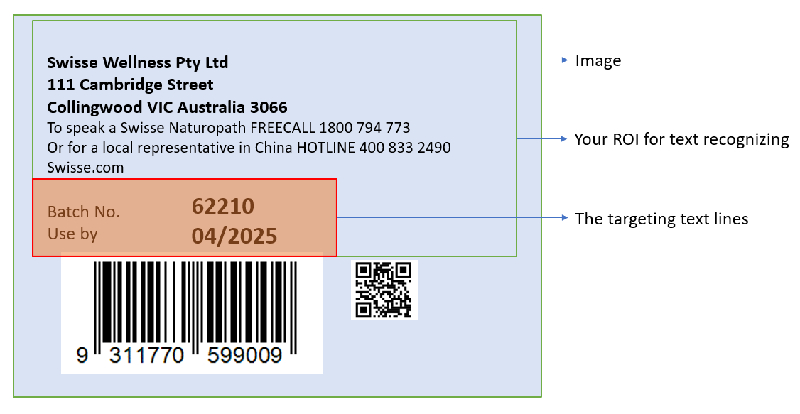

---
layout: default-layout
title: TextLineSpecification Parameters - Dynamsoft Capture Vision
description: Reference index for TextLineSpecification object in Dynamsoft Capture Vision parameters, which define configurations for specified text lines including character models, regex patterns, and recognition settings.
keywords: TextLineSpecification, text line, parameter reference
needAutoGenerateSidebar: true
noTitleIndex: true
needGenerateH3Content: true
---

# TextLineSpecification Parameters

The `TextLineSpecification` object defines configurations for specified text lines, including character models, recognition patterns, and output settings.

## Example JSON

```json
{
    "TextLineSpecificationOptions": [
        {
            "Name": "tls_default",
            "BaseTextLineSpecificationName": "",
            "ApplicableTextLineNumbers": [0],
            "CharacterModelName": "",
            "TextLineRecModelName": "",
            "CharHeightRange": [5, 1000],
            "CharacterNormalizationModes": [],
            "BinarizationModes": [],
            "GrayscaleEnhancementModes": [],
            "StringLengthRange": [3, 200],
            "StringRegexPattern": "",
            "OutputResults": 1,
            "ConcatResults": 0,
            "ConcatSeparator": "",
            "ConcatStringLengthRange": [0, 0],
            "ConcatStringRegexPattern": "",
            "ExpectedGroupsCount": 1,
            "SubGroups": [],
            "ReferenceGroupName": "",
            "TextLinesCount": 1,
            "Position": { "Left": -1, "Top": -1, "Right": -1, "Bottom": -1 },
            "ConfusableCharactersCorrection": {
                "ConfusionSet": "",
                "FontName": "",
                "Height": 0,
                "Width": 0
            }
        }
    ]
}
```

## Hierarchical Structure

This tree shows one `TextLineSpecification` object inside `TextLineSpecificationOptions`.

```text
TextLineSpecification
├── Name
├── BaseTextLineSpecificationName
├── ApplicableTextLineNumbers
├── CharacterModelName
├── TextLineRecModelName
├── CharHeightRange
├── CharacterNormalizationModes
├── BinarizationModes
├── GrayscaleEnhancementModes
├── StringLengthRange
├── StringRegexPattern
├── OutputResults
├── ConcatResults
├── ConcatSeparator
├── ConcatStringLengthRange
├── ConcatStringRegexPattern
├── ExpectedGroupsCount
├── SubGroups
├── ReferenceGroupName
├── TextLinesCount
├── Position
└── ConfusableCharactersCorrection
```

## Top-Level Parameters

| Parameter Name | Description |
|:---------------|:------------|
| [`Name`](name.md) | The unique name of the TextLineSpecification object. |
| [`BaseTextLineSpecificationName`](base-text-line-specification-name.md) | The name of another TextLineSpecification to inherit from. |
| [`ApplicableTextLineNumbers`](applicable-text-line-numbers.md) | The text line numbers this specification applies to. |
| [`CharacterModelName`](character-model-name.md) | The name of the character recognition model. |
| [`TextLineRecModelName`](text-line-rec-model-name.md) | The name of the text line recognition model. |
| [`CharHeightRange`](char-height-range.md) | The expected character height range. |
| [`CharacterNormalizationModes`](character-normalization-modes.md) | The modes for character normalization. |
| [`BinarizationModes`](binarization-modes.md) | The modes for binarization. |
| [`GrayscaleEnhancementModes`](grayscale-enhancement-modes.md) | The modes for grayscale enhancement. |
| [`StringLengthRange`](string-length-range.md) | The expected string length range. |
| [`StringRegexPattern`](string-regex-pattern.md) | The regex pattern for validating recognized strings. |
| [`OutputResults`](output-results.md) | Whether to output results for this specification. |
| [`ConcatResults`](concat-results.md) | Whether to concatenate results. |
| [`ConcatSeparator`](concat-separator.md) | The separator for concatenated results. |
| [`ConcatStringLengthRange`](concat-string-length-range.md) | The length range for concatenated strings. |
| [`ConcatStringRegexPattern`](concat-string-regex-pattern.md) | The regex pattern for concatenated strings. |
| [`ExpectedGroupsCount`](expected-groups-count.md) | The expected number of text line groups. |
| [`SubGroups`](sub-groups.md) | The sub-group definitions. |
| [`ReferenceGroupName`](reference-group-name.md) | The name of the reference group. |
| [`TextLinesCount`](text-lines-count.md) | The expected number of text lines. |
| [`Position`](position.md) | The position of the text line. |
| [`ConfusableCharactersCorrection`](confusable-characters-correction.md) | The settings for confusable characters correction. |


## Usage Instructions

### Design and Configuration Strategy

`TextLineSpecification` is used to apply specialized recognition settings to selected text lines.

- `ApplicableTextLineNumbers` controls which text lines are targeted.
- `CharacterModelName` and `TextLineRecModelName` select the CNN models used for recognition.
- Other parameters define preprocessing, validation, grouping, and output behavior for the targeted lines.

When multiple `TextLineSpecification` objects exist, each object affects only the lines it targets.

### Select Models

Use `CharacterModelName` and `TextLineRecModelName` to bind the corresponding models to the target text lines.

For model configuration details, see [CaptureVisionModel]({{ site.dcvb_parameters_reference }}capture-vision-model/index.html).

### Select Target Text Lines and Area

`ApplicableTextLineNumbers` defines which text lines use the current `TextLineSpecification` settings.

- If `ApplicableTextLineNumbers` is null, all text lines use default settings.
- If only some line numbers are specified, unspecified lines still use default settings.

You can further constrain target lines by area using `FirstPoint`, `SecondPoint`, `ThirdPoint`, and `FourthPoint`.
The final targeting result is determined by both line-number selection and area selection.

For example:

<div align="center">
   <p></p>
   Example Text Line Specification
</div>

You can use the following parameters to process the above image:

```json
{
    "ApplicableTextLineNumbers": [7, 8],
    "FirstPoint": [0, 60],
    "SecondPoint": [70, 60],
    "ThirdPoint": [70, 100],
    "FourthPoint": [0, 100]
}
```

If `ApplicableTextLineNumbers` is set to cover lines 1 to 8, but only lines 7 and 8 are inside the configured area, lines 1 to 6 are excluded by area filtering.

### Configure Image Processing Modes

`GrayscaleEnhancementModes` improve grayscale quality before recognition.

`BinarizationModes` determine binary-image quality and directly affect character visibility in text areas before recognition.

`CharacterNormalizationModes` are additional improvements, commonly based on morphological transformations.
You can learn more from <a href="https://docs.opencv.org/4.x/d9/d61/tutorial_py_morphological_ops.html" target="_blank">Image-Processing in OpenCV - Morphological Transformations</a>.

### Quick Settings

Based on an existing `TextLineSpecification` object, you can set `BaseTextLineSpecificationName` and override only the required fields. For example:

```json
{
    "TextLineSpecificationOptions": [
        {
            "Name": "LS_0",
            "CharacterModelName": "NumberLetterCharRecognition",
            "ApplicableTextLineNumbers": [1, 2, 3],
            "BinarizationModes": [
                {
                    "Mode": "BM_LOCAL_BLOCK",
                    "BlockSizeX": 5,
                    "BlockSizeY": 5
                }
            ],
            "CharacterNormalizationModes": [
                {
                    "Mode": "CNM_MORPH",
                    "MorphOperation": "Close",
                    "MorphArgument": "3"
                }
            ],
            "StringLengthRange": [44, 44],
            "StringRegexPattern": "Dynamsoft",
            "CharHeightRange": [800, 1000]
        },
        {
            "Name": "LS_1",
            "BaseTextLineSpecificationName": "LS_0",
            "ApplicableTextLineNumbers": [4, 5, 6, 7],
            "CharHeightRange": [600, 800]
        }
    ]
}
```

In this example, `LS_1` reuses the core settings from `LS_0` and overrides only line targeting and character-height range.

### Result Composition and Output

#### Result Concatenation

When multiple text lines need to be combined into a single result, use the following parameters:

- **`ConcatResults`**: Set to 1 to enable concatenation of multiple text line results into a single output.
- **`ConcatSeparator`**: Defines the separator string used between concatenated text lines (e.g., "\n" for newline).
- **`ConcatStringLengthRange`**: Specifies the valid length range [min, max] for the concatenated result.
- **`ConcatStringRegexPattern`**: Regular expression pattern that the concatenated result must match.

#### Grouping and Filtering

- **`ExpectedGroupsCount`**: Specifies the expected number of text line groups to be recognized.
- **`ReferenceGroupName`**: References another group for relative positioning or filtering.
- **`SubGroups`**: Defines sub-groups within the text line specification for hierarchical organization.
- **`TextLinesCount`**: Specifies the expected number of text lines to be processed.

#### Output Control

- **`OutputResults`**: Set to 1 to include this text line's results in the final output, or 0 to process internally without outputting.

#### Character Correction

- **`ConfusableCharactersCorrection`**: Configuration for correcting commonly confused characters (e.g., 0 vs O, 1 vs I).
