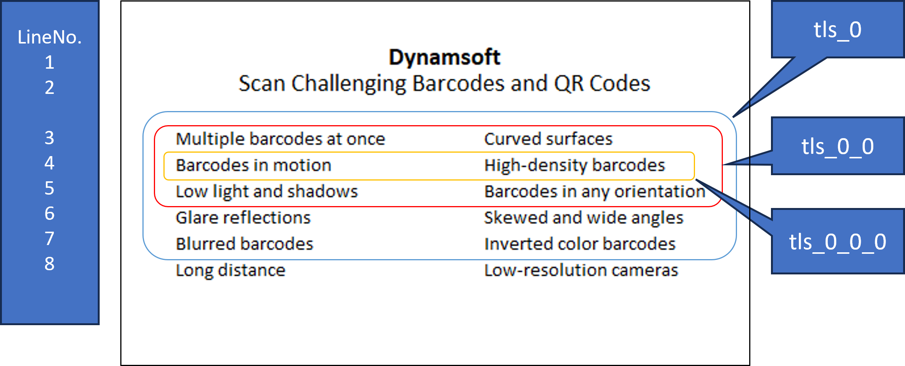

# SubGroups

Parameter `SubGroups` defines the layout of subgroups of the `TextLineSpecification` object. It can be nested recursively defined.

## JSON Structure

**Location in template:**
```
TextLineSpecificationOptions[i]
    └── SubGroups
```

**Parent object:** [TextLineSpecification]({{ site.dcvb_parameters }}file/auxiliary/text-line-specification.html) object

**Example:**

```json
{
    "SubGroups" : [
        {
            "Name": "tls_0_0",
            "ApplicableTextLineNumbers": "3-5",
            "SubGroups" : [
                {
                    "Name": "tls_0_0_0",
                    "ApplicableTextLineNumbers": "4"
                }
            ]
        },
        {
        }
    ]
}
```

> [!NOTE]
> - This snippet shows only the `SubGroups` parameter.
> - To use it, embed this parameter within a [TextLineSpecification]({{ site.dcvb_parameters }}file/auxiliary/text-line-specification.html) object.
> - For the complete JSON structure, see:
>   - [Full JSON Structure]({{ site.dcvb_parameters }}file/index.html#full-json-structure)
>   - [Minimal Valid JSON]({{ site.dcvb_parameters }}file/index.html#minimal-valid-json-example)


<div align="center">
   <p></p>
</div>

## Parameter Details

| Parameter Details |
| :----------------------------------- |
| **Type**<br>*Array* |
| **Range**<br>Array of `TextLineSpecification` Object |
| **Default Value**<br>null. It means that there are no definitions in the subgroups of this `TextLineSpecification` object. |
